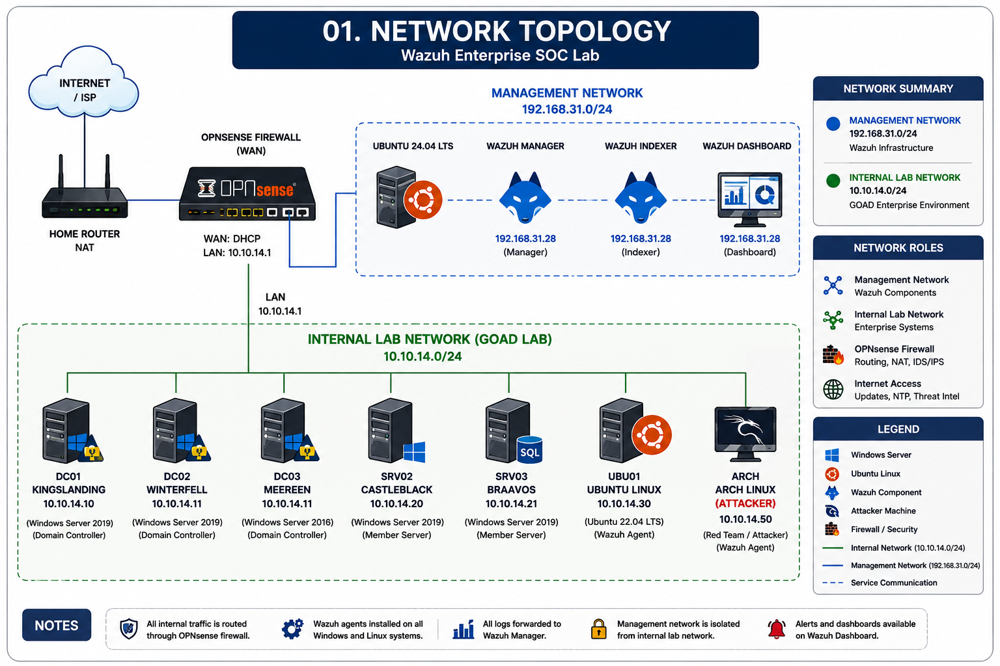
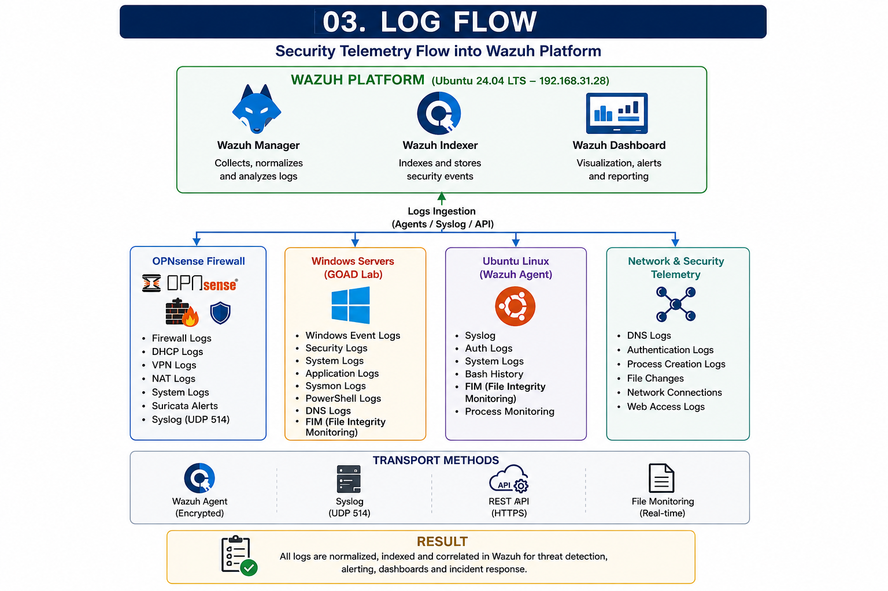
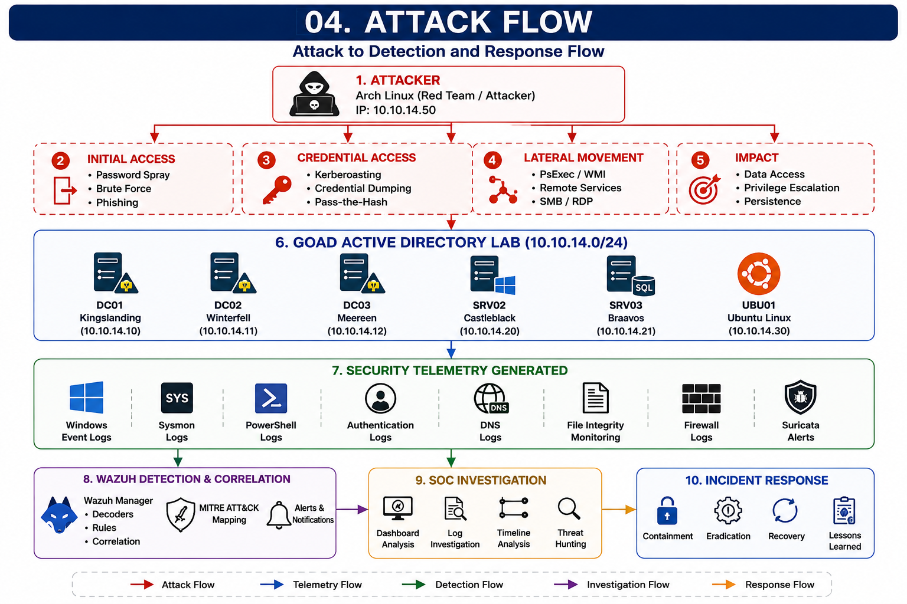

# Architecture

This folder contains the architecture diagrams for the **Wazuh Enterprise SOC Lab**. These diagrams provide a high-level overview of the enterprise environment, network topology, security telemetry, and attack workflow used throughout the project.

---

# 01. Network Topology



## Overview

This diagram illustrates the physical and logical connectivity of the lab environment.

### Components

### Internet

- Internet / ISP

### Management Network (192.168.31.0/24)

- Home Router
- OPNsense Firewall (WAN)
- Ubuntu 24.04 LTS
- Wazuh Manager
- Wazuh Indexer
- Wazuh Dashboard

### Internal Lab Network (10.10.14.0/24)

- DC01 – Kingslanding
- DC02 – Winterfell
- DC03 – Meereen
- SRV02 – Castleblack
- SRV03 – Braavos
- UBU01 – Ubuntu Linux
- ARCH – Arch Linux (Attacker)

---

# 02. Final Enterprise Architecture


## Overview

This diagram represents the complete enterprise SOC architecture implemented in the project.

### Security Infrastructure

- OPNsense Firewall
- Automatic NAT
- DHCP Server
- Remote Syslog
- Suricata IDS/IPS

### Wazuh Platform

- Ubuntu 24.04 LTS
- Wazuh Manager
- Wazuh Indexer
- Wazuh Dashboard

### Monitored Systems

- Domain Controllers
- Windows Servers
- Ubuntu Linux
- Wazuh Agents
- Arch Linux Red Team Machine

### Security Capabilities

- Centralized Log Collection
- Threat Detection
- Security Monitoring
- Incident Response
- MITRE ATT&CK Mapping
- Dashboards & Reporting

---

# 03. Log Flow



## Overview

This diagram illustrates how security telemetry is collected throughout the environment and forwarded to the Wazuh platform for analysis.

### Log Sources

### Windows

- Windows Event Logs
- Sysmon Logs
- Security Logs
- Authentication Events
- Process Creation Events
- File Integrity Monitoring

### Linux

- Syslog
- Authentication Logs
- Audit Logs
- File Integrity Monitoring

### Network

- OPNsense Firewall Logs
- Suricata IDS Alerts
- DHCP Logs
- DNS Logs
- VPN Logs

### Log Collection Flow

```
Endpoints
      │
      ▼
Wazuh Agents / Remote Syslog
      │
      ▼
Wazuh Manager
      │
      ▼
Wazuh Indexer
      │
      ▼
Wazuh Dashboard
```

---

# 04. Attack Flow



## Overview

This diagram demonstrates how offensive security activities generate telemetry that is collected and analyzed by Wazuh.

### Attack Source

- Arch Linux Red Team Machine

### Attack Simulation

- Password Spraying
- Kerberoasting
- SMB Enumeration
- Lateral Movement
- Credential Access
- Privilege Escalation
- Persistence Techniques

### Detection Pipeline

```
Attack
      │
      ▼
Windows & Linux Events
      │
      ▼
Wazuh Agents
      │
      ▼
Wazuh Manager
      │
      ▼
Detection Rules
      │
      ▼
MITRE ATT&CK Mapping
      │
      ▼
Alerts
      │
      ▼
SOC Investigation
      │
      ▼
Incident Response
```

---

# Network Summary

| Network | Address | Purpose |
|----------|---------|---------|
| Management Network | **192.168.31.0/24** | Wazuh Infrastructure |
| Internal Lab Network | **10.10.14.0/24** | GOAD Enterprise Environment |

---

# Technology Stack

## Operating Systems

- Ubuntu 24.04 LTS
- Windows Server 2019
- Windows Server 2016
- Arch Linux

## Security Platforms

- Wazuh
- OPNsense
- Suricata
- Sysmon

## Infrastructure

- VMware Workstation
- GOAD (Game of Active Directory)

---

# Project Goals

This architecture is designed to provide a realistic enterprise SOC environment for:

- Enterprise Log Collection
- Threat Detection
- Detection Engineering
- Threat Hunting
- Incident Response
- Active Directory Security Monitoring
- Firewall Monitoring
- Purple Team Exercises
- MITRE ATT&CK Mapping
- SOC Analyst Training

---

# Related Documentation

The implementation details for this architecture are documented in the following project sections:

- Infrastructure
- OPNsense
- GOAD Active Directory
- Wazuh Deployment
- Detection Engineering
- Attack Simulation
- Incident Reports
- Documentation
