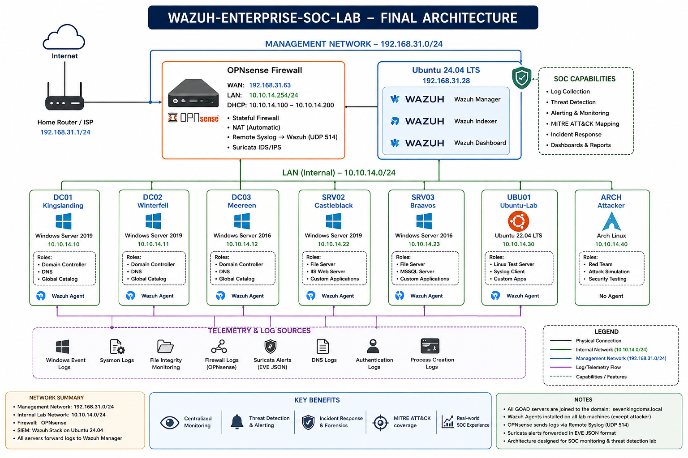

# Architecture

This folder contains the architecture diagrams and documentation for the **Wazuh Enterprise SOC Lab**.

---

# 02. Final Enterprise Architecture

## Overview

The diagram below illustrates the complete enterprise SOC architecture built for this project. It demonstrates the network segmentation, security components, monitored endpoints, telemetry sources, and log flow into the Wazuh platform.

---

## Architecture Components

### Internet & Management Network (192.168.31.0/24)

The management network hosts the security infrastructure and provides Internet connectivity.

**Components**

- Internet
- Home Router / ISP
- OPNsense Firewall (WAN)
- Ubuntu 24.04 LTS (Wazuh Server)

---

### Wazuh Platform

The Wazuh server provides centralized monitoring and security analytics.

**Installed Components**

- Wazuh Manager
- Wazuh Indexer
- Wazuh Dashboard

---

### OPNsense Firewall

The firewall protects the internal lab environment and provides centralized network security.

**Services**

- Stateful Firewall
- Automatic NAT
- DHCP Server
- Remote Syslog (UDP 514)
- Suricata IDS/IPS

---

### Internal Enterprise Network (10.10.14.0/24)

The internal network hosts the GOAD (Game of Active Directory) enterprise environment.

| Host | Role |
|------|------|
| **DC01 – Kingslanding** | Domain Controller |
| **DC02 – Winterfell** | Domain Controller |
| **DC03 – Meereen** | Domain Controller |
| **SRV02 – Castleblack** | IIS / File Server |
| **SRV03 – Braavos** | MSSQL / File Server |
| **UBU01 – Ubuntu Linux** | Linux Test Server |
| **ARCH – Arch Linux** | Red Team / Attacker |

---

## Security Telemetry

Security events are collected from multiple data sources.

- Windows Event Logs
- Sysmon Logs
- Wazuh Agents
- File Integrity Monitoring
- Authentication Logs
- DNS Logs
- Process Creation Logs
- OPNsense Firewall Logs
- Suricata IDS Alerts

---

## Network Summary

| Network | Address | Purpose |
|----------|---------|---------|
| Management Network | **192.168.31.0/24** | Wazuh Server & Firewall Management |
| Internal Lab Network | **10.10.14.0/24** | Enterprise Active Directory Environment |

---

## Security Features

- Centralized Log Collection
- Threat Detection
- Security Monitoring
- Incident Response
- MITRE ATT&CK Mapping
- Dashboards & Reporting
- File Integrity Monitoring
- Network Security Monitoring
- Active Directory Monitoring
- Firewall Log Analysis

---

## Purpose

The Wazuh Enterprise SOC Lab is designed to simulate a real enterprise Security Operations Center (SOC) environment for hands-on cybersecurity practice.

This lab enables:

- Blue Team Operations
- Threat Hunting
- Detection Engineering
- Incident Response
- Active Directory Security Monitoring
- Firewall Monitoring
- Enterprise Log Analysis
- Purple Team Exercises

---

## Related Diagrams

This folder will also contain:

- 01-Network-Topology.drawio
- 02-Final-Architecture.drawio
- 03-Log-Flow.drawio
- 04-Attack-Flow.drawio
