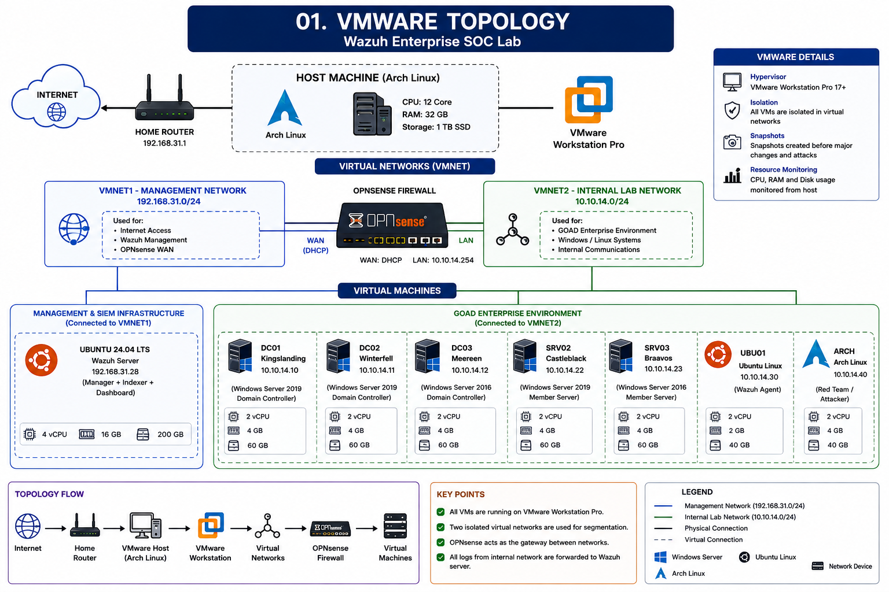
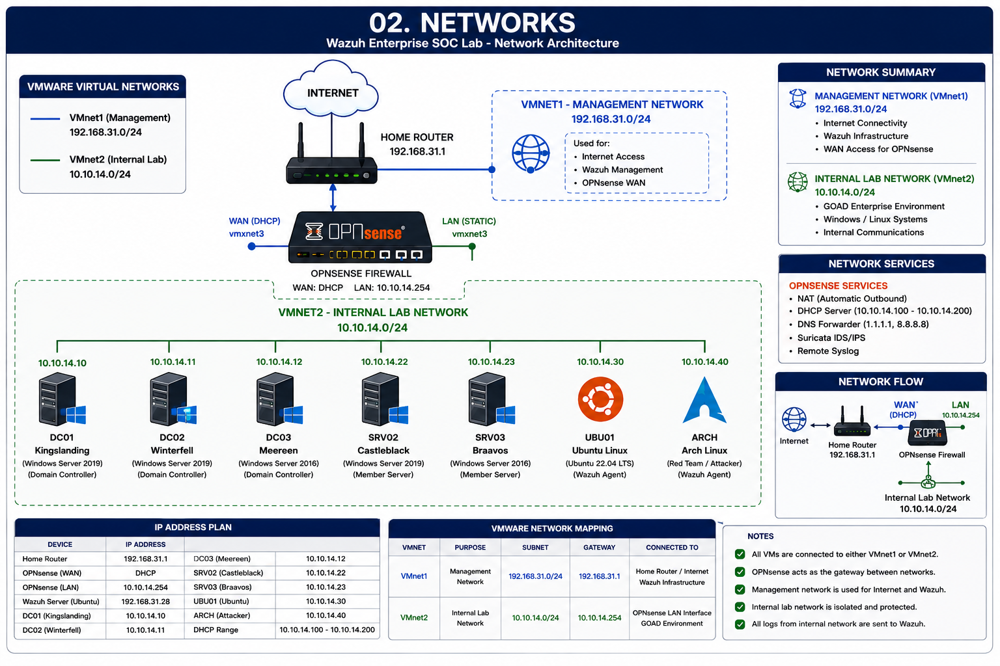

# Infrastructure

This folder documents the virtualization platform, physical infrastructure, networking, and virtual machines used to build the **Wazuh Enterprise SOC Lab**.

---

# Infrastructure Overview

The Wazuh Enterprise SOC Lab uses a **hybrid deployment model** to simulate a realistic enterprise Security Operations Center (SOC) environment.

The virtualization platform is hosted on an **Arch Linux** system running **VMware Workstation Pro**, which contains the enterprise infrastructure including the GOAD Active Directory environment, OPNsense firewall, and supporting virtual machines.

The **Wazuh platform** is deployed separately on a **dedicated physical Ubuntu 24.04 LTS server** connected to the same management network. This separation reflects real-world enterprise deployments where the SIEM infrastructure is isolated from the virtualization platform.

---

# 01. VMware Topology



## Overview

This diagram illustrates the virtualization platform running on the Arch Linux host.

### Physical Host

- Arch Linux
- VMware Workstation Pro

### Virtual Machines

- OPNsense Firewall
- DC01 – Kingslanding
- DC02 – Winterfell
- DC03 – Meereen
- SRV02 – Castleblack
- SRV03 – Braavos
- Ubuntu Linux (UBU01)
- Arch Linux (Attacker)

---

# 02. Network Layout



## Overview

This diagram illustrates the communication between the physical Wazuh server and the virtual enterprise lab.

### Management Network

**192.168.31.0/24**

Purpose

- Internet Connectivity
- Wazuh Management
- OPNsense WAN Interface
- Remote Syslog

### Internal Enterprise Network

**10.10.14.0/24**

Purpose

- Active Directory
- Windows Servers
- Ubuntu Linux
- Red Team Machine
- Security Monitoring

---

# Infrastructure Components

## Physical Systems

| System | Purpose |
|---------|---------|
| Arch Linux Host | VMware Workstation Platform |
| Ubuntu 24.04 LTS | Wazuh Manager, Indexer, Dashboard |

---

## Virtual Machines

| VM | Operating System | Purpose |
|----|------------------|---------|
| OPNsense | OPNsense | Firewall, NAT, DHCP, IDS/IPS |
| DC01 | Windows Server 2019 | Domain Controller |
| DC02 | Windows Server 2019 | Domain Controller |
| DC03 | Windows Server 2016 | Domain Controller |
| SRV02 | Windows Server 2019 | Member Server |
| SRV03 | Windows Server 2016 | Member Server |
| UBU01 | Ubuntu Linux | Linux Test Server |
| ARCH | Arch Linux | Red Team Workstation |

---

# Network Architecture

```
                    Internet
                        │
                        ▼
                Home Router / ISP
                 192.168.31.1
                        │
        ┌───────────────┴───────────────┐
        │                               │
        ▼                               ▼
 Arch Linux Host                 Ubuntu 24.04 LTS
 VMware Workstation              Wazuh Platform
        │                               │
        │                        Wazuh Manager
        │                        Wazuh Indexer
        │                        Wazuh Dashboard
        │
        ▼
 OPNsense Firewall
 WAN: 192.168.31.x
 LAN: 10.10.14.254
        │
        ▼
 Internal Enterprise Network
 10.10.14.0/24
        │
 ┌──────┼───────────────┬──────────────┬────────────┐
 │      │               │              │            │
 ▼      ▼               ▼              ▼            ▼
DC01   DC02            DC03          SRV02       SRV03
                                  │
                                  ▼
                               Ubuntu
                                  │
                                  ▼
                            Arch Linux
                            (Attacker)
```

---

# Network Summary

| Network | Address | Purpose |
|----------|---------|---------|
| Management Network | **192.168.31.0/24** | Management & Wazuh Infrastructure |
| Internal Enterprise Network | **10.10.14.0/24** | GOAD Active Directory Environment |

---

# Resource Allocation

| Machine | CPU | Memory | Storage |
|----------|----:|-------:|--------:|
| OPNsense | 2 vCPU | 4 GB | 20 GB |
| DC01 | 2 vCPU | 4 GB | 60 GB |
| DC02 | 2 vCPU | 4 GB | 60 GB |
| DC03 | 2 vCPU | 4 GB | 60 GB |
| SRV02 | 2 vCPU | 4 GB | 60 GB |
| SRV03 | 2 vCPU | 4 GB | 60 GB |
| Ubuntu Linux | 2 vCPU | 2 GB | 40 GB |
| Arch Linux | 2 vCPU | 4 GB | 40 GB |
| Physical Wazuh Server | 4 vCPU | 16 GB | 200 GB |

---

# IP Addressing

| Device | IP Address |
|----------|------------|
| Home Router | 192.168.31.1 |
| Wazuh Server | 192.168.31.28 |
| OPNsense WAN | DHCP |
| OPNsense LAN | 10.10.14.254 |
| DC01 | 10.10.14.10 |
| DC02 | 10.10.14.11 |
| DC03 | 10.10.14.12 |
| SRV02 | 10.10.14.22 |
| SRV03 | 10.10.14.23 |
| Ubuntu Linux | 10.10.14.45 |
| Arch Linux | 10.10.14.1 |

---

# Technology Stack

## Virtualization

- VMware Workstation Pro

## Firewall

- OPNsense

## IDS / IPS

- Suricata

## SIEM

- Wazuh Manager
- Wazuh Indexer
- Wazuh Dashboard

## Active Directory Lab

- GOAD (Game of Active Directory)

## Operating Systems

- Arch Linux
- Ubuntu 24.04 LTS
- Ubuntu Linux
- Windows Server 2019
- Windows Server 2016

---

# Screenshots

The **Screenshots** folder contains:

- VMware Workstation Overview
- Virtual Network Configuration
- Virtual Machine Inventory
- OPNsense Network Interfaces
- GOAD Virtual Machines
- Physical Wazuh Server

---

# Purpose

The infrastructure is designed to provide a realistic enterprise environment for:

- Security Monitoring
- Threat Detection
- Detection Engineering
- Incident Response
- Active Directory Security
- Firewall Monitoring
- Threat Hunting
- Purple Team Exercises
- SOC Analyst Training

---

# Related Documentation

- Architecture
- OPNsense
- GOAD
- Wazuh
- Detection Engineering
- Attack Simulation
- Incident Reports
- Documentation
