# OPNsense Firewall

This section documents the deployment, configuration, and validation of the **OPNsense Firewall** used in the **Wazuh Enterprise SOC Lab**.

The firewall provides network segmentation, routing, DHCP, NAT, firewall filtering, remote syslog forwarding, and Intrusion Detection (Suricata) for the lab environment.

---

# Objectives

- Deploy OPNsense Firewall
- Configure WAN and LAN interfaces
- Configure DHCP services
- Configure automatic NAT
- Configure firewall rules
- Configure aliases
- Forward firewall logs to Wazuh
- Deploy Suricata IDS
- Verify IDS logging
- Prepare the environment for attack simulation

---

# Network Configuration

| Component | Configuration |
|-----------|---------------|
| Firewall | OPNsense 26.7 |
| WAN | 192.168.31.63/24 |
| Gateway | 192.168.31.1 |
| LAN | 10.10.14.254/24 |
| DHCP Range | 10.10.14.100 – 10.10.14.200 |
| Management Network | 192.168.31.0/24 |
| Internal Network | 10.10.14.0/24 |
| IDS | Suricata |
| Log Forwarding | Remote Syslog (UDP 514) |
| SIEM | Wazuh |

---

# Firewall Architecture

```
Internet
     │
Home Router (192.168.31.1)
     │
WAN
192.168.31.63
     │
──────────────────────────────
      OPNsense Firewall
──────────────────────────────
LAN
10.10.14.254
     │
──────────────────────────────
10.10.14.0/24
──────────────────────────────
 │
 ├── DC01
 ├── DC02
 ├── DC03
 ├── SRV02
 ├── SRV03
 ├── Ubuntu
 └── Arch Linux
```

---

# 1. Dashboard

The dashboard provides an overview of the firewall status including:

- CPU Usage
- Memory Usage
- Interface Status
- Firewall Status
- Gateway Status
- Traffic Graphs
- Installed Services

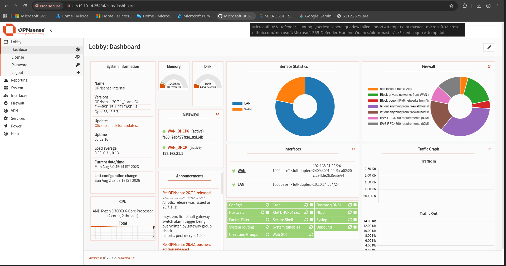

---

# 2. Interface Configuration

The firewall contains two interfaces.

## WAN

- Connected to Home Router
- DHCP Enabled
- Internet Connectivity

## LAN

- Static Address
- Internal Network
- Default Gateway for Lab

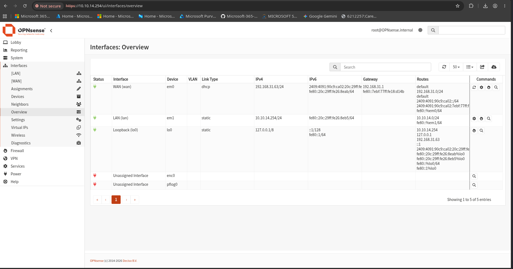

---

# 3. WAN Configuration

The WAN interface connects the lab environment to the management network and Internet.

Configuration includes:

- DHCP IPv4
- DHCPv6
- Block Private Networks
- Block Bogon Networks

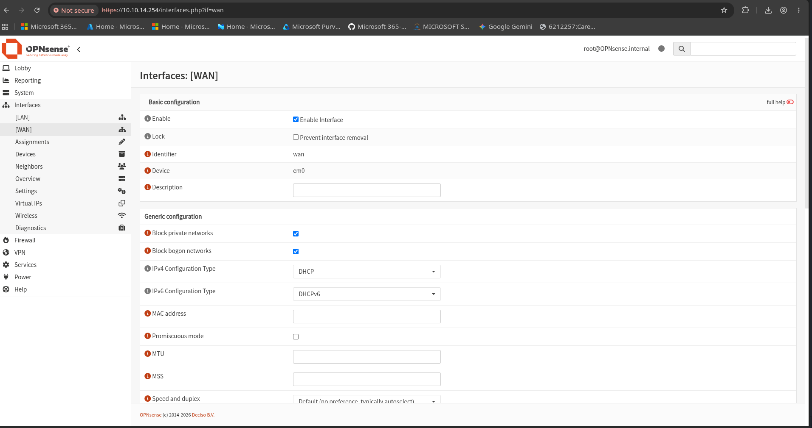

---

# 4. LAN Configuration

The LAN interface provides connectivity for all lab systems.

Configuration:

- Static IP
- Internal Gateway
- 10.10.14.0/24 Network

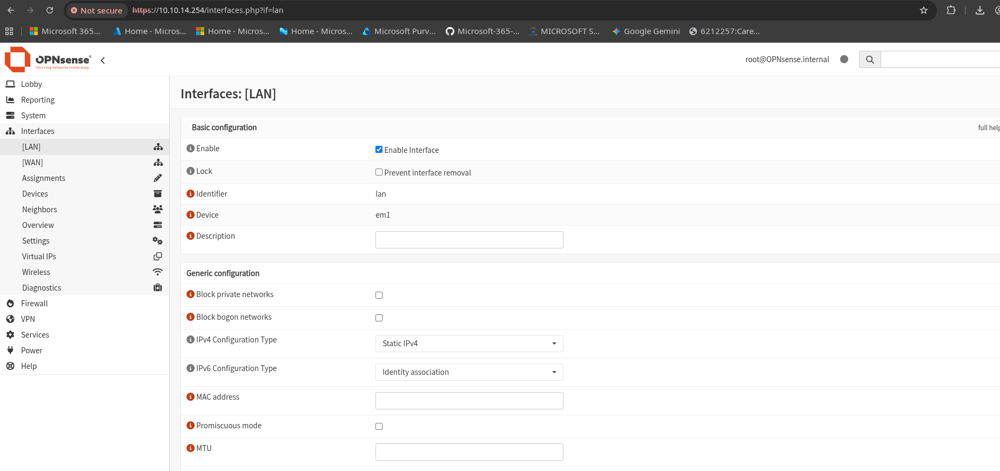

---

# 5. DHCP Server

The DHCP server automatically assigns IP addresses to systems connected to the LAN.

Configuration includes:

- LAN Interface
- Lease Time
- DHCP Service
- Dynamic Address Assignment

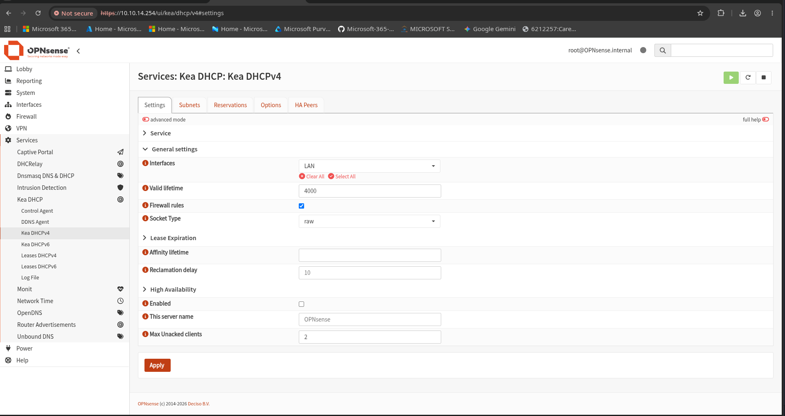

---

# DHCP Subnets

Configured DHCP subnet:

- Network: 10.10.14.0/24
- Address Pool:
  - 10.10.14.100
  - 10.10.14.200

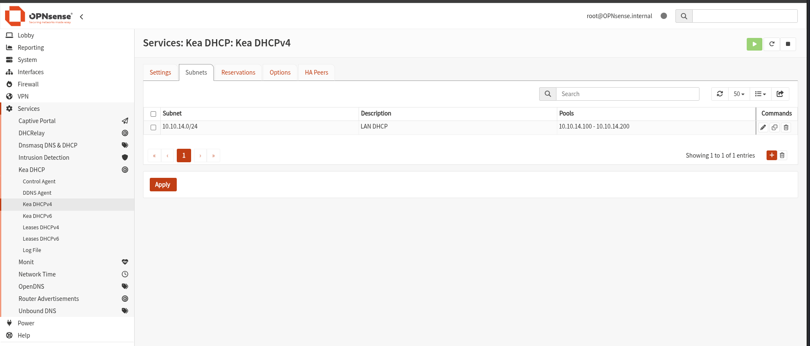

---

# 6. Firewall Rules

Default LAN rules allow outbound communication from the internal lab while maintaining a default-deny posture for unsolicited inbound traffic.

Configured Rules:

- Default Allow LAN IPv4
- Default Allow LAN IPv6

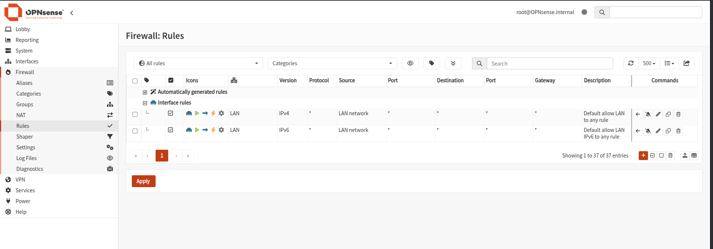

---

# 7. Source NAT

Outbound NAT is configured using Automatic Source NAT.

This allows internal systems to access external networks while hiding private IP addresses.

Configuration:

- Automatic Source NAT
- Outbound Translation
- Internet Access

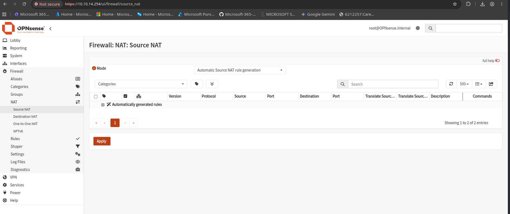

---

# 8. Firewall Aliases

Aliases simplify firewall rule management.

Configured aliases include:

- WAZUH_SERVER
- LAB_NETWORK

These aliases are referenced by firewall policies and future rule management.

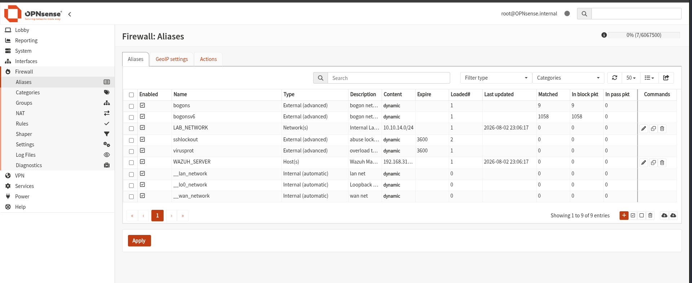

---

# 9. Remote Syslog

Firewall logs are forwarded to the Wazuh Manager using Remote Syslog.

Configuration:

- Destination:
  - Wazuh Server
- Protocol:
  - UDP
- Port:
  - 514

Log Sources:

- Firewall Logs
- DHCP Logs
- System Logs
- Suricata Logs

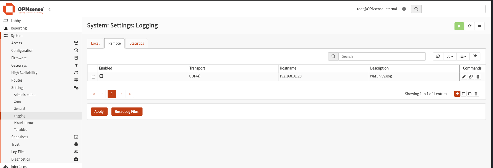

---

# 10. Suricata IDS

Suricata provides Intrusion Detection capabilities for the SOC lab.

Configuration:

- IDS Enabled
- LAN Monitoring
- WAN Monitoring
- Promiscuous Mode
- EVE JSON Logging
- Syslog Alerts

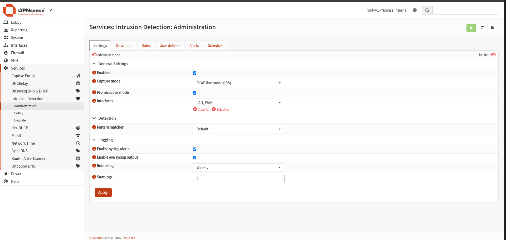

---

# 11. Suricata Alerts

At the time of the initial deployment, the Suricata engine was successfully configured and monitoring network traffic.

Traffic inspection and EVE JSON logging were verified successfully.

No IDS signature alerts had been generated yet because attack simulations had not yet been executed.

Suricata alerts will be demonstrated during the **Attack Simulation** phase of this project.

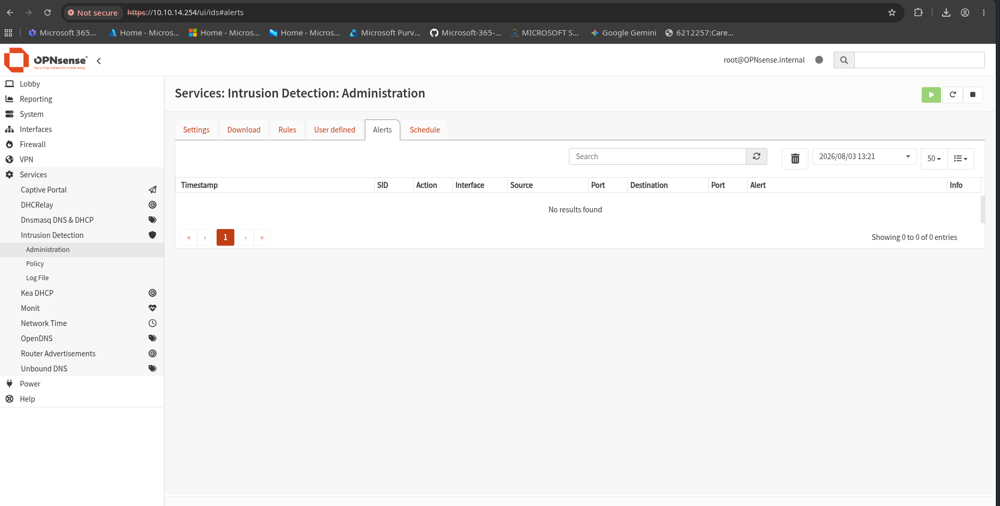

---

# Validation

The following components were successfully validated.

| Validation | Status |
|------------|--------|
| WAN Connectivity | ✅ |
| LAN Connectivity | ✅ |
| DHCP Server | ✅ |
| Automatic NAT | ✅ |
| Firewall Rules | ✅ |
| Firewall Aliases | ✅ |
| Remote Syslog | ✅ |
| Suricata Service | ✅ |
| EVE JSON Logging | ✅ |
| Traffic Inspection | ✅ |

---

# Integration with Wazuh

The firewall forwards security telemetry to the Wazuh platform.

Collected data includes:

- Firewall Events
- Network Connections
- DHCP Activity
- Authentication Logs
- System Logs
- Suricata EVE JSON
- IDS Events

This enables centralized monitoring, threat detection, and incident investigation through the Wazuh Dashboard.

---

# Next Phase

The next section covers the deployment and configuration of the Wazuh platform.

➡ **04-Wazuh**

This includes:

- Wazuh Installation
- Manager Configuration
- Indexer
- Dashboard
- Agent Enrollment
- Log Collection
- Initial Security Monitoring
