# Wazuh

## Overview

This section documents the deployment and validation of the **Wazuh 4.14.7** platform used as the central Security Information and Event Management (SIEM) solution in the **Wazuh-Enterprise-SOC-Lab**.

The Wazuh platform is deployed on a dedicated **Ubuntu Server 24.04 LTS** separate from the virtualization host. It provides centralized security monitoring, log collection, endpoint visibility, alert generation, and security analytics for Windows and Linux systems across the lab environment.

The deployment consists of a **single-node architecture**, which is suitable for small and medium enterprise environments while providing all core Wazuh capabilities.

---

# Objectives

- Deploy a dedicated Wazuh server
- Configure Wazuh Manager
- Configure Wazuh Indexer
- Configure Wazuh Dashboard
- Verify all services are operational
- Register Windows and Linux agents
- Monitor endpoint status
- Validate platform health
- Verify Indexer cluster health
- Document the complete deployment

---

# Environment

| Component | Value |
|-----------|-------|
| Wazuh Version | 4.14.7 |
| Deployment | Single Node |
| Operating System | Ubuntu Server 24.04 LTS |
| Manager | Wazuh Manager |
| Indexer | Wazuh Indexer |
| Dashboard | Wazuh Dashboard |
| Filebeat | Enabled |
| Agents | Windows Server 2016, Windows Server 2019, Ubuntu 24.04 |
| Total Agents | 6 |

---

# Architecture

```
                 +--------------------------------+
                 |      Wazuh Dashboard           |
                 +---------------+----------------+
                                 |
                                 |
                 +---------------v----------------+
                 |      Wazuh Indexer             |
                 +---------------+----------------+
                                 |
                                 |
                 +---------------v----------------+
                 |      Wazuh Manager             |
                 +---------------+----------------+
                                 |
         -------------------------------------------------
         |           |           |          |            |
         |           |           |          |            |
    Kingslanding  Winterfell  Meereen   Braavos      Syskey
    Windows        Windows     Windows   Windows      Ubuntu

                     Castleblack
                       Windows
```

---

# Components

## Wazuh Manager

The Wazuh Manager performs:

- Agent authentication
- Event processing
- Rule matching
- Alert generation
- Decoder execution
- Active response
- Security monitoring

---

## Wazuh Indexer

The Wazuh Indexer stores and indexes:

- Security alerts
- Endpoint events
- Inventory information
- Vulnerability data
- File Integrity Monitoring events

---

## Wazuh Dashboard

The Dashboard provides:

- Security overview
- Endpoint management
- Threat hunting
- Dashboard visualization
- Alert investigation
- Configuration management

---

## Filebeat

Filebeat forwards:

- Alerts
- Archives
- Manager events

to the Wazuh Indexer.

---

# Registered Agents

The lab currently contains six monitored endpoints.

| ID | Hostname | Operating System |
|----|----------|------------------|
|001|Kingslanding|Windows Server 2019|
|002|Winterfell|Windows Server 2019|
|003|Meereen|Windows Server 2016|
|004|Braavos|Windows Server 2016|
|005|Syskey|Ubuntu 24.04|
|006|Castleblack|Windows Server 2019|

---

# Deployment Validation

The deployment was validated by verifying:

- Wazuh Manager service
- Wazuh Indexer service
- Wazuh Dashboard service
- Filebeat service
- Registered agents
- Server resource utilization
- Indexer health
- Version information
- Platform accessibility

---

# Screenshots

## 01 – Wazuh Dashboard

Shows the Wazuh Overview dashboard after successful deployment.

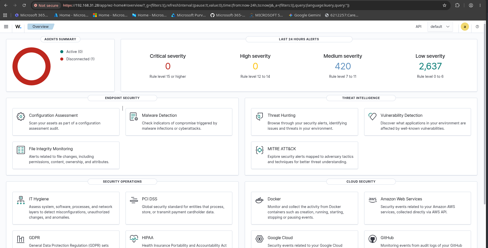

---

## 02 – Wazuh Manager Service

Verifies the Wazuh Manager service is running.

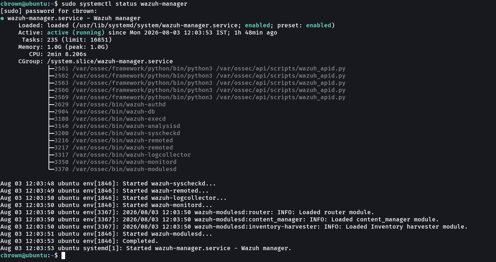

---

## 03 – Wazuh Indexer Service

Verifies the Wazuh Indexer service.

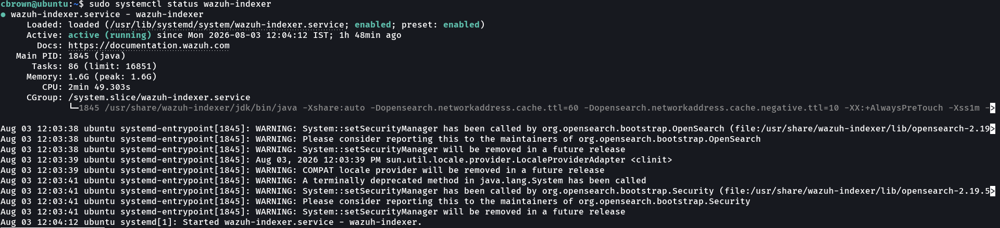

---

## 04 – Wazuh Dashboard Service

Confirms the Wazuh Dashboard service is active.

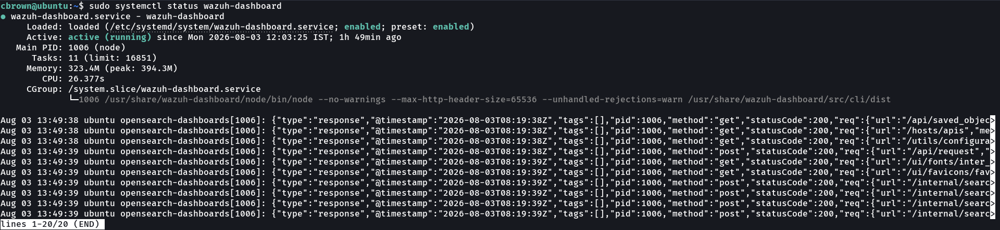

---

## 05 – Agent Management

Displays all managed endpoints within the Wazuh Dashboard.

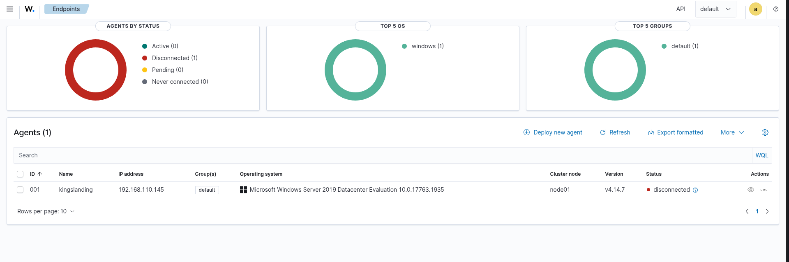

---

## 06 – Agent Details

Shows detailed information for a monitored endpoint.

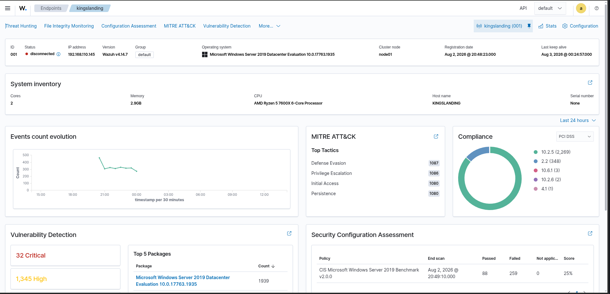

---

## 07 – Registered Agents

Displays all enrolled Windows and Linux agents.

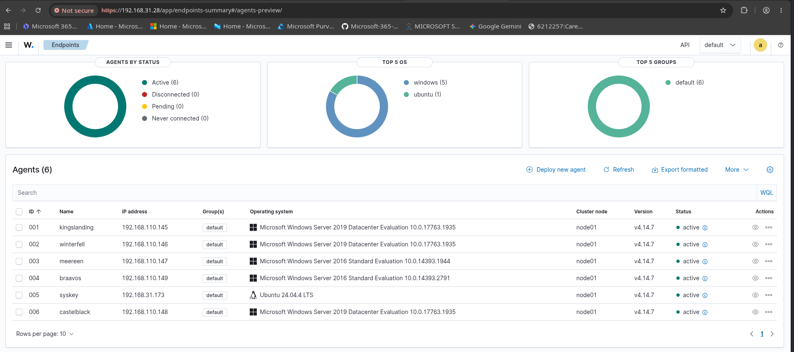

---

## 08 – Server Health

Shows CPU, memory usage, running processes, and overall server health.

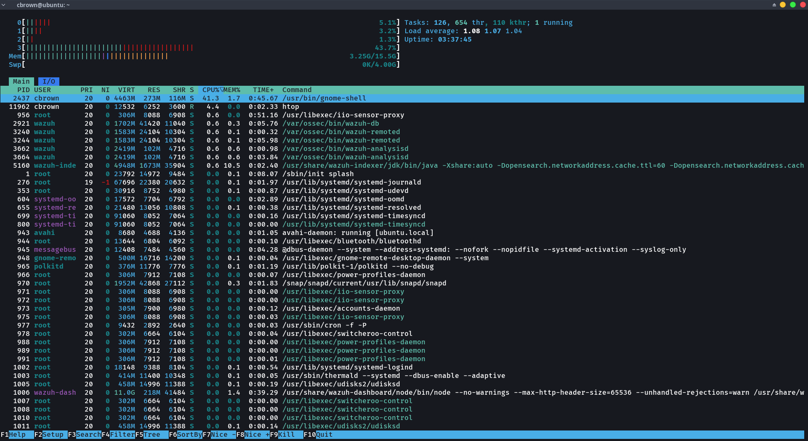

---

## 09 – Filebeat Status

Confirms Filebeat is running and forwarding logs to the Indexer.

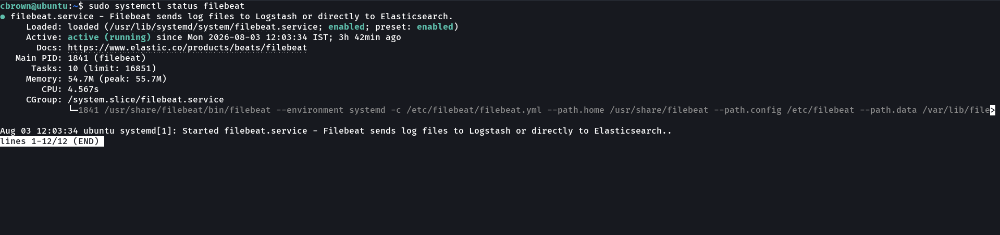

---

## 10 – Wazuh Services

Shows all core Wazuh services running successfully.

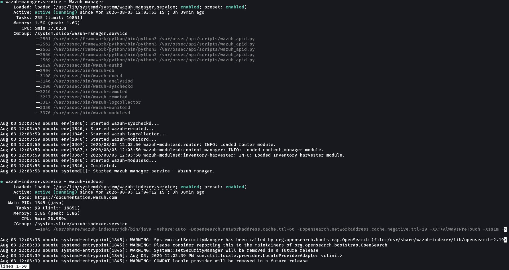

---

## 11 – Indexer Health

Displays the Wazuh Indexer cluster health status.

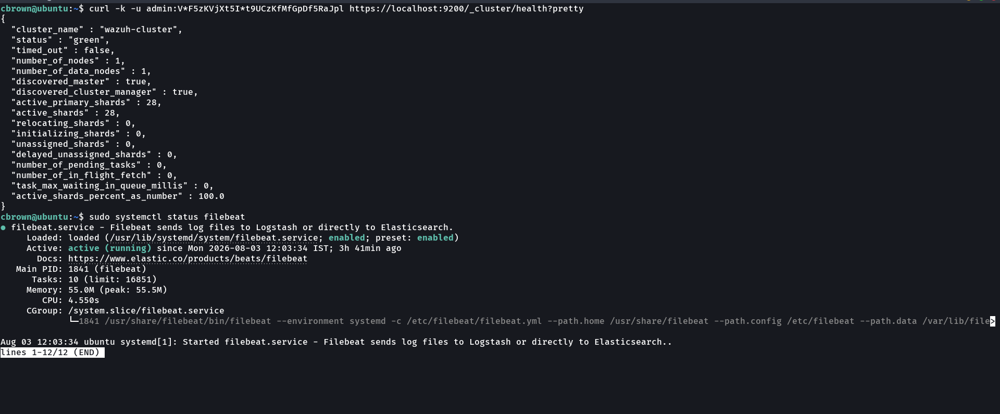

---

## 12 – Wazuh Version

Confirms the installed Wazuh platform version.

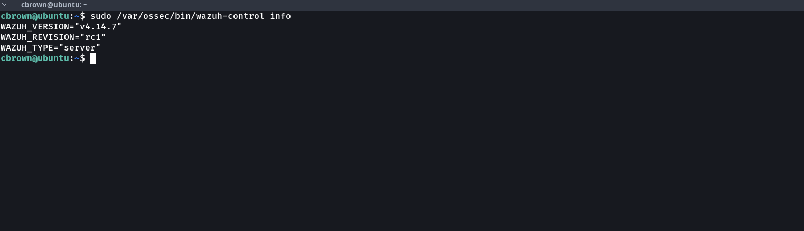

---

## 13 – System Information

Displays the operating system and hardware information for the Wazuh server.

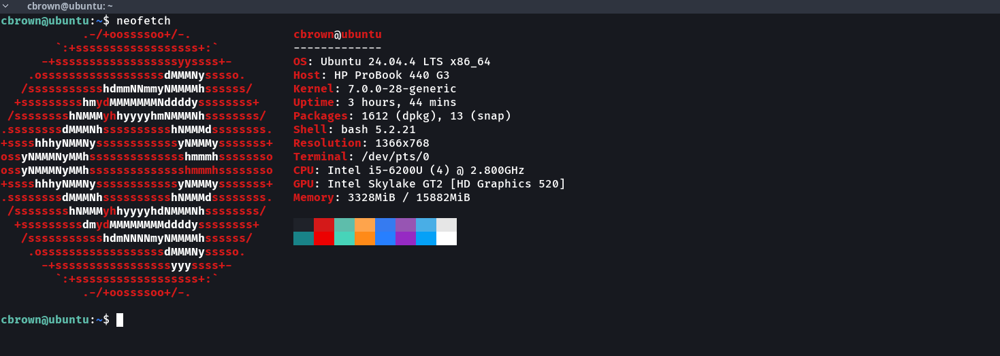

---

# Result

The Wazuh platform was successfully deployed as a dedicated single-node SIEM solution. All core components are operational, six endpoints are enrolled and communicating with the manager, services are healthy, and the platform is ready for subsequent sections including log collection, detection engineering, threat hunting, vulnerability detection, and incident response.

---

# Next Section

➡️ **05-Log-Collection**
