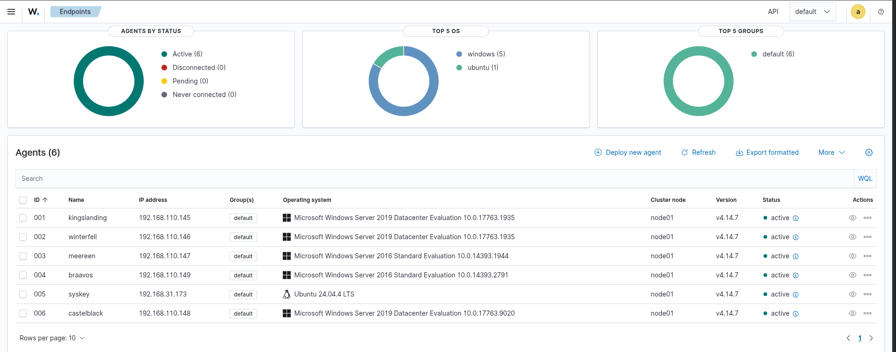
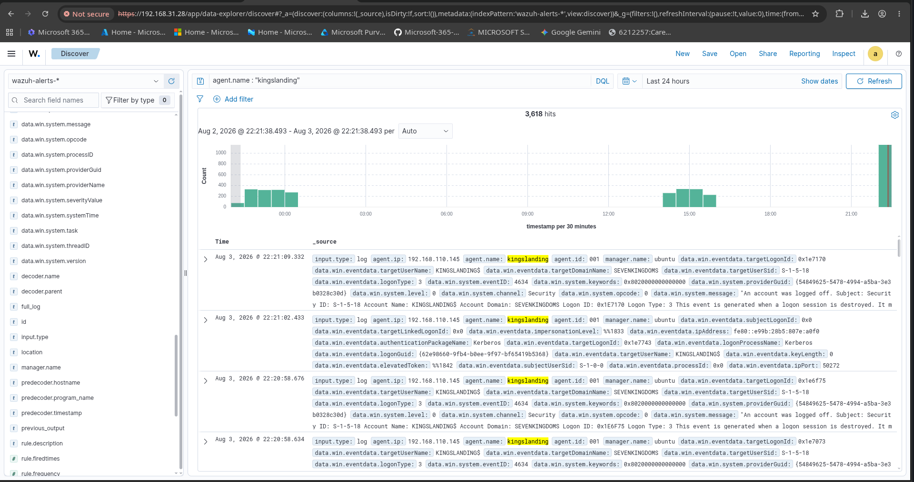
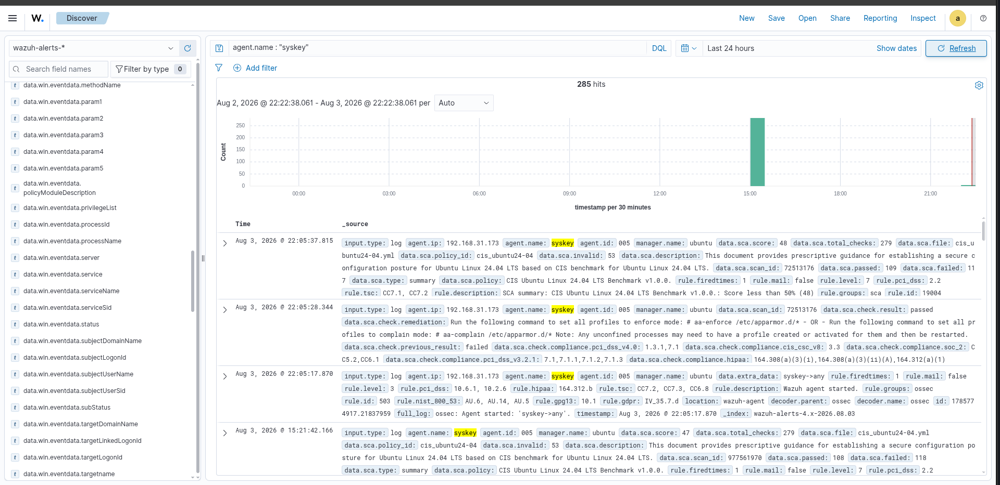
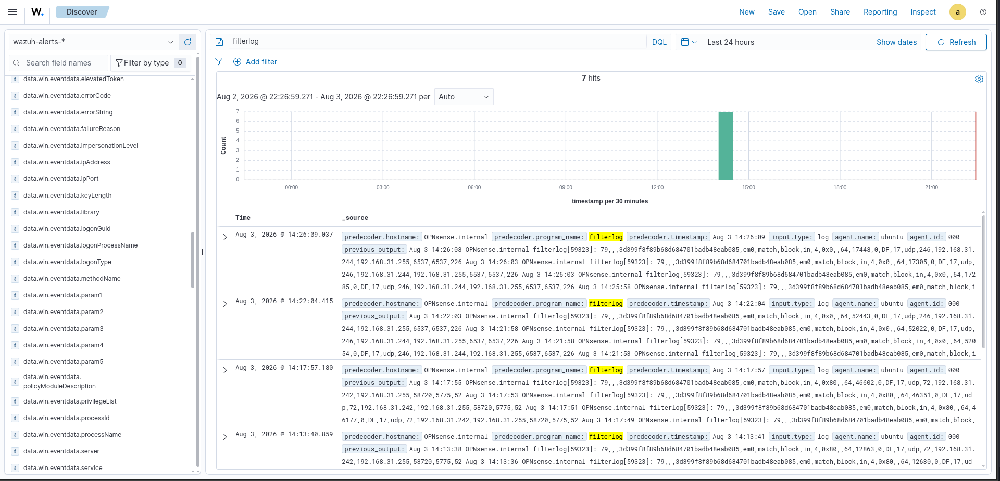
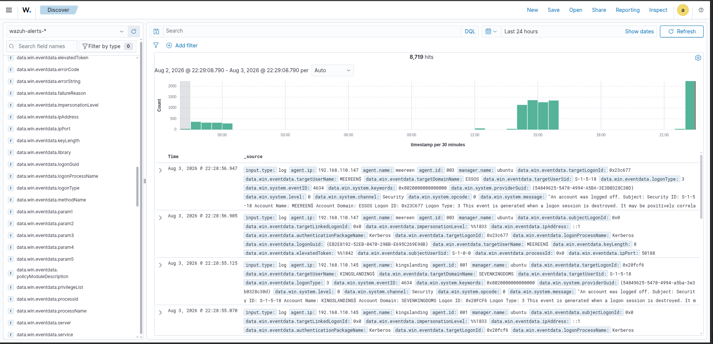
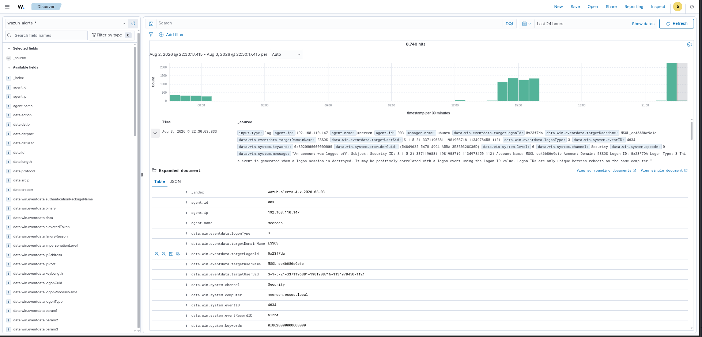

# 📥 Log Collection

## 📌 Overview

The Log Collection phase validates centralized log ingestion across the Microsoft Hybrid SOC Lab. In this stage, Wazuh collects, parses, indexes, and centralizes security events from Windows Servers, Ubuntu Linux, and the OPNsense Firewall into a single security monitoring platform.

This implementation provides complete visibility into authentication events, operating system logs, firewall activity, and security telemetry required for Security Operations Center (SOC) monitoring and incident investigation.

---

# 🎯 Objectives

- Deploy and validate Wazuh agents.
- Register Windows and Linux endpoints.
- Collect Windows Security Event Logs.
- Collect Ubuntu system logs.
- Forward OPNsense firewall logs using Remote Syslog.
- Centralize security events within Wazuh.
- Validate log parsing and indexing.
- Verify event visibility in Wazuh Dashboard.

---

# 🏗️ Log Collection Architecture

```text
                   +----------------------+
                   | Windows Servers      |
                   | Wazuh Agent          |
                   +----------+-----------+
                              |
                              |
                   +----------v-----------+
                   |                      |
                   |    Wazuh Manager     |
                   |                      |
                   +----------+-----------+
                              |
        +---------------------+---------------------+
        |                                           |
+-------v--------+                         +---------v----------+
| Ubuntu Server  |                         | OPNsense Firewall  |
| Wazuh Agent    |                         | Remote Syslog      |
+----------------+                         +--------------------+
                              |
                              |
                   +----------v-----------+
                   |    Wazuh Indexer     |
                   +----------+-----------+
                              |
                   +----------v-----------+
                   |   Wazuh Dashboard    |
                   +----------------------+
```

---

# 🔍 Log Sources

| Source | Collection Method | Status |
|---------|-------------------|--------|
| Windows Server 2019 | Wazuh Agent | ✅ |
| Windows Server 2016 | Wazuh Agent | ✅ |
| Ubuntu 24.04 LTS | Wazuh Agent | ✅ |
| OPNsense Firewall | Remote Syslog | ✅ |

---

# 📋 Validation Checklist

The following validations were completed successfully.

- ✅ Wazuh agents registered successfully.
- ✅ Windows endpoints reporting.
- ✅ Ubuntu endpoint reporting.
- ✅ Windows Security Event Logs collected.
- ✅ Ubuntu system logs collected.
- ✅ OPNsense firewall logs received.
- ✅ Security events searchable.
- ✅ Event parsing validated.
- ✅ Event metadata indexed successfully.

---

# 📸 Screenshots

## 01 – Registered Agents

Displays all registered Windows and Linux endpoints connected to the Wazuh Manager.



---

## 02 – Windows Security Logs

Windows Security Event Logs successfully collected from Active Directory servers.



---

## 03 – Linux Logs

Ubuntu Linux system logs collected through the Wazuh Agent.



---

## 04 – OPNsense Logs

Firewall logs forwarded from OPNsense using Remote Syslog and ingested into Wazuh.



---

## 05 – Security Events

Centralized event view displaying security events from Windows, Linux, and OPNsense.



---

## 06 – Event Details

Expanded event view showing parsed fields, metadata, and detailed log information.



---

# 📊 Collected Event Types

The lab successfully collects and normalizes multiple security event categories.

| Event Source | Examples |
|--------------|----------|
| Windows Security | Logon, Logoff, Account Management, Kerberos, Authentication |
| Ubuntu Linux | Authentication, SSH, Syslog, System Events |
| OPNsense | Firewall Allow/Deny, Interface Events, Filterlog |
| Wazuh | Agent Status, File Integrity Monitoring, SCA Results |

---

# 🔐 Security Monitoring Capabilities

This implementation enables centralized monitoring of:

- User authentication events
- Windows Security Logs
- Linux authentication logs
- Firewall traffic
- Firewall allow/deny actions
- Security policy compliance
- Operating system events
- Endpoint activity
- Security event correlation
- Incident investigation

---

# ✅ Key Outcomes

- Successfully centralized security logs from multiple platforms.
- Validated Windows Security Event Log collection.
- Validated Ubuntu Linux log collection.
- Validated OPNsense firewall log forwarding.
- Verified event parsing and normalization.
- Confirmed searchable security events within Wazuh.
- Established a centralized logging platform for SOC operations.

---

# 🛠️ Technologies Used

- Wazuh Manager
- Wazuh Indexer
- Wazuh Dashboard
- Wazuh Agent
- Windows Server 2016
- Windows Server 2019
- Ubuntu 24.04 LTS
- OPNsense Firewall
- Remote Syslog
- OpenSearch

---

# 💡 Skills Demonstrated

- SIEM Administration
- Wazuh Deployment
- Windows Event Collection
- Linux Log Monitoring
- OPNsense Integration
- Remote Syslog Configuration
- Centralized Log Management
- Security Event Analysis
- Event Parsing
- Threat Monitoring
- Security Operations (SOC)

---

# 📁 Folder Structure

```text
05-Log-Collection
│
├── README.md
│
└── Screenshots
    ├── 01-Registered-Agents.png
    ├── 02-Windows-Security-Logs.png
    ├── 03-Linux-Logs.png
    ├── 04-OPNsense-Logs.png
    ├── 05-Security-Events.png
    └── 06-Event-Details.png
```

---

# 🚀 Next Phase

The next phase focuses on **Detection Engineering**, where custom Wazuh rules, threat detection logic, alert generation, and attack simulations will be implemented to enhance the SOC monitoring capabilities of the Microsoft Hybrid SOC Lab.

➡️ **Next:** `06-Detection-Engineering`
