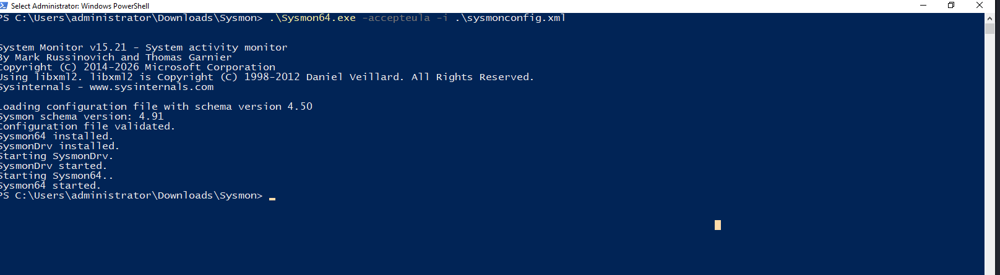
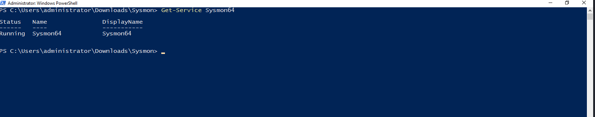
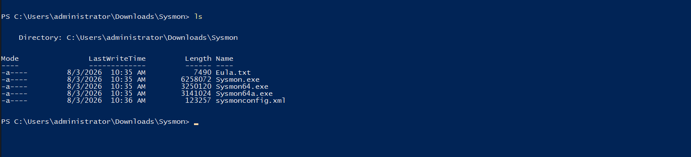
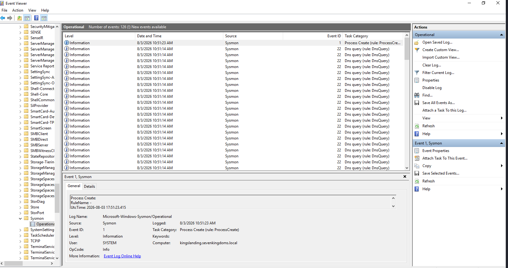
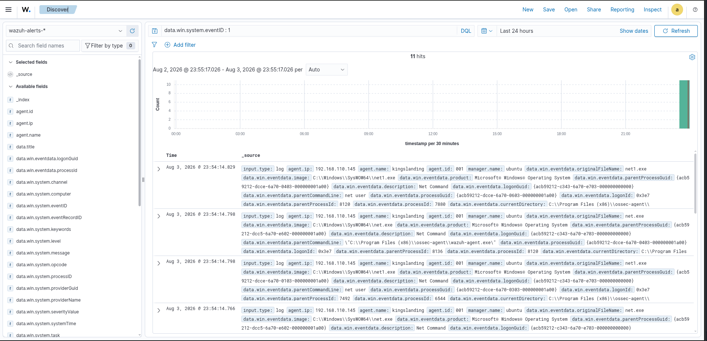
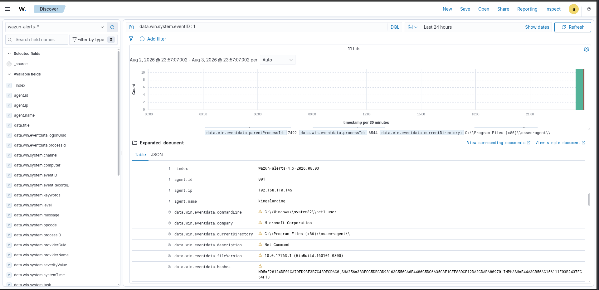

# 🛡️ Sysmon Integration

## 📌 Overview

The Sysmon Integration phase enhances endpoint visibility within the Wazuh Enterprise SOC Lab by deploying Microsoft Sysinternals Sysmon across all Windows servers. Sysmon provides advanced Windows telemetry, including process creation, network activity, file operations, registry modifications, and DNS queries, enabling detailed endpoint monitoring and threat detection.

All Sysmon events are collected through the Wazuh Agent, forwarded to the Wazuh Manager, indexed in OpenSearch, and visualized through the Wazuh Dashboard for centralized security monitoring.

---

# 🎯 Objectives

- Deploy Microsoft Sysmon on all Windows servers.
- Configure Sysmon using a production-ready configuration.
- Verify Sysmon service installation.
- Validate Sysmon Operational event logs.
- Integrate Sysmon with the Wazuh Agent.
- Collect Sysmon telemetry in Wazuh Dashboard.
- Validate Process Creation monitoring.
- Improve endpoint visibility for SOC investigations.

---

# 🏗️ Sysmon Architecture

```text
                  +-----------------------+
                  | Windows Server 2019   |
                  | Sysmon + Wazuh Agent  |
                  +-----------+-----------+
                              |
                  +-----------v-----------+
                  | Windows Server 2019   |
                  | Sysmon + Wazuh Agent  |
                  +-----------+-----------+
                              |
                  +-----------v-----------+
                  | Windows Server 2016   |
                  | Sysmon + Wazuh Agent  |
                  +-----------+-----------+
                              |
                  +-----------v-----------+
                  | Windows Server 2016   |
                  | Sysmon + Wazuh Agent  |
                  +-----------+-----------+
                              |
                  +-----------v-----------+
                  | Windows Server 2019   |
                  | Sysmon + Wazuh Agent  |
                  +-----------+-----------+
                              |
                              |
                              v
                   +-----------------------+
                   |     Wazuh Manager     |
                   +-----------+-----------+
                               |
                               v
                   +-----------------------+
                   |    Wazuh Indexer      |
                   +-----------+-----------+
                               |
                               v
                   +-----------------------+
                   |   Wazuh Dashboard     |
                   +-----------------------+
```

---

# 🔍 Sysmon Configuration

The lab uses Microsoft Sysinternals Sysmon with the **SwiftOnSecurity** Sysmon configuration to provide enterprise-grade Windows endpoint telemetry while reducing unnecessary event noise.

### Configuration Highlights

- Process Creation Monitoring
- File Creation Monitoring
- Registry Monitoring
- DNS Query Monitoring
- Driver Monitoring
- Image Load Monitoring
- Process Access Monitoring

---

# 📋 Deployment Summary

| Component | Status |
|-----------|--------|
| Sysmon Installed | ✅ |
| Configuration Applied | ✅ |
| Sysmon Service Running | ✅ |
| Event Viewer Operational Log | ✅ |
| Wazuh Agent Integration | ✅ |
| Process Creation Events | ✅ |

---

# 📸 Screenshots

## 01 – Sysmon Installation

Microsoft Sysmon installed successfully using a production-ready configuration.



---

## 02 – Sysmon Service

Verification that the Sysmon service is installed and running.



---

## 03 – Sysmon Configuration

Sysmon binaries and configuration file used throughout the lab deployment.



---

## 04 – Event Viewer

Windows Event Viewer displaying Sysmon Operational events generated by endpoint activity.



---

## 05 – Wazuh Sysmon Events

Sysmon telemetry successfully collected and visualized in the Wazuh Dashboard.



---

## 06 – Process Creation

Detailed Sysmon Process Creation (Event ID 1) collected and parsed by Wazuh.



---

# 📊 Important Sysmon Event IDs

| Event ID | Description |
|----------|-------------|
| 1 | Process Creation |
| 2 | File Creation Time Changed |
| 3 | Network Connection |
| 5 | Process Terminated |
| 7 | Image Loaded |
| 8 | Create Remote Thread |
| 10 | Process Access |
| 11 | File Create |
| 12 | Registry Object Create/Delete |
| 13 | Registry Value Set |
| 22 | DNS Query |

---

# 🔐 Security Monitoring Capabilities

This implementation enables monitoring of:

- Process execution
- Command-line activity
- Parent-child process relationships
- File creation events
- Registry modifications
- DNS queries
- Network connections (when enabled by configuration)
- Endpoint telemetry collection
- Threat investigation
- Security event correlation

---

# ✅ Key Outcomes

- Successfully deployed Sysmon across all Windows servers.
- Applied a standardized enterprise Sysmon configuration.
- Validated Sysmon service operation.
- Confirmed Sysmon Operational event generation.
- Integrated Sysmon with Wazuh Agent.
- Verified Process Creation event collection in Wazuh.
- Improved endpoint visibility for SOC monitoring and investigations.

---

# 🛠️ Technologies Used

- Microsoft Sysmon
- Microsoft Sysinternals
- Wazuh Agent
- Wazuh Manager
- Wazuh Dashboard
- OpenSearch
- Windows Server 2016
- Windows Server 2019
- PowerShell
- SwiftOnSecurity Sysmon Configuration

---

# 💡 Skills Demonstrated

- Endpoint Monitoring
- Sysmon Deployment
- Windows Security Monitoring
- Wazuh Administration
- Event Collection
- Event Parsing
- Windows Event Analysis
- SIEM Integration
- Endpoint Telemetry
- Security Operations (SOC)

---

# 📁 Folder Structure

```text
06-Sysmon
│
├── README.md
│
├── Configuration
│   ├── Install-Sysmon.ps1
│   ├── sysmonconfig.xml
│   └── Sysmon-Version.txt
│
└── screenshots
    ├── 01-Sysmon-Installation.png
    ├── 02-Sysmon-Service.png
    ├── 03-Sysmon-Configuration.png
    ├── 04-Event-Viewer-Sysmon.png
    ├── 05-Wazuh-Sysmon-Events.png
    └── 06-Process-Creation.png
```

---

# 🚀 Next Phase

The next phase focuses on **File Integrity Monitoring (FIM)** using Wazuh to detect unauthorized file modifications, monitor critical system directories, and generate alerts for suspicious file activity.

➡️ **Next:** `07-File-Integrity-Monitoring`
