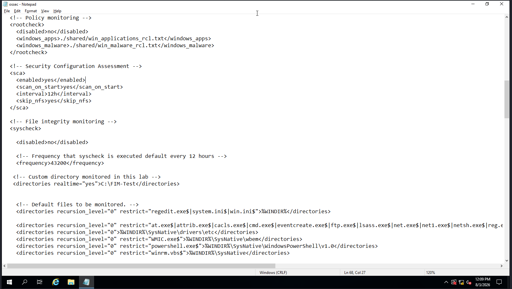
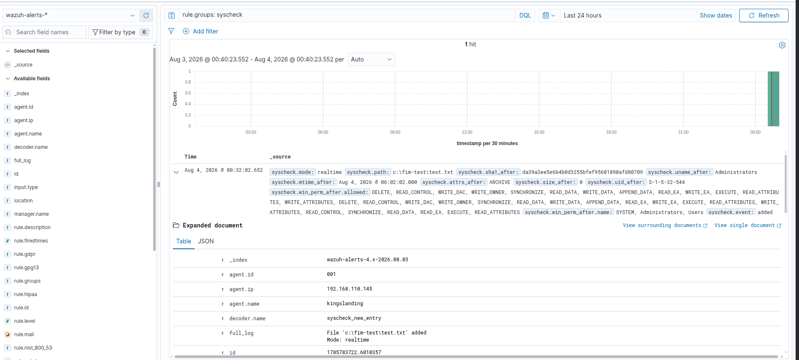
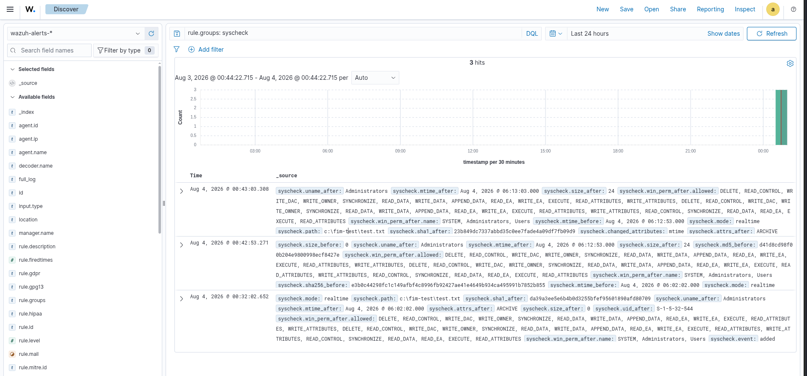
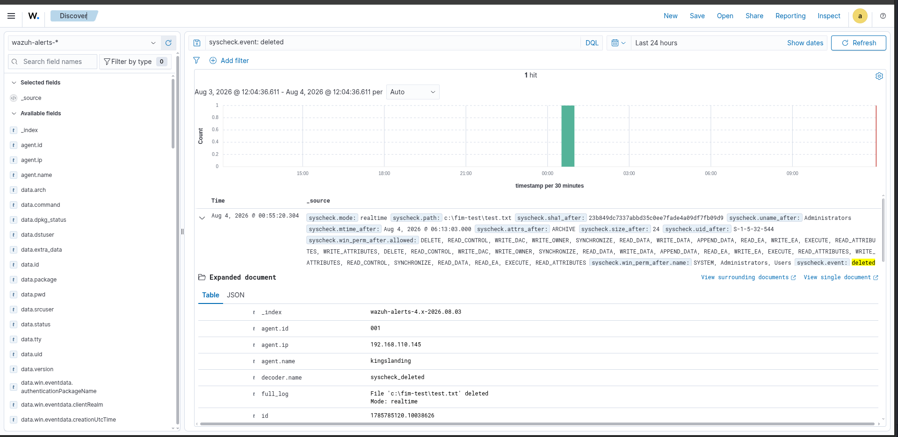
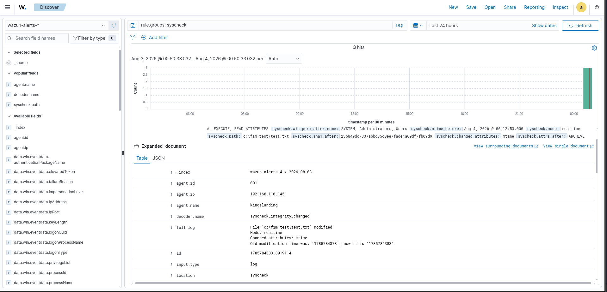
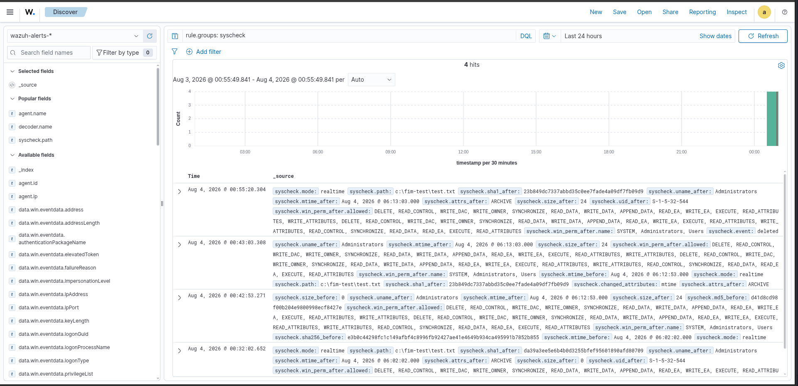

# 07 - File Integrity Monitoring (FIM)

## Overview

This lab demonstrates how to configure and validate **File Integrity Monitoring (FIM)** using the Wazuh Agent on Windows. A custom directory (`C:\FIM-Test`) is monitored in real time, allowing Wazuh to detect file creation, modification, and deletion events.

---

## Objectives

- Configure Wazuh File Integrity Monitoring
- Monitor a custom Windows directory
- Detect file creation, modification, and deletion
- Verify alerts in the Wazuh Dashboard
- Document the monitoring workflow

---

## Lab Environment

| Component | Value |
|----------|-------|
| SIEM | Wazuh |
| Agent OS | Windows Server 2019 |
| Monitoring Mode | Real-time |
| Test Directory | `C:\FIM-Test` |

---

## Configuration

The Wazuh Agent was configured to monitor a custom directory by adding the following entry inside the `<syscheck>` section of `ossec.conf`.

```xml
<directories realtime="yes">C:\FIM-Test</directories>
```

The complete configuration used in this lab is available in:

```
Configuration/ossec.conf-fim.xml
```

---

# Validation Steps

### 1. Configure File Integrity Monitoring

Added the custom directory to the Wazuh Agent configuration.

**Screenshot**



---

### 2. Create a Test File

Created a new file inside the monitored directory.

```
C:\FIM-Test\test.txt
```

Wazuh detected the new file immediately.

**Screenshot**



---

### 3. Modify the File

Edited the contents of `test.txt`.

Wazuh generated a File Integrity Monitoring alert indicating the file was modified.

**Screenshot**



---

### 4. Delete the File

Deleted the monitored file.

Wazuh generated a file deletion event.

**Screenshot**



---

### 5. Inspect Event Details

Opened the alert to review detailed metadata, including:

- File path
- SHA1 hash
- File permissions
- Agent information
- Event type
- Timestamp

**Screenshot**



---

### 6. Review the Dashboard

Verified that Wazuh displayed all File Integrity Monitoring events in Discover.

Observed events included:

- File Created
- File Modified
- File Deleted

**Screenshot**



---

# Result

Successfully configured Wazuh File Integrity Monitoring to monitor a custom Windows directory in real time.

The lab verified that Wazuh correctly detected:

- File creation
- File modification
- File deletion

These events were forwarded by the Wazuh Agent and successfully indexed and visualized in the Wazuh Dashboard.

---

## Files

```
07-File-Integrity-Monitoring/
├── Configuration/
│   └── ossec.conf-fim.xml
├── screenshots/
│   ├── 01-FIM-Configuration.png
│   ├── 02-FIM-File-Created.png
│   ├── 03-FIM-File-Modified.png
│   ├── 04-FIM-File-Deleted.png
│   ├── 05-FIM-Event-Details.png
│   └── 06-Wazuh-FIM-Dashboard.png
└── README.md
```

---

## Key Skills Demonstrated

- Wazuh Agent Configuration
- File Integrity Monitoring (FIM)
- Windows Security Monitoring
- Real-time File Monitoring
- Security Event Analysis
- Wazuh Dashboard Investigation
