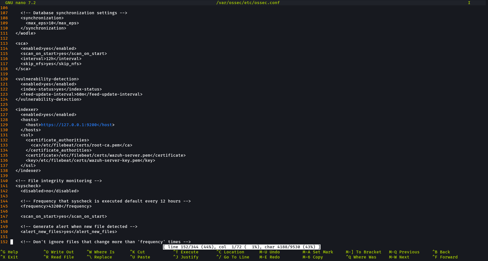
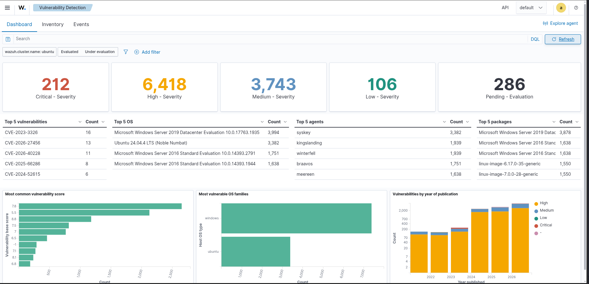
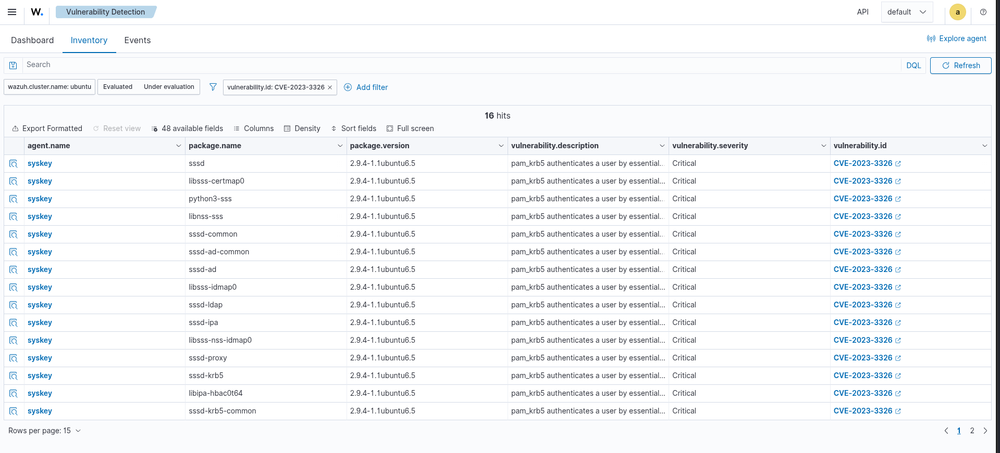
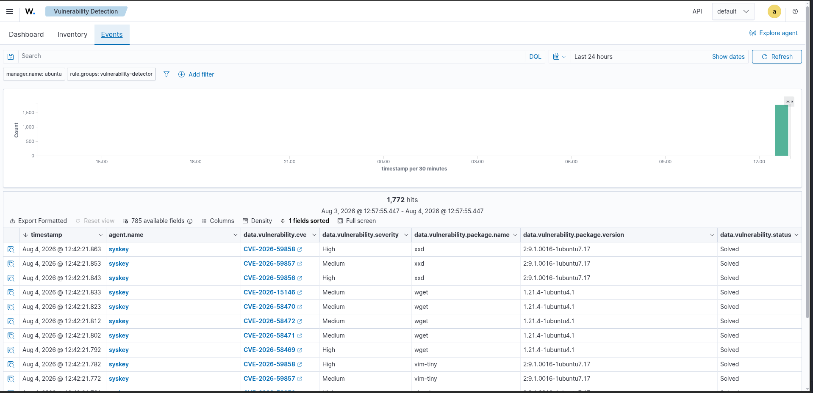
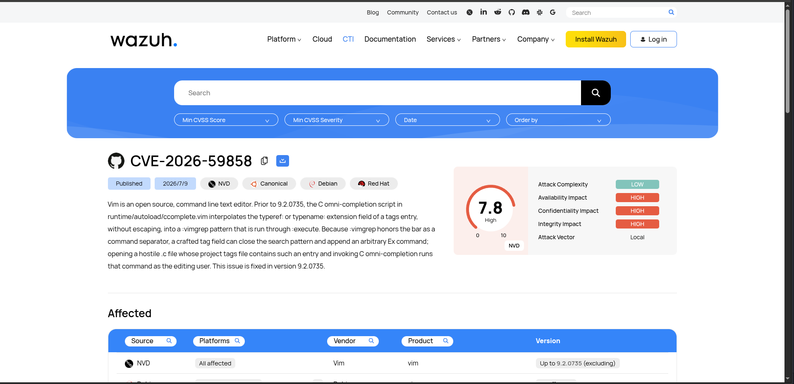

# 08 - Vulnerability Detection

## Overview

This lab demonstrates how to configure and validate **Wazuh Vulnerability Detection** using a **Wazuh Manager** and an **Ubuntu 24.04 Wazuh Agent**. The Wazuh Manager downloads vulnerability intelligence feeds and correlates them with the software inventory collected by the Ubuntu agent through **Syscollector**. Detected vulnerabilities are presented in the Wazuh Dashboard, enabling analysts to investigate affected packages, CVEs, severity levels, and vulnerability events.

---

# Objectives

- Configure Vulnerability Detection on the Wazuh Manager.
- Collect software inventory using the Ubuntu Wazuh Agent.
- Synchronize vulnerability intelligence feeds.
- Detect vulnerable software packages.
- Investigate vulnerabilities using the Wazuh Dashboard.
- Review vulnerability events and CVE details.

---

# Lab Environment

| Component | Details |
|-----------|---------|
| SIEM Platform | Wazuh 4.x |
| Wazuh Manager | Ubuntu Server |
| Endpoint | Ubuntu 24.04 |
| Wazuh Agent | Ubuntu Agent |
| Inventory Module | Syscollector |
| Detection Module | Vulnerability Detection |
| Threat Intelligence | Wazuh CTI |

---

# Architecture

```text
                   Wazuh Manager
                          │
          Downloads Vulnerability Intelligence
                          │
                          ▼
             Correlates Installed Packages
                          ▲
                          │
                Syscollector Inventory
                          ▲
                          │
                 Ubuntu 24.04 Wazuh Agent
```

---

# Configuration

## Wazuh Manager

The Wazuh Manager was configured to enable Vulnerability Detection and synchronize vulnerability intelligence feeds.

Configuration File

```
/var/ossec/etc/ossec.conf
```

Configuration included in:

```
Configuration/
└── manager-vulnerability-detection.xml
```

---

## Ubuntu Agent

The Ubuntu Wazuh Agent was configured to collect software inventory using the Syscollector module.

Configuration File

```
/var/ossec/etc/ossec.conf
```

Configuration included in:

```
Configuration/
└── ubuntu-agent-ossec.conf.xml
```

---

# Validation

The following validation tasks were completed successfully.

- Vulnerability Detection enabled.
- Software inventory collected.
- Vulnerability intelligence synchronized.
- Vulnerable packages detected.
- Vulnerability inventory displayed.
- Vulnerability events generated.
- CVE details investigated.

---

# Screenshots

## 1. Vulnerability Detection Enabled

Shows the Wazuh Manager configuration with Vulnerability Detection enabled.



---

## 2. Vulnerability Inventory

Displays the Vulnerability Detection dashboard with severity distribution, top vulnerabilities, affected operating systems, and vulnerable packages.



---

## 3. Critical Vulnerability

Displays a detected critical vulnerability affecting the Ubuntu endpoint, including the affected package, installed version, severity, and CVE identifier.



---

## 4. Vulnerability Events

Displays vulnerability events generated by Wazuh, including timestamps, CVE identifiers, package names, severity levels, and event status.



---

## 5. Vulnerability Details

Displays detailed information about the selected vulnerability, including CVSS score, description, attack vector, published date, and impact.



---

# Detection Workflow

```text
Ubuntu Wazuh Agent
        │
        ▼
Syscollector
        │
Collect Installed Software
        │
        ▼
Wazuh Manager
        │
Downloads Wazuh CTI Feeds
        │
Correlates Installed Packages
        │
with Known CVEs
        │
        ▼
Generates Vulnerability Events
        │
        ▼
Wazuh Dashboard
        │
Dashboard
Inventory
Events
Vulnerability Details
```

---

# Skills Demonstrated

- Wazuh Vulnerability Detection
- Ubuntu Endpoint Monitoring
- Syscollector
- Software Inventory Collection
- CVE Analysis
- CVSS Interpretation
- Threat Intelligence Correlation
- Security Monitoring
- Vulnerability Assessment
- Security Investigation

---

# Key Takeaways

- Successfully configured Wazuh Vulnerability Detection.
- Collected Ubuntu software inventory using Syscollector.
- Correlated installed software with vulnerability intelligence.
- Identified vulnerable software packages.
- Investigated vulnerability events using the Wazuh Dashboard.
- Reviewed detailed CVE information for vulnerability analysis.

---

# Configuration Files

```
Configuration/
├── manager-vulnerability-detection.xml
└── ubuntu-agent-ossec.conf.xml
```

---

# Project Structure

```text
08-Vulnerability-Detection/
│
├── Configuration/
│   ├── manager-vulnerability-detection.xml
│   └── ubuntu-agent-ossec.conf.xml
│
├── screenshots/
│   ├── 01-Vulnerability-Detection-Enabled.png
│   ├── 02-Vulnerability-Inventory.png
│   ├── 03-Critical-Vulnerability.png
│   ├── 04-Vulnerability-Events.png
│   └── 05-Vulnerability-Details.png
│
└── README.md
```

---

# References

- Wazuh Documentation
- Wazuh Vulnerability Detection Documentation
- Wazuh CTI
- MITRE CVE Program
- NIST National Vulnerability Database (NVD)

---

# Conclusion

This lab demonstrates an end-to-end vulnerability management workflow using Wazuh. The Ubuntu Wazuh Agent collects software inventory through Syscollector, the Wazuh Manager correlates installed packages with Wazuh CTI vulnerability intelligence, and detected vulnerabilities are investigated using the Dashboard, Inventory, Events, and Vulnerability Details views. This workflow provides continuous visibility into endpoint vulnerabilities and supports effective vulnerability assessment and remediation.
