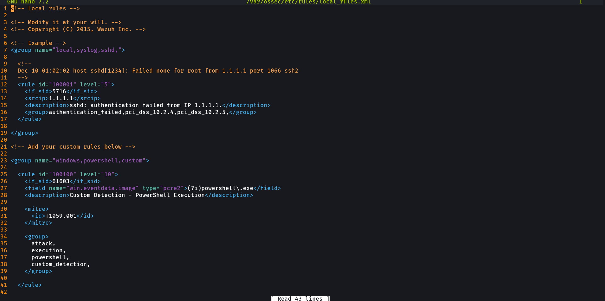
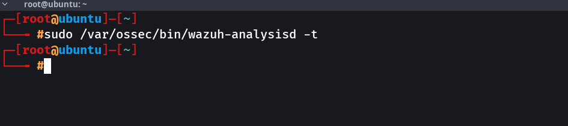
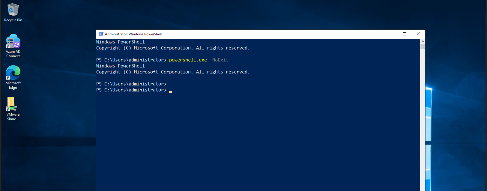
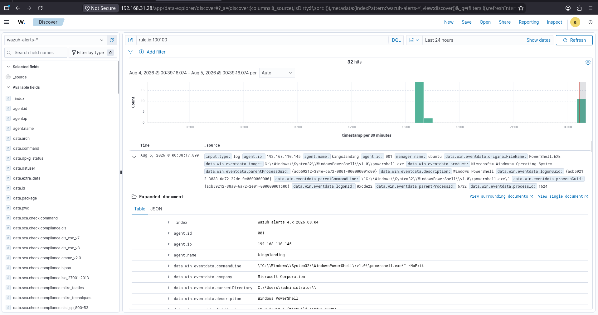
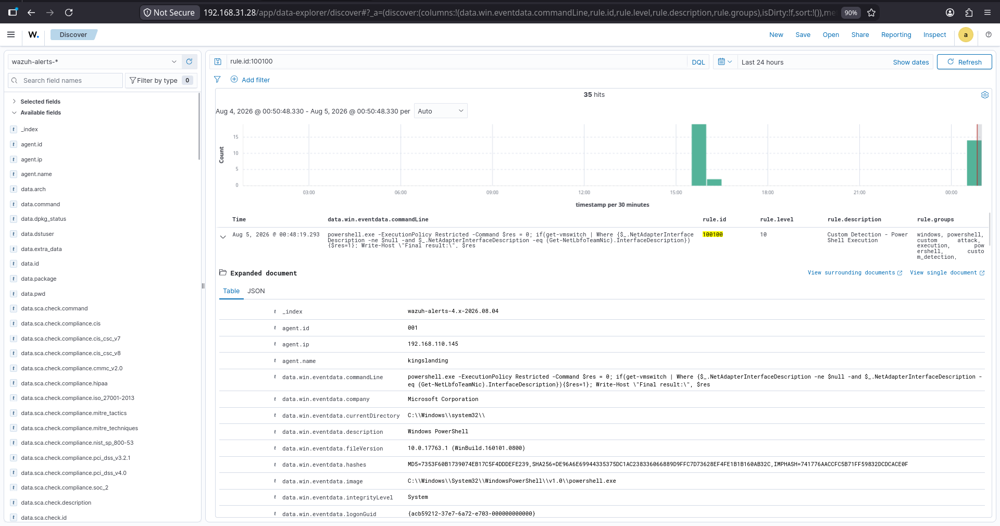

# 09 - Detection Rules

## Overview

Detection rules are the core of the Wazuh detection engine. They analyze security events collected from monitored endpoints and generate alerts when predefined conditions are met.

Wazuh includes thousands of built-in detection rules for Windows, Linux, cloud platforms, network devices, and security applications. Administrators can extend these capabilities by creating custom detection rules tailored to their organization's requirements.

In this lab, a custom detection rule was created to detect **Windows PowerShell execution**, validate the configuration, trigger the detection, and verify the generated alert in the Wazuh Dashboard.

---

# Lab Objectives

- Understand Wazuh Detection Rules
- Learn the difference between built-in and custom rules
- Create a custom detection rule
- Validate the rule configuration
- Generate a PowerShell execution event
- Trigger a custom alert
- Verify alerts in the Wazuh Dashboard
- Map the detection to MITRE ATT&CK

---

# Detection Workflow

```text
Windows Endpoint
        │
PowerShell Execution
        │
Windows Event Log
        │
Windows Agent
        │
Wazuh Manager
        │
Built-in Rule (SID 61603)
        │
Custom Rule (Rule ID 100100)
        │
Security Alert
        │
Wazuh Indexer
        │
Wazuh Dashboard
```

---

# Built-in Rules

Wazuh provides thousands of built-in detection rules located on the manager.

Location:

```text
/var/ossec/ruleset/rules/
```

Examples include:

- Windows Security
- Sysmon
- PowerShell
- Linux Authentication
- Auditd
- Docker
- Cloud Integrations

Built-in rules should not be modified directly.

---

# Custom Rules

Custom rules are stored separately from built-in rules.

Location:

```text
/var/ossec/etc/rules/local_rules.xml
```

Keeping custom rules separate ensures they are preserved during Wazuh upgrades.

---

# Custom Detection Rule

```xml
<group name="windows,powershell,custom">

  <rule id="100100" level="10">

    <if_sid>61603</if_sid>

    <field name="win.eventdata.image" type="pcre2">
      (?i)powershell\.exe
    </field>

    <description>
      Custom Detection - PowerShell Execution
    </description>

    <mitre>
      <id>T1059.001</id>
    </mitre>

    <group>
      attack,
      execution,
      powershell,
      custom_detection,
    </group>

  </rule>

</group>
```

---

# Rule Explanation

| Component | Description |
|-----------|-------------|
| Rule ID | 100100 |
| Parent SID | 61603 |
| Rule Level | 10 |
| Detection | Windows PowerShell Execution |
| Regex | `(?i)powershell\.exe` |
| MITRE ATT&CK | T1059.001 - PowerShell |

---

# Rule Validation

Before restarting the Wazuh Manager, the rule configuration was validated.

Command:

```bash
sudo /var/ossec/bin/wazuh-analysisd -t
```

The command completed successfully without returning any errors, confirming that the custom rule configuration was valid.

---

# Test Procedure

PowerShell was executed on the Windows endpoint.

```powershell
powershell.exe -NoExit
```

The Windows agent collected the event and forwarded it to the Wazuh Manager.

The custom detection rule matched the event and generated a security alert.

---

# Detection Results

The generated alerts were verified in Discover.

Search Filter:

```text
rule.id:100100
```

Multiple alerts were generated, confirming successful detection.

---

# MITRE ATT&CK Mapping

| Technique | Description |
|-----------|-------------|
| T1059 | Command and Scripting Interpreter |
| T1059.001 | PowerShell |

This mapping provides additional context by linking the detection to a known adversary technique.

---

# Screenshots

## 1. Local Rules Configuration

The custom detection rule was configured in the Wazuh Manager.



---

## 2. Rule Validation

The custom rule configuration was validated using the Wazuh analysis engine.



---

## 3. PowerShell Test

PowerShell execution on the Windows endpoint generated the event used for testing.



---

## 4. Custom Rule Triggered

The custom detection rule successfully generated alerts in the Wazuh Dashboard.



---

## 5. Alert Details

Expanded alert details showing the custom rule information, agent, and PowerShell command.



---

# Project Structure

```text
09-Detection-Rules
│
├── Configuration
│   ├── local_rules.xml
│   └── README.md
│
├── Screenshots
│   ├── 01-Local-Rules-Configuration.png
│   ├── 02-Rule-Validation.png
│   ├── 03-PowerShell-Test.png
│   ├── 04-Custom-Rule-Triggered.png
│   └── 05-Alert-Details.png
│
└── README.md
```

---

# Skills Demonstrated

- Wazuh Detection Rules
- Detection Engineering
- XML Rule Development
- Rule Validation
- Event Correlation
- Windows Event Monitoring
- PowerShell Detection
- Wazuh Dashboard Analysis
- MITRE ATT&CK Mapping
- Security Alert Investigation

---

# Key Takeaways

- Wazuh detection rules analyze collected events and generate security alerts.
- Built-in rules can be extended using custom rules without modifying the original ruleset.
- Custom rules should be stored in `/var/ossec/etc/rules/local_rules.xml`.
- Rule validation using `wazuh-analysisd -t` helps prevent configuration errors before deployment.
- PowerShell execution was successfully detected using a custom Wazuh rule (`100100`) based on the built-in rule (`61603`).
- The detection was mapped to **MITRE ATT&CK T1059.001 (PowerShell)** to provide additional threat context.
- The generated alerts were successfully verified in the Wazuh Dashboard, demonstrating an end-to-end detection workflow.
