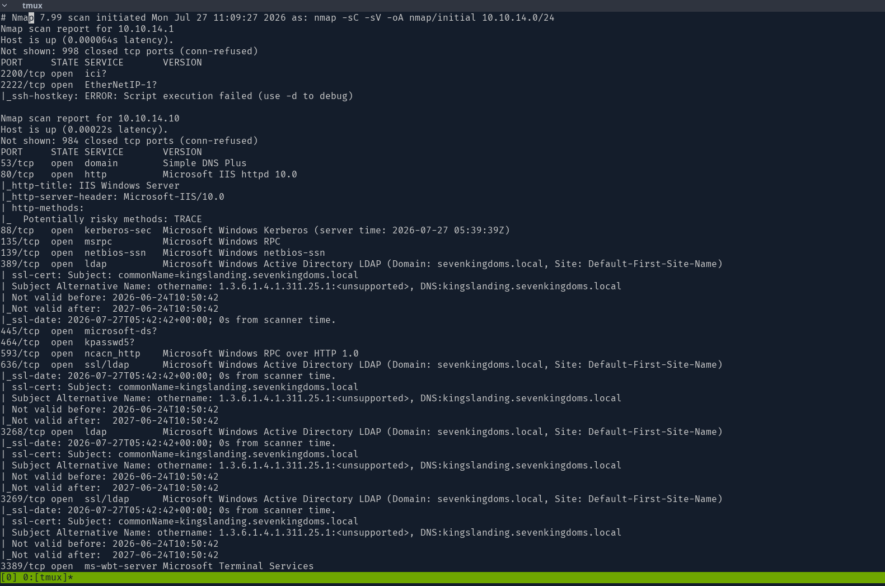
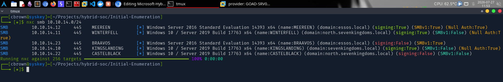
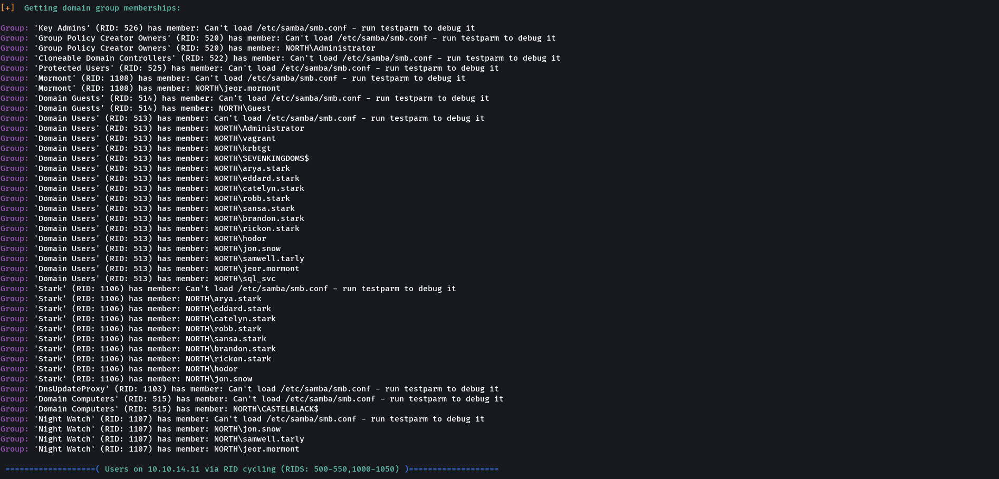
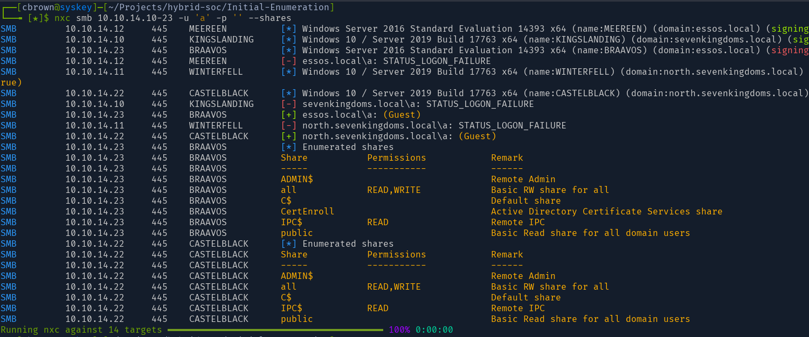
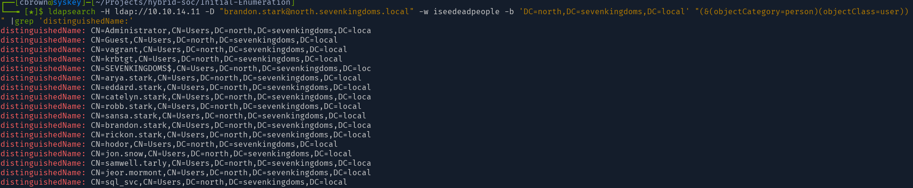
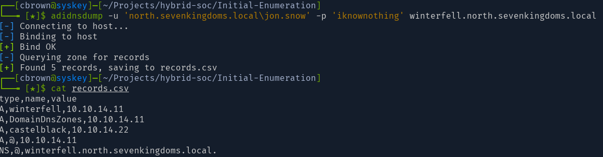
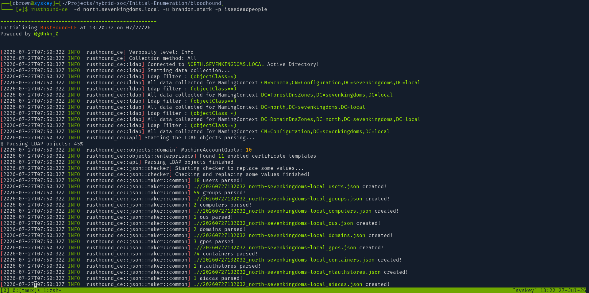
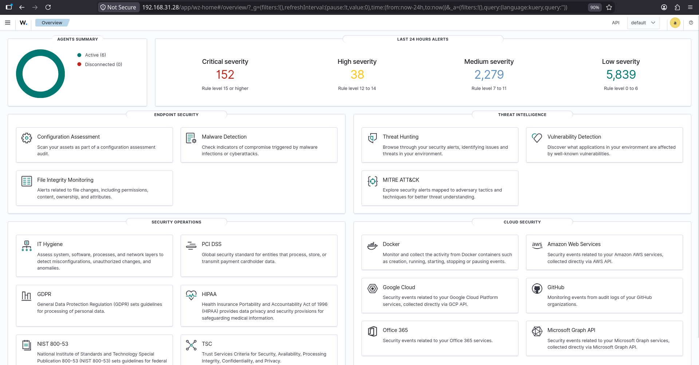
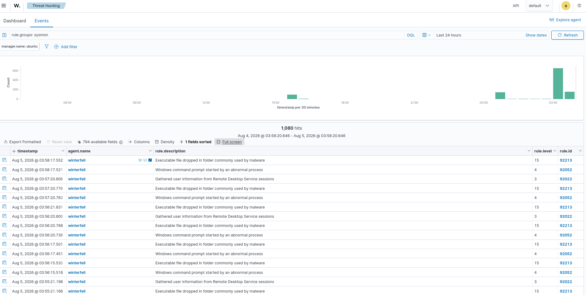

# Initial Reconnaissance

## Overview

Initial reconnaissance is the first phase of the attack lifecycle where an attacker gathers information about the target environment before attempting exploitation. The objective is to identify live hosts, open ports, Active Directory services, SMB shares, users, domain information, and trust relationships that can be leveraged during later attack stages.

This simulation was performed against the Wazuh Enterprise SOC Lab to validate endpoint telemetry collection and demonstrate how reconnaissance activities are captured by Wazuh.

---

# Objectives

- Identify live hosts within the enterprise network.
- Enumerate exposed network services.
- Enumerate SMB services and shared resources.
- Discover Active Directory users and domain information.
- Enumerate LDAP objects.
- Perform DNS enumeration.
- Collect Active Directory relationship data using RustHound.
- Validate that reconnaissance activity generates endpoint telemetry in Wazuh.

---

# MITRE ATT&CK Mapping

| Technique | ID |
|-----------|----|
| Active Scanning | T1595 |
| Network Service Discovery | T1046 |
| System Network Configuration Discovery | T1016 |
| Remote System Discovery | T1018 |
| Domain Trust Discovery | T1482 |
| Account Discovery | T1087 |
| Permission Groups Discovery | T1069 |

---

# Lab Environment

| Component | Description |
|-----------|-------------|
| SIEM | Wazuh |
| Firewall | OPNsense |
| Endpoint Monitoring | Sysmon |
| Attacker | Arch Linux |
| Target | Active Directory Lab |
| Domain Controllers | Windows Server |
| Member Servers | Windows Server |
| Linux Server | Ubuntu |

---

# Reconnaissance Tools

- Nmap
- NetExec
- enum4linux
- ldapsearch
- DNS enumeration utilities
- RustHound

---

# Attack Activities

## 1. Network Discovery

Performed host discovery and service enumeration using Nmap.

**Purpose**

- Discover live systems
- Identify open ports
- Identify running services

---

## 2. SMB Enumeration

Enumerated SMB services using NetExec.

**Purpose**

- Identify accessible SMB services
- Determine domain membership
- Identify operating systems

---

## 3. User Enumeration

Performed Active Directory user enumeration using enum4linux.

**Purpose**

- Discover domain users
- Enumerate security information

---

## 4. SMB Share Enumeration

Enumerated available SMB shares.

**Purpose**

- Identify accessible shared folders
- Discover potential sensitive data

---

## 5. LDAP Enumeration

Enumerated Active Directory objects through LDAP.

**Purpose**

- Discover users
- Discover groups
- Discover computers
- Gather domain information

---

## 6. DNS Enumeration

Performed DNS enumeration.

**Purpose**

- Identify DNS records
- Identify domain controllers
- Discover additional hosts

---

## 7. Active Directory Relationship Collection

Collected Active Directory relationship data using RustHound.

**Purpose**

- Identify privilege relationships
- Enumerate attack paths
- Prepare for BloodHound analysis

---

# Wazuh Detection

After executing reconnaissance activities, Wazuh successfully collected endpoint telemetry generated by Windows systems through Sysmon.

Observed telemetry included:

- Windows process creation events
- Windows authentication events
- Sysmon event collection
- Security event correlation
- Threat Hunting events

**Note**

Because the attacker and Windows hosts are deployed on the same Host-Only VMware network, reconnaissance traffic is exchanged directly between endpoints. As a result, these activities are primarily observed through endpoint telemetry (Sysmon and Windows Event Logs collected by Wazuh) rather than firewall traffic traversing OPNsense.

---

# Evidence

## Attack Evidence

- Nmap network scan
- SMB enumeration
- User enumeration
- SMB share enumeration
- LDAP enumeration
- DNS enumeration
- RustHound collection

## Wazuh Evidence

- Wazuh Dashboard Overview
- Sysmon Threat Hunting Events

---

# Screenshots

## Network Discovery

---

## SMB Enumeration

---

## User Enumeration

---

## SMB Shares

---

## LDAP Enumeration

---

## DNS Enumeration

---

## RustHound Collection

---

## Wazuh Dashboard

---

## Wazuh Threat Hunting Events

---

# Detection Summary

| Activity | Status |
|----------|--------|
| Network Discovery | ✅ Completed |
| SMB Enumeration | ✅ Completed |
| User Enumeration | ✅ Completed |
| SMB Share Enumeration | ✅ Completed |
| LDAP Enumeration | ✅ Completed |
| DNS Enumeration | ✅ Completed |
| RustHound Collection | ✅ Completed |
| Wazuh Telemetry | ✅ Collected |
| Threat Hunting | ✅ Verified |

---

# Key Findings

- Successfully performed enterprise reconnaissance against the Active Directory environment.
- Multiple reconnaissance techniques generated endpoint telemetry.
- Wazuh successfully collected Sysmon events generated during the assessment.
- Threat Hunting confirmed the presence of reconnaissance-related activity.
- The collected telemetry provides a strong foundation for subsequent detection engineering and incident response activities.

---

# Next Phase

The next attack simulation focuses on password spraying against Active Directory accounts to evaluate authentication monitoring and detection capabilities.

➡ **02-Password-Spraying**
