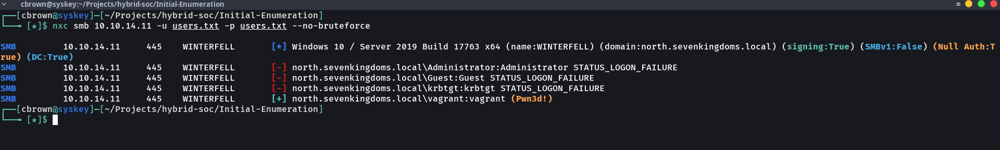
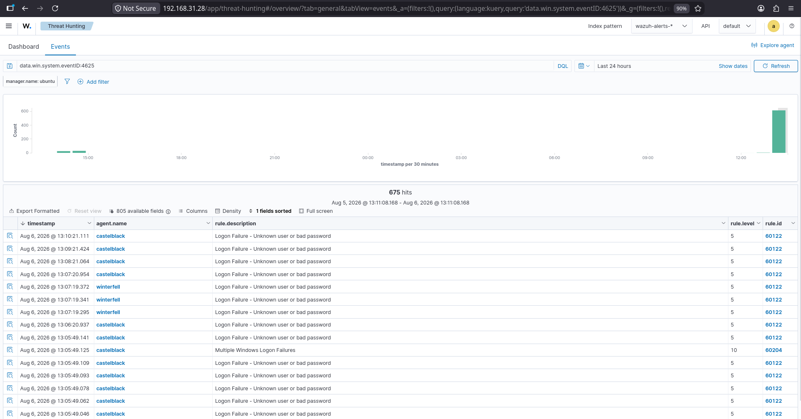
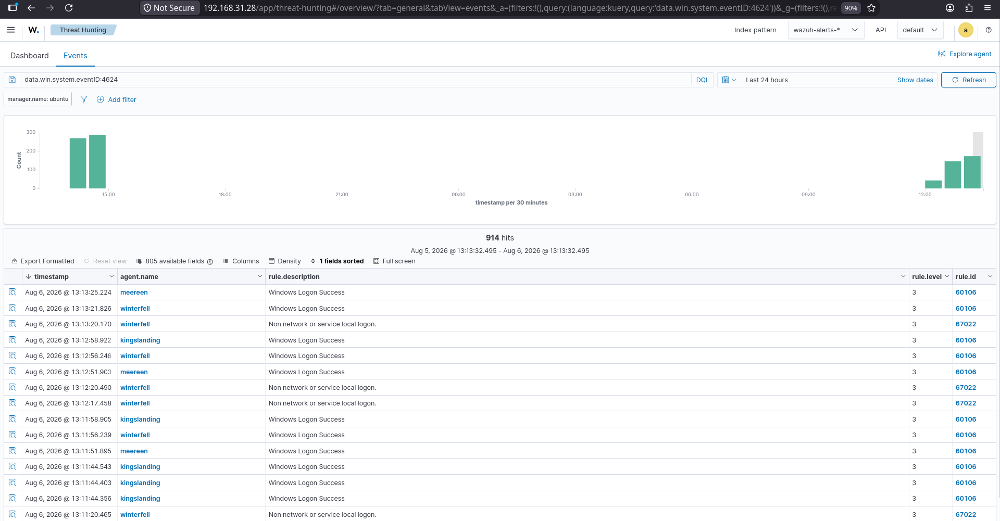
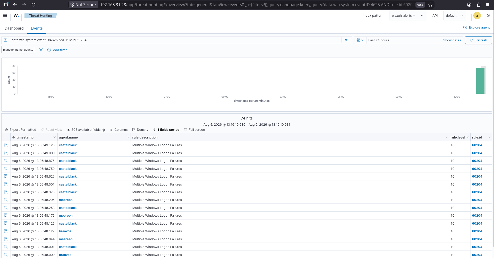

# 02 – Password Spraying

## Overview

This attack simulation demonstrates a password spraying attack against a Windows Active Directory environment using **NetExec (nxc)**. Password spraying is a technique where a single password is tested against multiple user accounts to identify valid credentials while reducing the risk of account lockout.

The objective of this exercise is to simulate a real-world authentication attack, observe how Windows logs authentication events, and validate Wazuh's ability to detect failed and successful logon attempts through Windows Security Event Logs.

---

# Objectives

- Simulate a password spraying attack against Active Directory.
- Enumerate valid credentials using NetExec.
- Generate Windows Security authentication events.
- Validate Wazuh detection of failed and successful logon attempts.
- Observe Wazuh correlation rules for multiple authentication failures.

---

# MITRE ATT&CK Mapping

| Tactic | Technique | ID |
|---------|-----------|----|
| Credential Access | Password Spraying | T1110.003 |
| Defense Evasion | Valid Accounts | T1078 |

---

# Lab Environment

| Component | Details |
|----------|---------|
| Attacker Machine | Arch Linux |
| Attack Tool | NetExec (nxc) |
| Target | WINTERFELL Domain Controller |
| Target IP | 10.10.14.11 |
| SIEM | Wazuh |
| Operating System | Windows Server 2019 |

---

# Attack Tool

**NetExec (nxc)**

NetExec is an Active Directory post-exploitation framework capable of performing authentication testing, password spraying, SMB enumeration, credential validation, and remote administration.

---

# Attack Scenario

The attacker attempts to authenticate against multiple domain accounts using a common password.

This technique helps identify weak or reused passwords without repeatedly targeting a single account, reducing the likelihood of triggering account lockout policies.

Attack workflow:

```
Arch Linux
      │
      ▼
NetExec Password Spray
      │
      ▼
Windows Domain Controller
      │
      ▼
Windows Security Logs
      │
      ▼
Wazuh Agent
      │
      ▼
Wazuh Manager
      │
      ▼
Threat Hunting Alerts
```

---

# Commands Executed

```bash
nxc smb 10.10.14.11 -u users.txt -p users.txt --no-bruteforce
```

---

# Attack Results

During the password spraying attack:

- Multiple authentication failures were generated.
- NetExec successfully identified one valid credential.
- Windows Security Event Logs recorded both failed and successful logon events.
- Wazuh successfully collected and analyzed the generated authentication events.

---

# Detection in Wazuh

Wazuh successfully detected Windows authentication activity generated during the password spraying attack.

## Failed Logon

| Event | Value |
|-------|-------|
| Windows Event ID | 4625 |
| Rule ID | 60122 |
| Severity | 5 |
| Description | Logon Failure - Unknown user or bad password |

---

## Successful Logon

| Event | Value |
|-------|-------|
| Windows Event ID | 4624 |
| Rule ID | 60106 |
| Severity | 3 |
| Description | Windows Logon Success |

---

## Correlation Rule

Wazuh correlated repeated authentication failures into a higher severity detection.

| Rule | Value |
|------|-------|
| Rule ID | 60204 |
| Description | Multiple Windows Logon Failures |
| Severity | 10 |

This demonstrates Wazuh's ability to correlate repeated failed authentication attempts into a higher confidence alert, helping SOC analysts quickly identify password spraying or brute-force attacks.

---

# Screenshots

| Screenshot | Description |
|------------|-------------|
|  | NetExec password spraying attack against the domain controller. |
|  | Wazuh detecting Windows Event ID 4625 (failed logon attempts). |
|  | Wazuh detecting Windows Event ID 4624 (successful logon). |
|  | Wazuh correlation rule (60204) identifying multiple failed authentication attempts. |

---

# Detection Summary

| Detection | Status |
|----------|--------|
| Password Spraying Executed | ✅ |
| Failed Logon Detection | ✅ |
| Successful Logon Detection | ✅ |
| Windows Event ID 4625 | ✅ |
| Windows Event ID 4624 | ✅ |
| Correlation Rule Triggered | ✅ |
| Authentication Events Collected | ✅ |

---

# Key Findings

- Password spraying generated multiple failed authentication attempts across domain accounts.
- Wazuh successfully ingested Windows Security authentication events.
- Event ID **4625** identified failed logon attempts.
- Event ID **4624** confirmed successful authentication events.
- Wazuh Rule **60204** correlated multiple failed logons into a higher severity alert, improving analyst visibility into authentication attacks.
- The simulation demonstrates how Wazuh detects and correlates credential-based attacks within an Active Directory environment.

---

# Next Phase

Continue to:

```
10-Attack-Simulation/
└── 03-Credential-Access
```

The next phase focuses on credential extraction and access techniques used after successful authentication.
