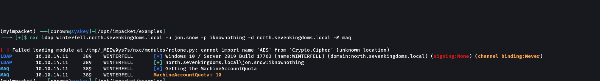
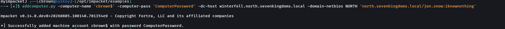
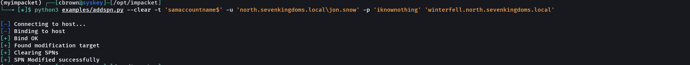
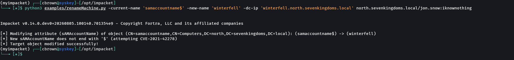
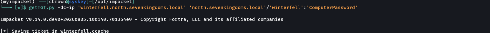
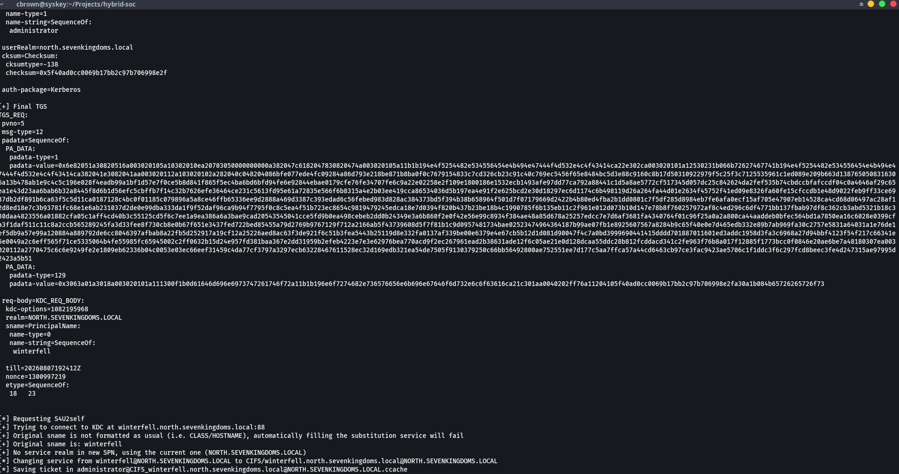
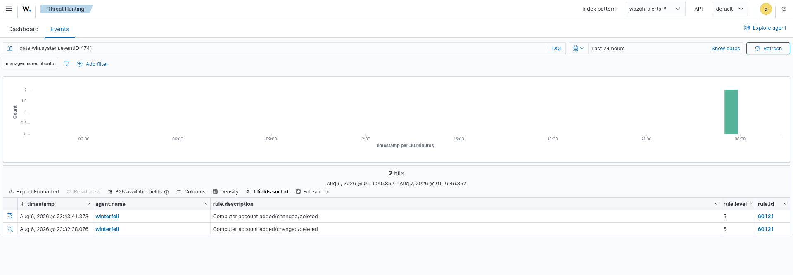
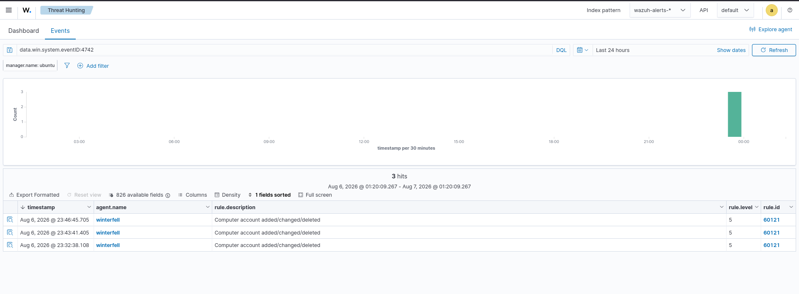

# 04 – Privilege Escalation

## Overview

After obtaining valid Active Directory credentials during the previous attack phases, the next objective was to escalate privileges within the domain. This simulation demonstrates a MachineAccountQuota (MAQ) abuse attack that leverages Active Directory computer account creation and manipulation to perform the noPac privilege escalation chain (CVE-2021-42278 / CVE-2021-42287).

The attack was executed against the Wazuh Enterprise SOC Lab to validate Active Directory security monitoring and demonstrate how privilege escalation activities are detected by Wazuh.

---

# Objectives

- Verify MachineAccountQuota configuration.
- Create a rogue computer account.
- Modify the Service Principal Name (SPN).
- Rename the computer account.
- Obtain a Kerberos Ticket Granting Ticket (TGT).
- Impersonate the Domain Administrator.
- Validate Active Directory security monitoring in Wazuh.

---

# MITRE ATT&CK Mapping

| Technique | ID |
|-----------|----|
| Valid Accounts | T1078 |
| Create Account | T1136 |
| Create Domain Account | T1136.002 |
| Account Manipulation | T1098 |
| Abuse Elevation Control Mechanism | T1548 |
| Steal or Forge Kerberos Tickets | T1558 |

---

# Lab Environment

| Component | Description |
|-----------|-------------|
| SIEM | Wazuh |
| Firewall | OPNsense |
| Endpoint Monitoring | Sysmon |
| Attacker | Arch Linux |
| Target | Windows Active Directory |
| Domain Controller | WINTERFELL |
| Domain | north.sevenkingdoms.local |

---

# Attack Tools

- NetExec
- Impacket
- LDAP
- Kerberos
- Python

---

# Attack Workflow

```text
Valid Domain User (jon.snow)
        │
        ▼
Authenticate to LDAP
        │
        ▼
Check MachineAccountQuota
        │
        ▼
Create Rogue Machine Account
        │
        ▼
Modify SPN
        │
        ▼
Rename Computer Account
        │
        ▼
Request Kerberos TGT
        │
        ▼
Impersonate Administrator (S4U2Self)
        │
        ▼
Privilege Escalation
```

---

# Attack Activities

## 1. MachineAccountQuota Enumeration

Authenticated to LDAP using a valid domain user account and verified that the domain allowed standard users to create computer accounts.

**Purpose**

- Verify MachineAccountQuota
- Determine whether computer account abuse is possible

---

## 2. Rogue Computer Account Creation

Created a new computer account within Active Directory using Impacket.

**Purpose**

- Register a controlled machine account
- Prepare the privilege escalation chain

---

## 3. SPN Modification

Modified the Service Principal Name (SPN) associated with the rogue computer account.

**Purpose**

- Prepare Kerberos manipulation
- Support the noPac attack chain

---

## 4. Computer Account Rename

Renamed the machine account by modifying the `sAMAccountName` attribute.

**Purpose**

- Abuse CVE-2021-42278
- Prepare for Kerberos impersonation

---

## 5. Kerberos Ticket Request

Requested a Kerberos Ticket Granting Ticket (TGT) for the rogue computer account.

**Purpose**

- Obtain a valid Kerberos TGT
- Continue Kerberos authentication flow

---

## 6. Administrator Impersonation

Used the obtained Kerberos ticket to perform S4U2Self impersonation of the Domain Administrator.

**Purpose**

- Request an Administrator service ticket
- Demonstrate privilege escalation through Kerberos

---

# Wazuh Detection

During the privilege escalation simulation, Wazuh successfully collected Windows Security events generated by Active Directory.

Observed detections included:

- Computer account creation
- Computer account modification
- Active Directory account monitoring
- Security event correlation

---

## Detection Summary

### Windows Security Event ID 4741

Detected creation of a new Active Directory computer account.

| Field | Value |
|------|------|
| Event ID | 4741 |
| Rule ID | 60121 |
| Description | Computer account added/changed/deleted |
| Severity | 5 |

---

### Windows Security Event ID 4742

Detected modification of an existing Active Directory computer account.

| Field | Value |
|------|------|
| Event ID | 4742 |
| Rule ID | 60121 |
| Description | Computer account added/changed/deleted |
| Severity | 5 |

---

### Note

Windows Security Event ID **5136 (Directory Service Object Modified)** was not generated during this lab because **Directory Service Changes** auditing was not enabled on the Domain Controller. Consequently, Wazuh could not collect events related to SPN or LDAP attribute modifications.

---

# Evidence

## Attack Evidence

- MachineAccountQuota enumeration
- Rogue computer account creation
- SPN modification
- Computer account rename
- Kerberos TGT acquisition
- Administrator impersonation

---

## Wazuh Evidence

- Windows Event ID 4741
- Windows Event ID 4742
- Active Directory monitoring
- Threat Hunting verification

---

# Screenshots

## 1. MachineAccountQuota Enumeration



---

## 2. Rogue Computer Account Creation



---

## 3. SPN Modification



---

## 4. Computer Account Rename



---

## 5. Kerberos TGT Request



---

## 6. Administrator Impersonation



---

## 7. Wazuh Detection – Computer Account Created



---

## 8. Wazuh Detection – Computer Account Modified



---

# Detection Summary

| Activity | Status |
|----------|--------|
| MachineAccountQuota Enumeration | ✅ Completed |
| Rogue Computer Account Creation | ✅ Completed |
| SPN Modification | ✅ Completed |
| Computer Account Rename | ✅ Completed |
| Kerberos TGT Request | ✅ Completed |
| Administrator Impersonation | ✅ Completed |
| Wazuh Detection | ✅ Verified |

---

# Key Findings

- Successfully abused MachineAccountQuota to create a rogue Active Directory computer account.
- Demonstrated computer account manipulation through SPN and `sAMAccountName` modifications.
- Successfully obtained a Kerberos Ticket Granting Ticket (TGT) for the rogue computer account.
- Successfully performed S4U2Self impersonation of the Domain Administrator.
- Wazuh detected both computer account creation (Event ID 4741) and computer account modification (Event ID 4742).
- Directory Service Changes auditing was not enabled; therefore, Event ID 5136 was not available for correlation.
- The collected telemetry demonstrates Wazuh's ability to detect key Active Directory changes associated with privilege escalation attacks.

---
