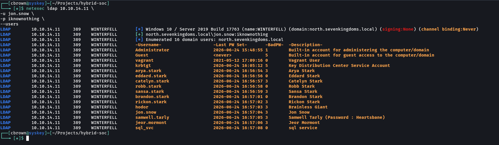
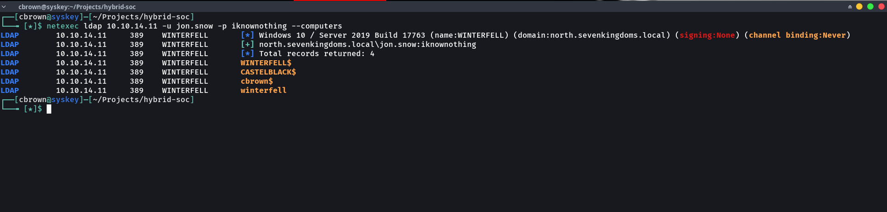
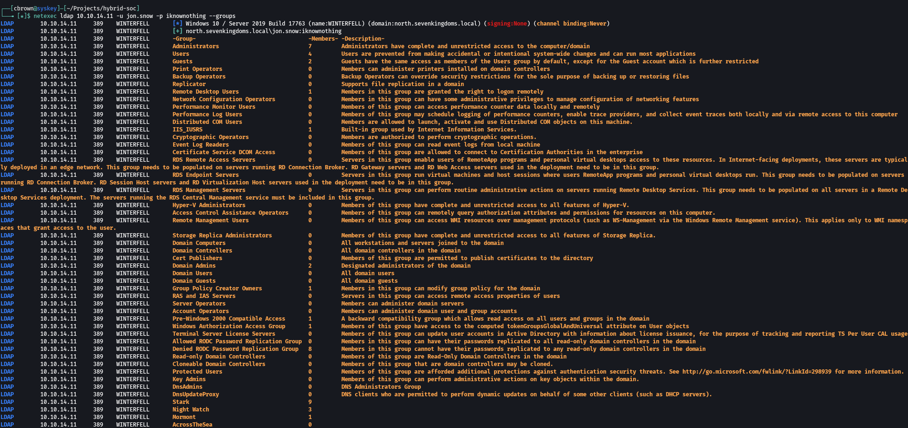
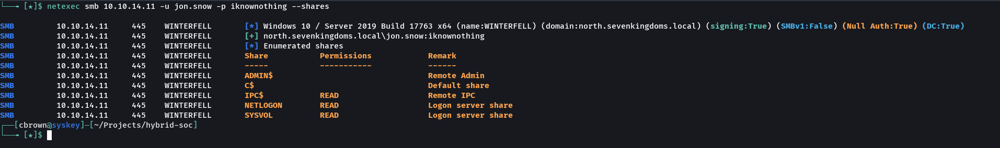
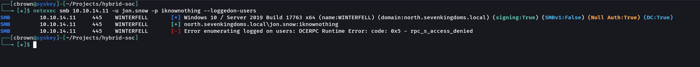
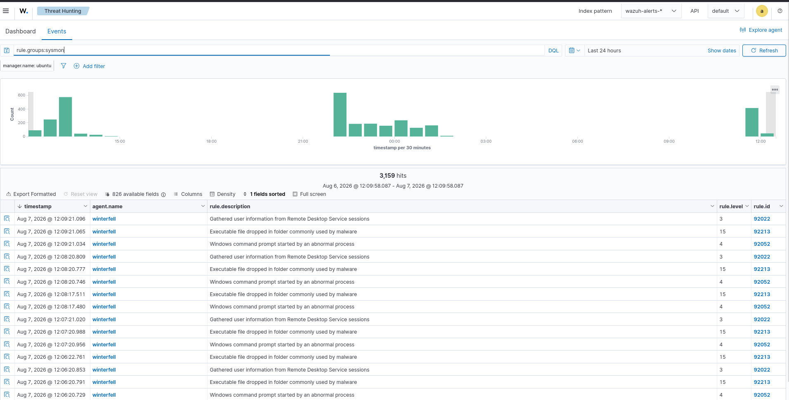
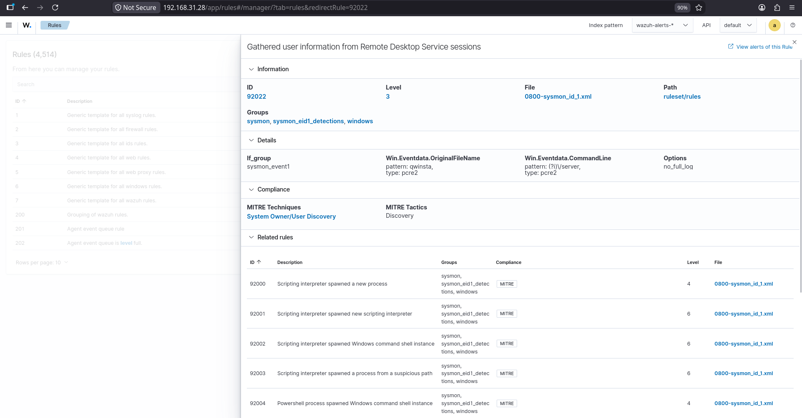

# Discovery

## Overview

Discovery is the post-compromise phase of the attack lifecycle where an attacker gathers detailed information about the compromised Active Directory environment. After obtaining valid credentials and elevated privileges, the attacker enumerates domain users, computers, security groups, SMB shares, and logged-on users to understand the environment and identify potential targets for lateral movement.

This simulation demonstrates common Active Directory discovery techniques using NetExec against the Wazuh Enterprise SOC Lab while validating that endpoint telemetry generated by these activities is collected and analyzed through Wazuh and Sysmon.

---

# Objectives

- Enumerate Active Directory users.
- Enumerate domain computers.
- Enumerate Active Directory groups.
- Enumerate SMB shares.
- Enumerate logged-on users.
- Validate endpoint telemetry collection.
- Investigate discovery-related events using Wazuh Threat Hunting.

---

# MITRE ATT&CK Mapping

| Technique | ID |
|-----------|----|
| Account Discovery | T1087 |
| Domain Account Discovery | T1087.002 |
| Domain Groups Discovery | T1069.002 |
| Network Share Discovery | T1135 |
| System Owner/User Discovery | T1033 |
| Remote System Discovery | T1018 |

---

# Lab Environment

| Component | Description |
|-----------|-------------|
| SIEM | Wazuh |
| Endpoint Monitoring | Sysmon |
| Firewall | OPNsense |
| Attacker | Arch Linux |
| Target | Active Directory Domain |
| Domain Controller | Windows Server 2019 |
| Domain | north.sevenkingdoms.local |

---

# Discovery Tools

- NetExec (NetExec/NXC)
- LDAP
- SMB
- Wazuh Threat Hunting
- Sysmon

---

# Attack Workflow

```text
Compromised User Account
        │
        ▼
Enumerate Domain Users
        │
        ▼
Enumerate Domain Computers
        │
        ▼
Enumerate Domain Groups
        │
        ▼
Enumerate SMB Shares
        │
        ▼
Enumerate Logged-on Users
        │
        ▼
Generate Endpoint Telemetry
        │
        ▼
Investigate Detection in Wazuh
```

---

# Discovery Activities

## 1. Domain User Enumeration

Enumerated Active Directory user accounts.

**Purpose**

- Identify valid domain users.
- Discover privileged accounts.
- Understand the Active Directory environment.

---

## 2. Domain Computer Enumeration

Enumerated all domain-joined computers.

**Purpose**

- Identify servers and workstations.
- Discover lateral movement targets.

---

## 3. Domain Group Enumeration

Enumerated Active Directory security groups.

**Purpose**

- Identify privileged groups.
- Understand administrative memberships.
- Discover security boundaries.

---

## 4. Network Share Enumeration

Enumerated available SMB shares.

**Purpose**

- Identify accessible network resources.
- Discover shared folders.
- Locate sensitive data repositories.

---

## 5. Logged-on User Enumeration

Enumerated active user sessions.

**Purpose**

- Identify currently logged-on users.
- Discover privileged sessions.
- Identify potential lateral movement opportunities.

---

# Wazuh Detection

Following execution of the discovery commands, Wazuh successfully collected endpoint telemetry generated by Sysmon.

Observed telemetry included:

- Process creation events
- Discovery activity
- Remote Desktop session enumeration
- Sysmon Event ID 1
- Threat Hunting events

---

# Detection Analysis

Wazuh generated a detection for Remote Desktop session enumeration.

**Detection Rule**

| Property | Value |
|----------|-------|
| Rule ID | **92022** |
| Rule Name | Gathered user information from Remote Desktop Service sessions |
| Rule Group | sysmon |
| Severity | 3 |

**MITRE ATT&CK**

| Tactic | Technique |
|---------|-----------|
| Discovery | T1033 – System Owner/User Discovery |

This confirms that Wazuh successfully detected post-compromise discovery activity through Sysmon process monitoring.

---

# Evidence

## Attack Evidence

- Domain user enumeration
- Domain computer enumeration
- Domain group enumeration
- Network share enumeration
- Logged-on user enumeration

## Wazuh Evidence

- Threat Hunting events
- Discovery detection rule
- Sysmon telemetry

---

# Screenshots

## Domain User Enumeration



---

## Domain Computer Enumeration



---

## Domain Group Enumeration



---

## Network Share Enumeration



---

## Logged-on User Enumeration



---

## Wazuh Discovery Events



---

## Wazuh Detection Rule Details



---

# Detection Summary

| Activity | Status |
|----------|--------|
| Domain User Enumeration | ✅ Completed |
| Domain Computer Enumeration | ✅ Completed |
| Domain Group Enumeration | ✅ Completed |
| Network Share Enumeration | ✅ Completed |
| Logged-on User Enumeration | ✅ Completed |
| Sysmon Telemetry | ✅ Collected |
| Wazuh Threat Hunting | ✅ Verified |
| Discovery Detection | ✅ Verified |

---

# Key Findings

- Successfully enumerated Active Directory users, computers, groups, and SMB shares.
- Identified logged-on user sessions for potential follow-on attacks.
- Wazuh successfully collected Sysmon telemetry generated during discovery activities.
- Wazuh Rule **92022** detected Remote Desktop session enumeration.
- Discovery activity was successfully mapped to **MITRE ATT&CK T1033 (System Owner/User Discovery)**.
- Endpoint telemetry provided clear visibility into post-compromise discovery operations.

---

# Next Phase

The next attack simulation focuses on **Execution**, where the attacker executes commands and payloads on compromised systems to establish operational control.

➡ **06-Execution**
