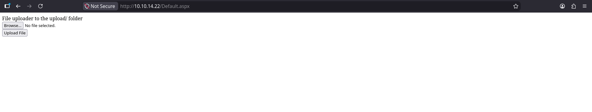
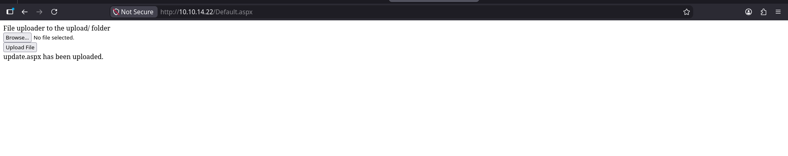
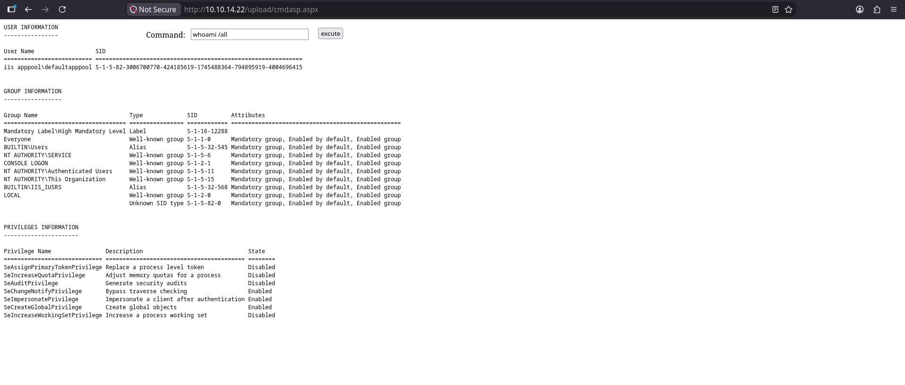
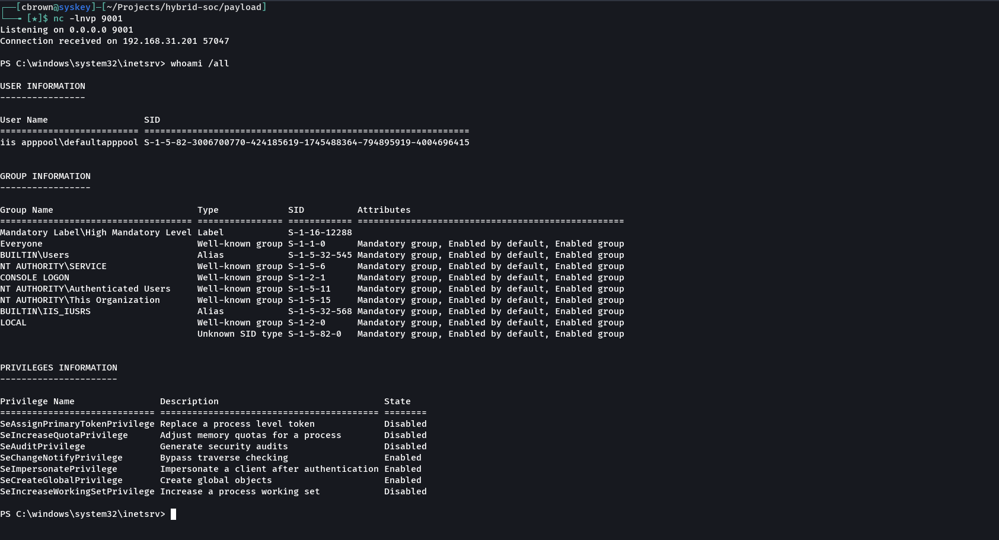
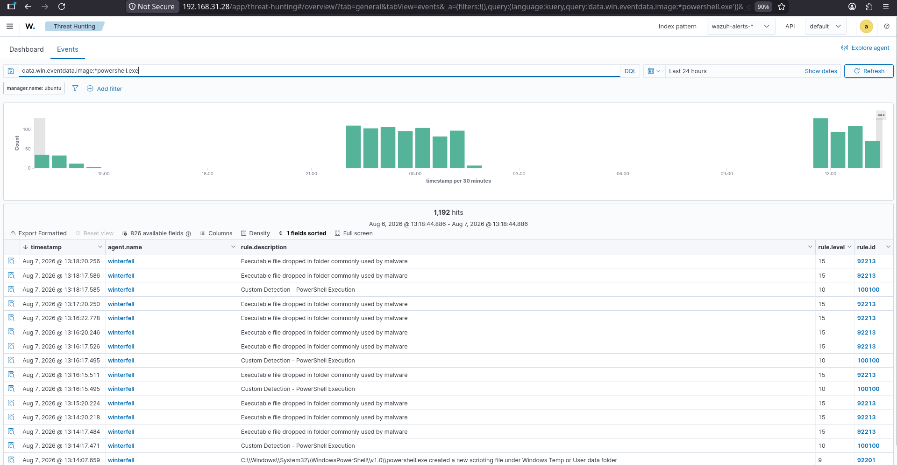
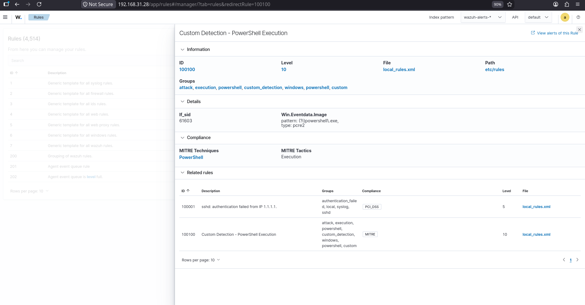

# Execution

## Overview

The Execution phase focuses on gaining code execution on a target system after identifying an exposed attack surface. In this simulation, a vulnerable ASP.NET web application that allows unrestricted file uploads was abused to upload an ASPX web shell. The web shell was then used to execute operating system commands, ultimately resulting in an interactive reverse shell on the compromised IIS server.

Throughout the attack, Wazuh successfully detected PowerShell execution and generated both built-in Sysmon detections and a custom detection rule created specifically for this lab.

---

# Objectives

- Identify a vulnerable file upload functionality.
- Upload a malicious ASPX web shell.
- Execute operating system commands through the web shell.
- Establish a reverse shell to the compromised server.
- Validate execution telemetry collected by Wazuh.
- Verify custom PowerShell detection rules.

---

# MITRE ATT&CK Mapping

| Technique | ID |
|-----------|----|
| Command and Scripting Interpreter: PowerShell | T1059.001 |
| Command and Scripting Interpreter: Windows Command Shell | T1059.003 |
| Exploitation for Client Execution | T1203 |
| User Execution | T1204 |

---

# Lab Environment

| Component | Description |
|-----------|-------------|
| SIEM | Wazuh |
| Firewall | OPNsense |
| Endpoint Monitoring | Sysmon |
| Attacker | Arch Linux |
| Target | Windows IIS Server |
| Web Application | Vulnerable ASP.NET File Upload |

---

# Attack Tools

- ASPX Web Shell
- Netcat
- PowerShell
- Windows Command Prompt

---

# Attack Activities

## 1. Vulnerable File Upload Discovery

Identified an ASP.NET web application exposing an unrestricted file upload functionality.

**Purpose**

- Identify an initial execution vector.
- Validate unrestricted file upload capability.

---

## 2. ASPX Web Shell Upload

Uploaded a malicious ASPX web shell to the vulnerable upload directory.

**Purpose**

- Achieve remote code execution.
- Deploy an execution payload.

---

## 3. Remote Command Execution

Accessed the uploaded web shell and executed operating system commands.

Example commands included:

- `whoami`
- `hostname`
- `ipconfig`
- `whoami /all`

**Purpose**

- Validate successful command execution.
- Enumerate execution context.

---

## 4. Reverse Shell

Executed a PowerShell reverse shell through the uploaded ASPX web shell and established an interactive session with the attacker system.

**Purpose**

- Obtain an interactive shell.
- Execute commands directly on the compromised host.
- Prepare for post-exploitation activities.

---

# Wazuh Detection

Execution activity generated multiple endpoint events collected by Sysmon and forwarded to Wazuh.

Observed detections included:

- PowerShell execution
- Windows command execution
- Executable execution
- Custom PowerShell detection
- Process creation telemetry
- Threat Hunting events

The custom Wazuh rule successfully detected PowerShell execution during exploitation.

---

# Detection Evidence

## Built-in Detection

Wazuh generated Sysmon alerts during execution, including executable launches associated with the uploaded payload.

Examples:

- Executable file dropped in folder commonly used by malware
- Windows PowerShell execution

---

## Custom Detection

A custom Wazuh detection rule (**Rule ID 100100**) successfully identified PowerShell execution.

**Rule Information**

- Rule ID: 100100
- Rule Name: Custom Detection – PowerShell Execution
- Rule Level: 10
- Rule File: `local_rules.xml`

**MITRE Mapping**

- Tactic: Execution
- Technique: PowerShell (T1059.001)

---

# Evidence

## Attack Evidence

- Vulnerable upload page
- Successful ASPX web shell upload
- Remote command execution
- Interactive reverse shell

## Wazuh Evidence

- Execution events
- Custom PowerShell detection rule

---

# Screenshots

## Vulnerable File Upload

---

## ASPX Web Shell Uploaded

---

## Remote Command Execution

---

## Reverse Shell

---

## Wazuh Execution Events

---

## Wazuh PowerShell Detection Rule

---

# Detection Summary

| Activity | Status |
|----------|--------|
| Vulnerable Upload Identified | ✅ Completed |
| ASPX Web Shell Uploaded | ✅ Completed |
| Remote Command Execution | ✅ Completed |
| Reverse Shell Established | ✅ Completed |
| PowerShell Execution Detected | ✅ Completed |
| Custom Wazuh Detection Triggered | ✅ Completed |
| Threat Hunting Validated | ✅ Completed |

---

# Key Findings

- Successfully exploited an unrestricted ASP.NET file upload vulnerability.
- Uploaded a malicious ASPX web shell to gain remote code execution.
- Established an interactive reverse shell on the target IIS server.
- Wazuh successfully collected execution telemetry generated by Sysmon.
- Built-in Wazuh rules detected suspicious executable activity.
- A custom PowerShell detection rule successfully identified PowerShell execution during the attack.
- The collected telemetry provides a reliable foundation for execution detection, threat hunting, and incident response.

---

# Next Phase

The next attack simulation demonstrates techniques used to maintain long-term access to compromised systems.

➡ **07-Persistence**
