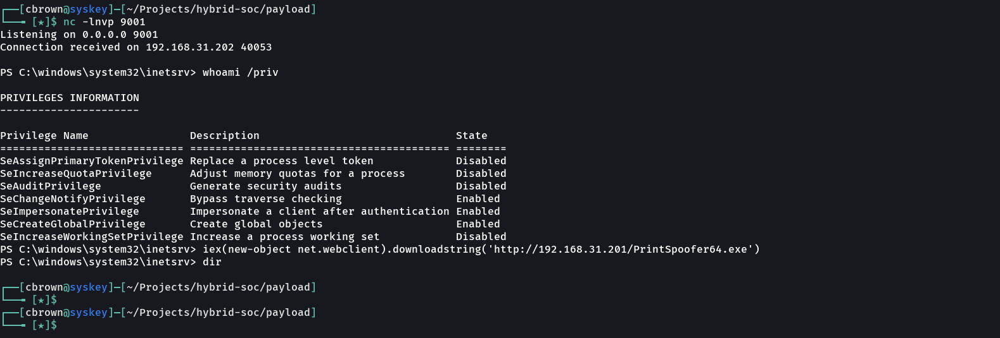
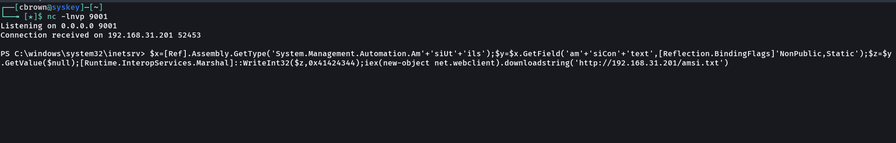
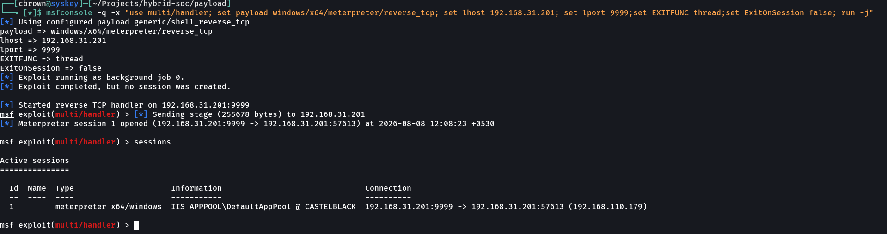

# 07 – Defense Evasion

## Overview

This attack simulation demonstrates a defense-evasion scenario against a Windows IIS server using **PrinterSpoofer, PowerShell, AMSI bypass techniques, and Meterpreter**.

The initial PrinterSpoofer payload was detected and blocked by the endpoint security controls. After the payload was blocked, a controlled AMSI bypass was performed in the isolated lab environment. Following the bypass, payload execution succeeded and a Meterpreter session was established.

The objective of this exercise is to simulate how an attacker may adapt after an endpoint security control blocks a payload and validate the visibility provided by the Wazuh Enterprise SOC Lab.

---

# Objectives

- Execute a controlled PrinterSpoofer payload.
- Observe endpoint security detection and blocking.
- Demonstrate a controlled AMSI bypass.
- Execute the payload after the AMSI bypass.
- Establish a Meterpreter session.
- Validate the resulting Windows execution context.
- Investigate the attack activity using Wazuh.
- Document practical evidence of the defense-evasion sequence.

---

# MITRE ATT&CK Mapping

| Tactic | Technique | ID |
|---|---|---|
| Defense Evasion | Impair Defenses | T1562 |
| Defense Evasion | Impair Defenses: Disable or Modify Tools | T1562.001 |
| Execution | Command and Scripting Interpreter | T1059 |
| Execution | PowerShell | T1059.001 |

---

# Lab Environment

| Component | Details |
|---|---|
| Attacker Machine | Arch Linux |
| Attack Tools | PrinterSpoofer, PowerShell, Metasploit |
| Target | Windows IIS Server |
| Web Server | IIS |
| Initial Context | `IIS APPPOOL\DefaultAppPool` |
| SIEM | Wazuh |
| Endpoint Monitoring | Sysmon |

---

# Attack Tools

**PrinterSpoofer, PowerShell, Metasploit Framework, and Meterpreter**

These tools were used during the controlled attack simulation to demonstrate payload execution, defense-evasion activity, and post-exploitation session establishment.

---

# Attack Scenario

The attacker attempts to execute a PrinterSpoofer payload against the compromised Windows IIS server.

The endpoint security controls detect and block the payload.

### 1. PrinterSpoofer Payload Blocked

The PrinterSpoofer payload was detected and blocked by the endpoint security controls.



---

The attacker then changes technique and performs a controlled AMSI bypass.

### 2. AMSI Bypass Executed

The AMSI bypass was successfully executed in the isolated lab environment.



---

After the AMSI bypass, payload execution succeeds and a Meterpreter session is established.

### 3. Meterpreter Session Established

The resulting Meterpreter session was established on the Windows IIS server.


The session operated under:

```text
IIS APPPOOL\DefaultAppPool
