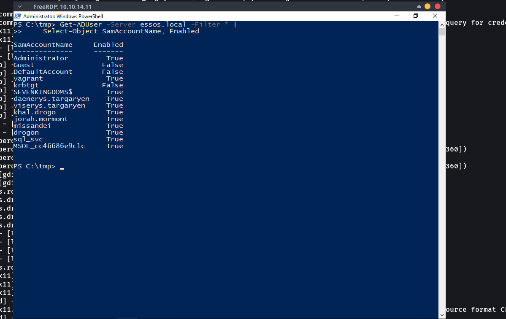

# 08 – Lateral Movement

## Overview

This attack simulation demonstrates a practical lateral-movement scenario within the isolated **Wazuh Enterprise SOC Lab**.

The activity started from the previously compromised `WINTERFELL` system in the `north.sevenkingdoms.local` environment. After obtaining administrative access, the attacker identified the `essos.local` domain, enumerated domain users, identified the MEEREEN domain controller, validated remote connectivity, performed credential-access activity, cracked an NTLM hash, and established remote access to MEEREEN using WinRM.

The objective of this exercise was to demonstrate how access obtained on one Windows system can be used to discover and access another system within the Active Directory environment, while providing practical evidence that can be investigated through Wazuh.

---

# Objectives

- Validate previously obtained administrative access.
- Perform RDP-based access to the Windows environment.
- Enumerate users in the `essos.local` domain.
- Identify the MEEREEN domain controller.
- Validate connectivity to MEEREEN.
- Perform controlled credential-access activity.
- Recover credential material associated with a domain account.
- Crack a recovered NTLM hash in the isolated lab.
- Establish a WinRM session to MEEREEN.
- Verify the remote hostname.
- Verify the authenticated domain user.
- Verify Domain Admin group membership.
- Demonstrate practical lateral movement between Windows systems.

---

# MITRE ATT&CK Mapping

| Tactic | Technique | ID |
|---|---|---|
| Discovery | Account Discovery | T1087 |
| Discovery | Permission Groups Discovery | T1069 |
| Credential Access | OS Credential Dumping | T1003 |
| Credential Access | Brute Force | T1110 |
| Lateral Movement | Remote Services | T1021 |
| Lateral Movement | Windows Remote Management | T1021.006 |

---

# Lab Environment

| Component | Details |
|---|---|
| Attacker Machine | Arch Linux |
| Initial System | WINTERFELL |
| Initial IP | `10.10.14.11` |
| Initial Domain | `north.sevenkingdoms.local` |
| Target System | MEEREEN |
| Target IP | `10.10.14.12` |
| Target Domain | `essos.local` |
| SIEM | Wazuh |
| Endpoint Monitoring | Sysmon |
| Virtualization | VMware Workstation |
| Remote Access | RDP / WinRM |

---

# Network Environment

```text
10.10.14.10
KINGSLANDING
sevenkingdoms.local
        │
        ▼
10.10.14.11
WINTERFELL
north.sevenkingdoms.local
        │
        │ Lateral Movement
        ▼
10.10.14.12
MEEREEN
essos.local
        │
        ▼
10.10.14.22
CASTELBLACK
        │
        ▼
10.10.14.23
BRAAVOS
```

---

# Attack Tools

- Hashcat
- Mimikatz
- Evil-WinRM
- PowerShell
- RDP
- Active Directory PowerShell tools

---

# Attack Scenario

The attacker began with administrative access to the `WINTERFELL` system at:

```text
10.10.14.11
```

The attacker then investigated the Active Directory environment and identified the `ESSOS.LOCAL` domain.

The ESSOS domain controller was identified as:

```text
MEEREEN
10.10.14.12
essos.local
```

Domain users were enumerated to identify accounts that could be investigated during the credential-access stage.

Credential material associated with the `jeor.mormont` account was then recovered. The associated NTLM hash was successfully cracked in the isolated laboratory environment.

The recovered credential was subsequently used during the remote-access stage to establish a WinRM session to MEEREEN using the `jorah.mormont` account.

The remote session was then validated by checking:

- Remote hostname
- Authenticated domain user
- Domain Admin group membership

---

# Attack Workflow

```text
Existing Administrator Access
        │
        ▼
WINTERFALL / WINTERFELL
10.10.14.11
        │
        ▼
ESSOS Domain Discovery
        │
        ▼
ESSOS Domain User Enumeration
        │
        ▼
MEEREEN Discovery
10.10.14.12
        │
        ▼
RDP Connectivity Validation
        │
        ▼
Credential Access
        │
        ▼
NTLM Hash Cracking
        │
        ▼
WinRM Authentication
        │
        ▼
MEEREEN
10.10.14.12
        │
        ▼
essos\jorah.mormont
        │
        ▼
Domain Admin Membership
```

---

# Attack Activities

## 1. Administrator Hash Cracked

During the previous attack phase, the Administrator NTLM hash was recovered and successfully cracked.

This provided the privileged starting point for the subsequent lateral-movement activity.

### Evidence


**Screenshot Explanation**

The screenshot provides practical evidence that the Administrator NTLM hash was successfully cracked.

The result demonstrates that valid administrative credentials were recovered and could be used as the starting point for further access and Active Directory discovery.

This represents the transition from the previous credential-compromise phase into the lateral-movement phase.

---

## 2. RDP Lateral Movement

The recovered Administrator credential was used to establish an RDP session to the Windows environment.

### Evidence


**Screenshot Explanation**

The screenshot provides practical evidence of successful RDP access.

The Windows desktop confirms that an interactive remote session was successfully established.

This access provided the attacker with an interactive Windows environment from which further Active Directory discovery and investigation could be performed.

---

## 3. ESSOS Domain User Enumeration

After obtaining access to the Windows environment, the attacker enumerated users in the `essos.local` domain.

The enumeration identified multiple domain accounts, including:

```text
Administrator
Guest
DefaultAccount
vagrant
krbtgt
SEVENKINGDOMS$
daenerys.targaryen
viserys.targaryen
khal.drogo
jorah.mormont
missandei
drogon
sql_svc
MSOL_cc46686e9c1
```

### Evidence



**Screenshot Explanation**

The screenshot provides practical evidence that user enumeration was successfully performed against the `essos.local` domain.

The output shows multiple domain accounts, including:

```text
daenerys.targaryen
viserys.targaryen
khal.drogo
jorah.mormont
missandei
drogon
sql_svc
```

This information was used to identify accounts for further investigation during the credential-access stage.

The screenshot therefore demonstrates practical Active Directory account discovery rather than simply documenting the attack concept.

---

## 4. ESSOS RDP Connectivity

The ESSOS domain controller was identified as MEEREEN at:

```text
10.10.14.12
```

Connectivity to the target system was then validated before attempting further remote access.

### Evidence


**Screenshot Explanation**

The screenshot provides practical evidence that the MEEREEN system was reachable from the current Windows environment.

The connectivity test showed:

```text
RemoteAddress      : 10.10.14.12
RemotePort         : 3389
TcpTestSucceeded   : True
```

This confirms that the target system was reachable and that TCP port `3389` was accessible.

The result provided confirmation that the target was available for remote-access investigation.

---

## 5. Credential Access – Jeor Mormont

Credential material associated with the `jeor.mormont` account was recovered during the credential-access stage.

### Evidence


**Screenshot Explanation**

The screenshot provides practical evidence of credential-access activity involving the `jeor.mormont` account.

The repository version of the screenshot has been redacted to prevent reusable credential material from being exposed publicly.

The evidence demonstrates the transition from Active Directory discovery into credential-access activity.

The recovered credential material was subsequently processed during the NTLM hash-cracking stage.

---

## 6. Jeor Mormont NTLM Hash Cracked

The recovered NTLM hash associated with the `jeor.mormont` account was processed using Hashcat.

The hash was successfully cracked in the isolated lab environment.

### Evidence


**Screenshot Explanation**

The screenshot provides practical evidence that the NTLM hash was successfully cracked.

The Hashcat result showed:

```text
Status...........: Cracked
Hash.Mode........: 1000 (NTLM)
Recovered........: 1/1 (100%)
Progress.........: 3561/3561 (100%)
```

The important result is:

```text
Status: Cracked
Recovered: 1/1
```

This confirms that the recovered NTLM hash was successfully matched against the supplied wordlist.

The recovered credential was then used during the subsequent remote-access activity.

> **Security Note:** Plaintext passwords, NTLM hashes, Kerberos keys, authentication tokens, and other reusable credential material should not be committed to a public repository. Screenshots published in the repository should remain appropriately redacted.

---

## 7. WinRM Lateral Movement – Jorah Mormont

After the credential-access and password-recovery stages, the recovered credential was used to establish a WinRM session to the MEEREEN system at:

```text
10.10.14.12
```

The remote session was established using Evil-WinRM.

### Evidence


**Screenshot Explanation**

The screenshot provides practical evidence of successful lateral movement to the ESSOS domain.

The Evil-WinRM connection was established against:

```text
10.10.14.12
```

The remote hostname was verified using:

```text
hostname
```

The result was:

```text
meereen
```

This confirms that the remote system was the MEEREEN host.

The authenticated user was then verified using:

```text
whoami
```

The result was:

```text
essos\jorah.mormont
```

This confirms that the remote session was operating under the `jorah.mormont` account in the ESSOS domain.

The Domain Admin group was then checked using:

```text
net group "Domain Admins" /domain
```

The output showed:

```text
Members

Administrator
daenerys.targaryen
jorah.mormont
```

This confirms that `jorah.mormont` is a member of the ESSOS `Domain Admins` group.

The screenshot therefore demonstrates practical evidence of:

- Successful WinRM connection to MEEREEN.
- Successful remote command execution.
- Remote hostname verification.
- Authenticated domain user verification.
- Domain Admin membership verification.

This represents the final step of the documented lateral-movement sequence.

---

# Practical Attack Evidence

The seven screenshots demonstrate the progression of the activity:

```text
01 – Administrator Hash Cracked
        │
        ▼
02 – RDP Lateral Movement
        │
        ▼
03 – ESSOS Domain User Enumeration
        │
        ▼
04 – ESSOS RDP Connectivity
        │
        ▼
05 – Credential Access – Jeor Mormont
        │
        ▼
06 – Jeor Mormont NTLM Hash Cracked
        │
        ▼
07 – WinRM Lateral Movement – Jorah Mormont
        │
        ▼
MEEREEN
10.10.14.12
        │
        ▼
essos\jorah.mormont
        │
        ▼
Domain Admin Membership
```

---

# Wazuh Detection

The lateral-movement activity generates Windows security telemetry that can be investigated through Wazuh.

Relevant telemetry includes:

| Activity | Windows Telemetry |
|---|---|
| Successful authentication | Event ID 4624 |
| Failed authentication | Event ID 4625 |
| Explicit credential use | Event ID 4648 |
| Process creation | Sysmon Event ID 1 |
| Network connection | Sysmon Event ID 3 |
| PowerShell activity | PowerShell Operational Logs |
| Remote management | WinRM / Windows Event Logs |

The SOC investigation can correlate authentication activity with:

- Source system
- Destination system
- Username
- Logon type
- Authentication package
- Workstation name
- Process creation
- Remote management activity
- Timestamp

---

# SOC Investigation

A SOC analyst can investigate the lateral-movement activity by correlating authentication and endpoint telemetry across the source and destination systems.

Example investigation flow:

```text
WINTERFELL
10.10.14.11
        │
        ▼
Remote Authentication / Activity
        │
        ▼
MEEREEN
10.10.14.12
        │
        ▼
essos\jorah.mormont
        │
        ▼
WinRM Activity
```

The purpose of the investigation is to determine whether the remote authentication and management activity represents legitimate administration or suspicious lateral movement.

---

# Detection Summary

| Activity | Status |
|---|---|
| Administrator Hash Cracked | ✅ Completed |
| RDP Access | ✅ Completed |
| ESSOS Domain User Enumeration | ✅ Completed |
| MEEREEN Discovery | ✅ Completed |
| MEEREEN Connectivity Validation | ✅ Completed |
| Credential Access – Jeor Mormont | ✅ Completed |
| Jeor Mormont NTLM Hash Cracked | ✅ Completed |
| WinRM Session Established | ✅ Completed |
| Remote Hostname Verified | ✅ Completed |
| Remote User Verified | ✅ Completed |
| Domain Admin Membership Verified | ✅ Completed |
| Lateral Movement Demonstrated | ✅ Completed |

---

# Key Findings

- Administrative credential access from the previous attack phase provided the starting point for the lateral-movement activity.
- The `essos.local` domain was successfully identified.
- Multiple ESSOS domain users were successfully enumerated.
- MEEREEN was identified as the ESSOS domain controller at `10.10.14.12`.
- Connectivity to MEEREEN was successfully validated.
- Credential material associated with `jeor.mormont` was recovered during the credential-access stage.
- The associated NTLM hash was successfully cracked using Hashcat.
- A WinRM session was successfully established to MEEREEN.
- The remote hostname was verified as `meereen`.
- The authenticated user was verified as `essos\jorah.mormont`.
- The `jorah.mormont` account was confirmed as a member of the ESSOS `Domain Admins` group.
- The seven screenshots provide practical evidence for the documented lateral-movement sequence.
- The activity provides Windows authentication and remote-management telemetry that can be investigated through Wazuh.

---

# Security Considerations

This attack simulation was performed entirely inside an isolated VMware laboratory environment.

Before publishing the project publicly:

- Redact plaintext passwords.
- Redact NTLM hashes.
- Redact Kerberos keys.
- Remove authentication tokens.
- Do not publish reusable credentials.
- Keep the attack environment isolated from production systems.

---

# Conclusion

This attack simulation demonstrated a practical lateral-movement scenario within the Wazuh Enterprise SOC Lab.

The activity progressed from existing administrative access through:

```text
Credential Compromise
        │
        ▼
RDP Access
        │
        ▼
Active Directory Discovery
        │
        ▼
ESSOS User Enumeration
        │
        ▼
MEEREEN Discovery
        │
        ▼
Credential Access
        │
        ▼
NTLM Hash Cracking
        │
        ▼
WinRM Lateral Movement
```

The final remote session demonstrated successful access to:

```text
MEEREEN
10.10.14.12
essos.local
```

The remote session was verified as:

```text
essos\jorah.mormont
```

The account was also confirmed as a member of:

```text
Domain Admins
```

The embedded screenshots provide practical evidence for each major stage rather than documenting only the theoretical attack process.

---

# Next Phase

Continue to:

```text
10-Attack-Simulation/
└── 09-Persistence
```

The next phase focuses on persistence techniques within the Windows Active Directory environment.
