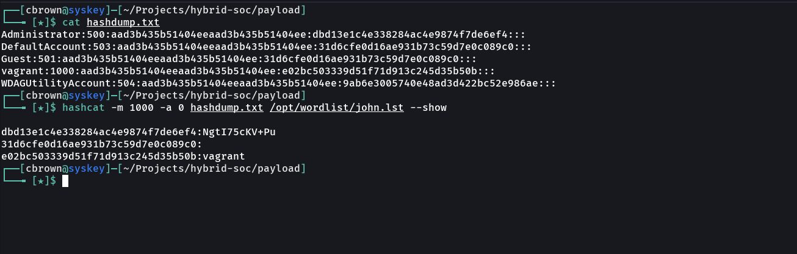
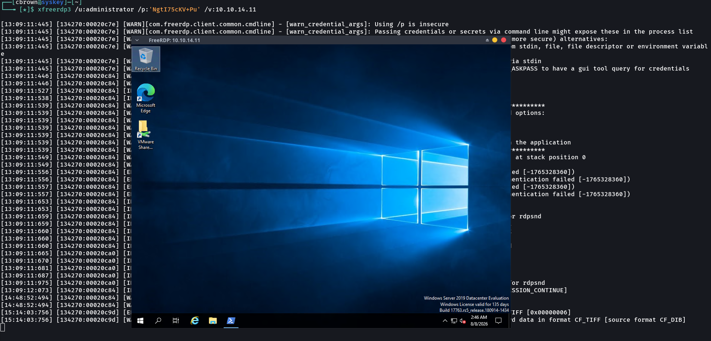
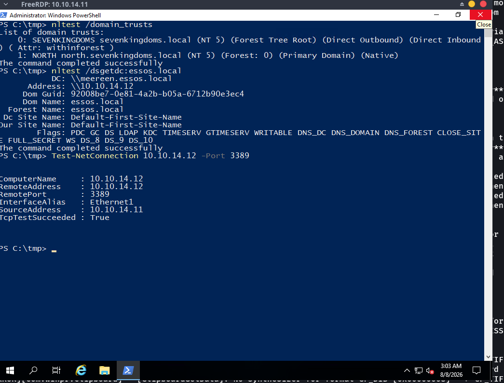
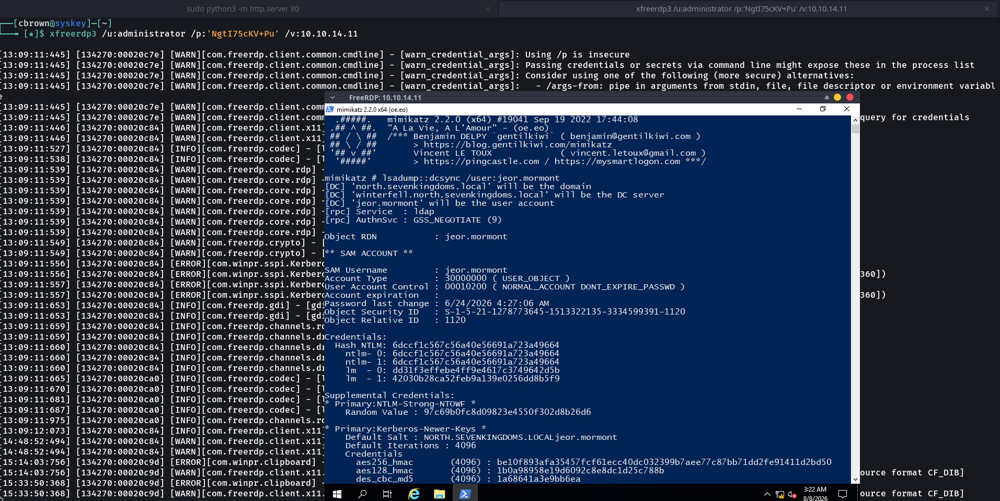
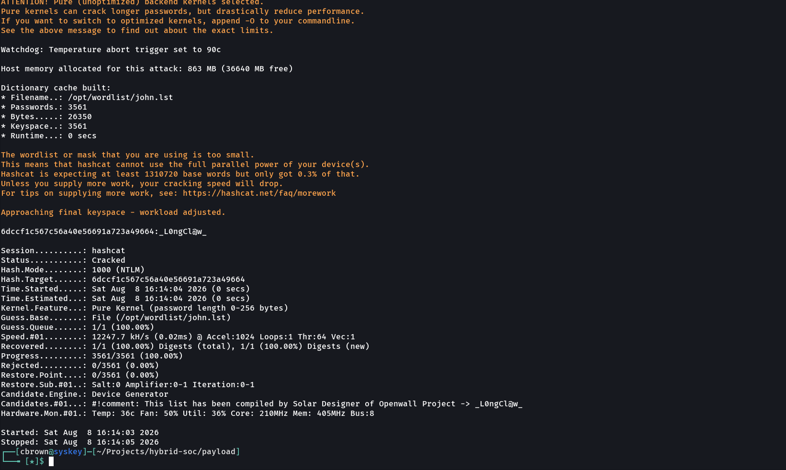
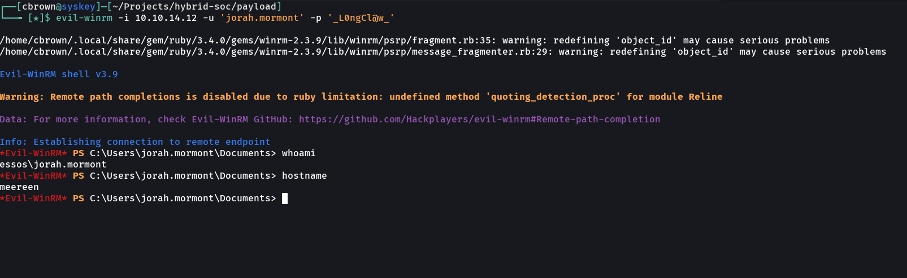

# 08 – Lateral Movement

## Overview

This attack simulation demonstrates lateral movement within the isolated Wazuh Enterprise SOC Lab.

The activity started from the previously compromised `WINTERFELL` system in the `north.sevenkingdoms.local` environment. After obtaining administrative access, the attacker identified the `ESSOS.LOCAL` domain, enumerated domain users, identified the MEEREEN domain controller, validated connectivity, performed credential-access activity, cracked an NTLM hash, and established remote access to MEEREEN using WinRM.

The objective was to demonstrate how credentials obtained from one system can be used to access another system in the environment and how the resulting activity can be investigated through Wazuh.

---

# Objectives

- Validate previously obtained administrative access.
- Enumerate users in the `essos.local` domain.
- Identify the MEEREEN domain controller.
- Validate connectivity to MEEREEN.
- Perform credential-access activity.
- Crack a recovered NTLM hash in the isolated lab.
- Establish a WinRM session to MEEREEN.
- Verify the remote hostname.
- Verify the authenticated domain user.
- Verify Domain Admin group membership.
- Demonstrate practical lateral movement between Windows systems.

---

# MITRE ATT&CK Mapping

| Tactic | Technique | ID |
|---|---|---|
| Discovery | Account Discovery | T1087 |
| Discovery | Permission Groups Discovery | T1069 |
| Credential Access | OS Credential Dumping | T1003 |
| Credential Access | Brute Force | T1110 |
| Lateral Movement | Remote Services | T1021 |
| Lateral Movement | Windows Remote Management | T1021.006 |

---

# Lab Environment

| Component | Details |
|---|---|
| Attacker Machine | Arch Linux |
| Initial System | WINTERFELL |
| Initial IP | `10.10.14.11` |
| Initial Domain | `north.sevenkingdoms.local` |
| Target System | MEEREEN |
| Target IP | `10.10.14.12` |
| Target Domain | `essos.local` |
| SIEM | Wazuh |
| Endpoint Monitoring | Sysmon |
| Virtualization | VMware Workstation |
| Remote Access | RDP / WinRM |

---

# Network Environment

```text
10.10.14.10
KINGSLANDING
sevenkingdoms.local

        │
        ▼

10.10.14.11
WINTERFELL
north.sevenkingdoms.local

        │
        │ Lateral Movement
        ▼

10.10.14.12
MEEREEN
essos.local

        │
        ▼

10.10.14.22
CASTELBLACK


10.10.14.23
BRAAVOS

## 1. Administrator Hash Cracked

During the previous attack phase, the Administrator NTLM hash was recovered and successfully cracked.

### Evidence



**Screenshot Explanation**

The screenshot provides practical evidence that the Administrator NTLM hash was successfully cracked.

The result demonstrates that valid administrative credentials were recovered and could be used as the starting point for further lateral-movement activity.

## 2. RDP Lateral Movement

The recovered Administrator credential was used to establish an RDP session to the Windows environment.

### Evidence



**Screenshot Explanation**

The screenshot provides practical evidence of successful RDP access.

The Windows desktop confirms that an interactive remote session was successfully established and provided access to the Windows environment for further Active Directory discovery.

## 3. ESSOS Domain User Enumeration

After obtaining access to the Windows environment, the attacker enumerated users in the `essos.local` domain.

The enumeration identified accounts including:

```text
Administrator
vagrant
daenerys.targaryen
viserys.targaryen
khal.drogo
jorah.mormont
missandei
drogon
sql_svc


### 4. ESSOS RDP Connectivity

```markdown
## 4. ESSOS RDP Connectivity

The ESSOS domain controller was identified as MEEREEN at `10.10.14.12`.

Connectivity to the system was then tested.

### Evidence



**Screenshot Explanation**

The screenshot provides practical evidence that the MEEREEN system was reachable from the current Windows environment.

The connectivity test showed:

```text
RemoteAddress      : 10.10.14.12
RemotePort         : 3389
TcpTestSucceeded   : True


### 5. Credential Access – Jeor Mormont

```markdown
## 5. Credential Access – Jeor Mormont

Credential material associated with the `jeor.mormont` account was recovered during the credential-access stage.

### Evidence



**Screenshot Explanation**

The screenshot provides practical evidence of credential-access activity involving the `jeor.mormont` account.

The screenshot has been redacted to prevent reusable credential material from being exposed publicly.

This demonstrates the transition from Active Directory discovery into credential-access activity.

## 6. Jeor Mormont NTLM Hash Cracked

The recovered NTLM hash associated with the `jeor.mormont` credential was processed using Hashcat.

The hash was successfully cracked in the isolated lab environment.

### Evidence



**Screenshot Explanation**

The screenshot provides practical evidence that the NTLM hash was successfully cracked.

The Hashcat result showed:

```text
Status...........: Cracked
Hash.Mode........: 1000 (NTLM)
Recovered........: 1/1 (100%)
Progress.........: 3561/3561 (100%)

Status: Cracked
Recovered: 1/1


### 7. WinRM Lateral Movement – Jorah Mormont

**This is the exact format you were asking for:**

```markdown
## 7. WinRM Lateral Movement – Jorah Mormont

After recovering and cracking the credential associated with the `jorah.mormont` account, the credential was used to establish a WinRM session to the MEEREEN system at `10.10.14.12`.

The remote session was established using Evil-WinRM.

### Evidence



**Screenshot Explanation**

The screenshot provides practical evidence of successful lateral movement to the ESSOS domain.

The Evil-WinRM connection was established against:

```text
10.10.14.12
