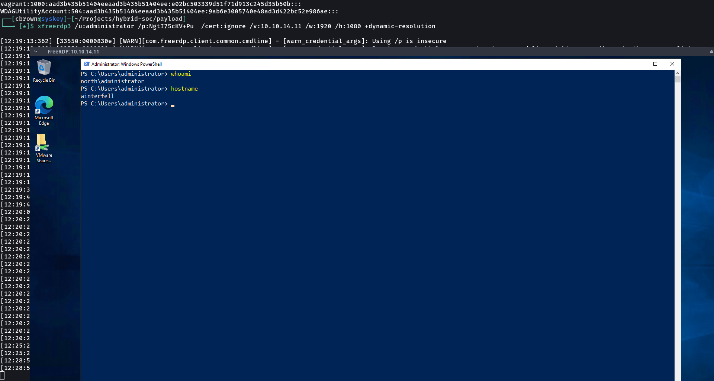
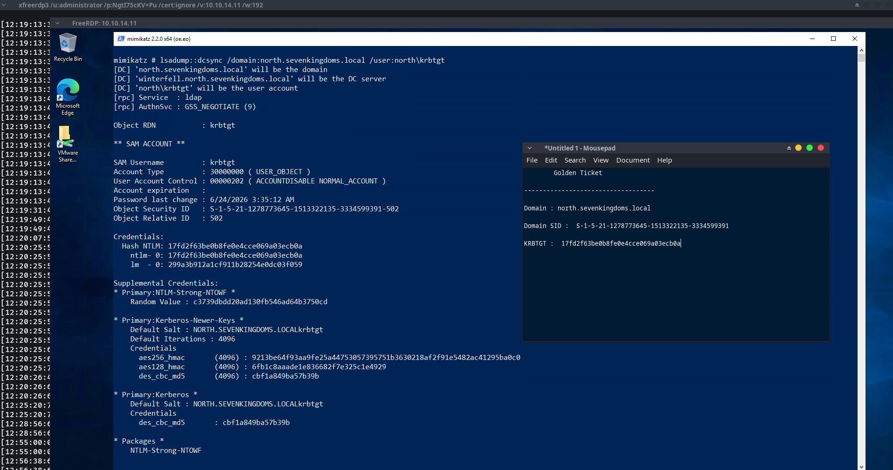
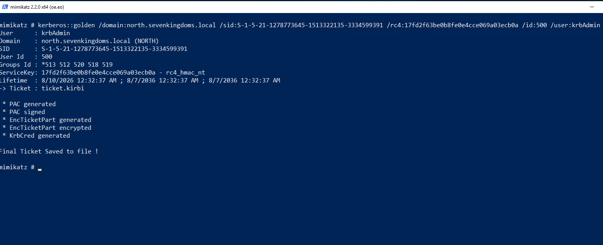

# 09 – Persistence

## Overview

This simulation demonstrates a **Kerberos-based persistence technique** within the isolated Wazuh Enterprise SOC Lab.

The activity began from the previously compromised `WINTERFELL` system in the `north.sevenkingdoms.local` domain. In the earlier attack phase, the Administrator NTLM hash was recovered and cracked. Using the recovered credential, RDP access was established to WINTERFELL.

With administrative access obtained, the Kerberos domain context was examined, and the `krbtgt` account was identified. The required credential material was extracted in the isolated lab environment.

This material was then used to forge a **Golden Ticket**, which was injected into the Windows authentication session and validated via the Kerberos ticket cache.

The objective of this exercise is to demonstrate how compromise of the `krbtgt` account enables persistent Kerberos authentication in Active Directory, while also providing practical evidence for SOC investigation.

---

## Objectives

- Validate Administrator access
- Establish RDP access to WINTERFELL
- Identify Kerberos domain context
- Locate the `krbtgt` account
- Recover Kerberos credential material
- Create a Golden Ticket
- Inject the forged ticket into the Windows session
- Validate ticket with `klist`
- Demonstrate privileged access using the forged context
- Document persistence technique with practical evidence
- Provide SOC evidence for Wazuh investigation

---

## MITRE ATT&CK Mapping

| Tactic            | Technique                                      | ID        |
| ----------------- | ---------------------------------------------- | --------- |
| Persistence       | Steal or Forge Kerberos Tickets: Golden Ticket | T1558.001 |
| Credential Access | OS Credential Dumping                          | T1003     |
| Credential Access | OS Credential Dumping: NTDS                    | T1003.003 |
| Lateral Movement  | Use Alternate Authentication Material          | T1550     |

---

## Lab Environment

| Component           | Details                     |
| ------------------- | --------------------------- |
| Attacker Machine    | Arch Linux                  |
| Initial System      | WINTERFELL                  |
| Initial IP          | `10.10.14.11`               |
| Domain              | `north.sevenkingdoms.local` |
| SIEM                | Wazuh                       |
| Endpoint Monitoring | Sysmon                      |
| Virtualization      | VMware Workstation          |
| Remote Access       | RDP                         |
| Attack Tool         | Mimikatz                    |

---

## Attack Scenario

The persistence activity followed this sequence:

Previously Obtained Administrator Credential
                    │
                    ▼
             RDP to WINTERFELL
                    │
                    ▼
       Identify Kerberos Domain Context
                    │
                    ▼
            Identify krbtgt Account
                    │
                    ▼
       Recover Kerberos Credential Material
                    │
                    ▼
          Golden Ticket Creation
                    │
                    ▼
          Golden Ticket Injection
                    │
                    ▼
       Kerberos Ticket Validation
                    │
                    ▼
       Privileged Resource Access
                    │
                    ▼
             Wazuh Investigation

## Proof of Concept

### 1. Administrator RDP Access

During the previous attack phase, the Administrator NTLM hash was recovered and cracked. The recovered credential was then used to establish RDP access to the WINTERFELL system.

### Evidence

**Screenshot Explanation**

The screenshot provides practical evidence of successful administrative access to WINTERFELL.

The RDP session confirms that the previously recovered Administrator credential was successfully used to access the Windows system and establish the privileged context required for the persistence simulation.

### 2. Domain Kerberos Context

After obtaining administrative access to WINTERFELL, the Active Directory Kerberos security context was examined.

The `north.sevenkingdoms.local` domain and the `krbtgt` account were identified, along with the credential material required for the Golden Ticket simulation.

### Evidence

**Screenshot Explanation**

The screenshot provides practical evidence of the Kerberos security context associated with the `north.sevenkingdoms.local` domain.

The captured information identifies the domain, domain SID, and `krbtgt` account used during the subsequent Golden Ticket creation stage.

> **Security Note:** Sensitive `krbtgt` credential material should be redacted before publishing this screenshot to a public repository.

### 3. Golden Ticket Creation

After obtaining the required domain information and `krbtgt` credential material, a Golden Ticket was generated for the `north.sevenkingdoms.local` domain.

### Evidence

**Screenshot Explanation**

The screenshot provides practical evidence that the Golden Ticket was successfully created.

The Mimikatz output shows the successful generation of the forged Kerberos ticket and confirms that the resulting ticket was saved as:

ticket.kirbi
