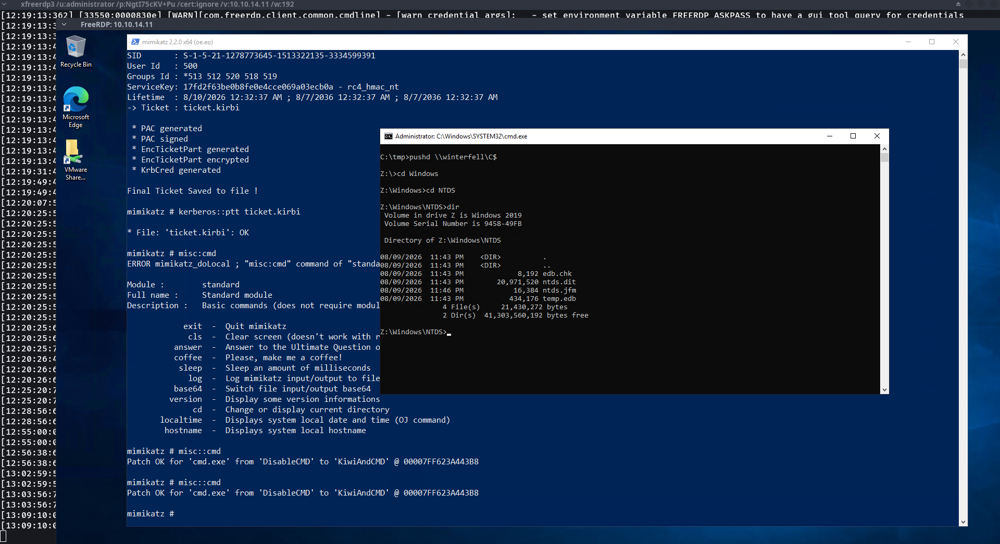
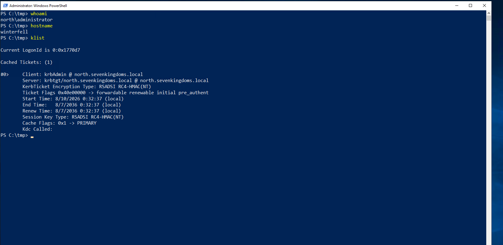

# 09 – Persistence

## Overview

This attack simulation demonstrates a Kerberos-based persistence scenario within the isolated Wazuh Enterprise SOC Lab.

The activity started from the previously compromised `WINTERFELL` system in the `north.sevenkingdoms.local` environment. During the previous attack phase, the Administrator NTLM hash was recovered and successfully cracked. The recovered Administrator credential was then used to establish RDP access to WINTERFELL.

After obtaining administrative access, the Kerberos security context of the domain was examined and the `krbtgt` account was identified. The required Kerberos credential material was recovered in the isolated lab environment.

The recovered domain information and `krbtgt` credential material were then used to create a Golden Ticket. The generated ticket was injected into the Windows authentication session and validated through the Windows Kerberos ticket cache.

The objective of this exercise is to demonstrate how compromise of the `krbtgt` account can be abused to establish persistent Kerberos authentication within an Active Directory environment and provide practical evidence for SOC investigation.

---

# Objectives

- Validate previously obtained Administrator access.
- Establish RDP access to WINTERFELL.
- Identify the Active Directory Kerberos domain context.
- Identify the `krbtgt` account.
- Recover the required Kerberos credential material in the isolated lab.
- Create a Golden Ticket.
- Inject the generated Kerberos ticket into the Windows session.
- Validate the Kerberos ticket using `klist`.
- Demonstrate privileged resource access using the forged authentication context.
- Document the persistence technique with practical evidence.
- Provide evidence that can be investigated through Wazuh.

---

# MITRE ATT&CK Mapping

| Tactic | Technique | ID |
| ---------------- | -------------------------------------------- | --------- |
| Persistence | Steal or Forge Kerberos Tickets: Golden Ticket | T1558.001 |
| Credential Access | OS Credential Dumping | T1003 |
| Credential Access | OS Credential Dumping: NTDS | T1003.003 |
| Lateral Movement | Use Alternate Authentication Material | T1550 |

---

# Lab Environment

| Component | Details |
| ------------------- | --------------------------- |
| Attacker Machine | Arch Linux |
| Initial System | WINTERFELL |
| Initial IP | `10.10.14.11` |
| Domain | `north.sevenkingdoms.local` |
| SIEM | Wazuh |
| Endpoint Monitoring | Sysmon |
| Virtualization | VMware Workstation |
| Remote Access | RDP |
| Attack Tool | Mimikatz |

---

# Attack Scenario

The persistence activity followed this sequence:

```text
Previously Obtained Administrator Credential
                    │
                    ▼
             RDP to WINTERFELL
                    │
                    ▼
       Identify Kerberos Domain Context
                    │
                    ▼
            Identify krbtgt Account
                    │
                    ▼
       Recover Kerberos Credential Material
                    │
                    ▼
          Golden Ticket Creation
                    │
                    ▼
          Golden Ticket Injection
                    │
                    ▼
       Kerberos Ticket Validation
                    │
                    ▼
       Privileged Resource Access
                    │
                    ▼
             Wazuh Investigation
### Evidence


**Screenshot Explanation**

The screenshot provides practical evidence of successful administrative access to the WINTERFELL system.

---

### Evidence


**Screenshot Explanation**

The screenshot provides practical evidence of the Kerberos security context associated with the `north.sevenkingdoms.local` domain.

---

### Evidence


**Screenshot Explanation**

The screenshot provides practical evidence that the Golden Ticket was successfully created.

---

### Evidence



**Screenshot Explanation**

The screenshot provides practical evidence of Golden Ticket injection and subsequent privileged resource access.

---

### Evidence



**Screenshot Explanation**

The screenshot provides practical evidence of the Kerberos ticket being present in the current Windows authentication session.
