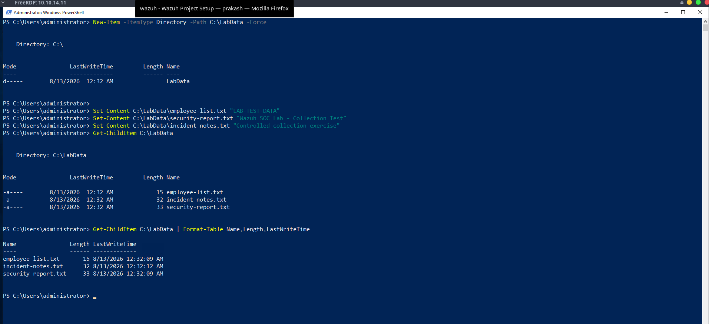
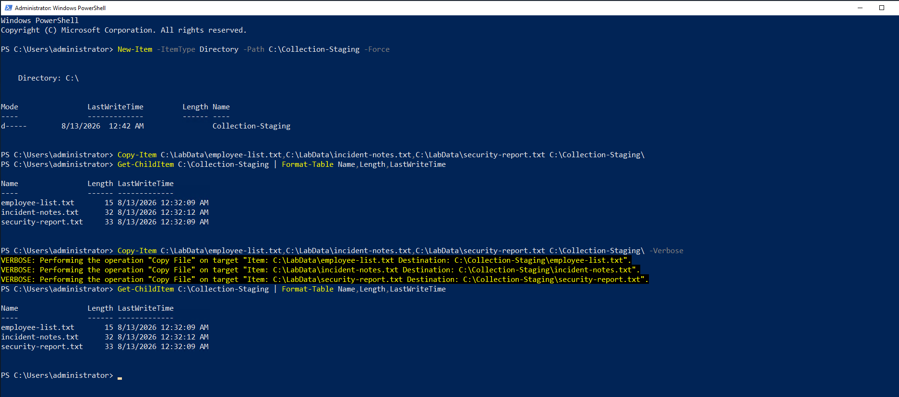
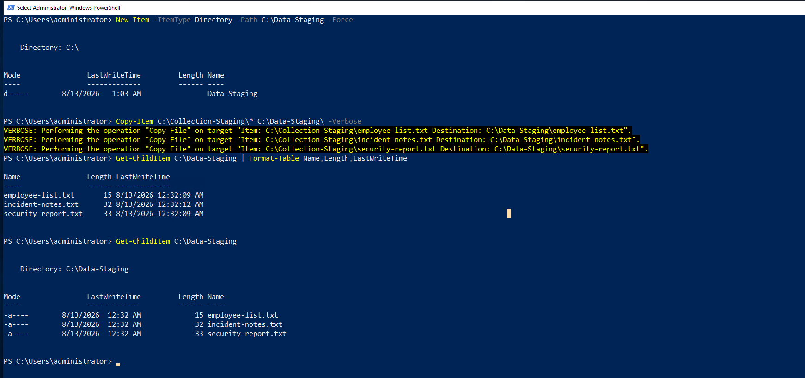
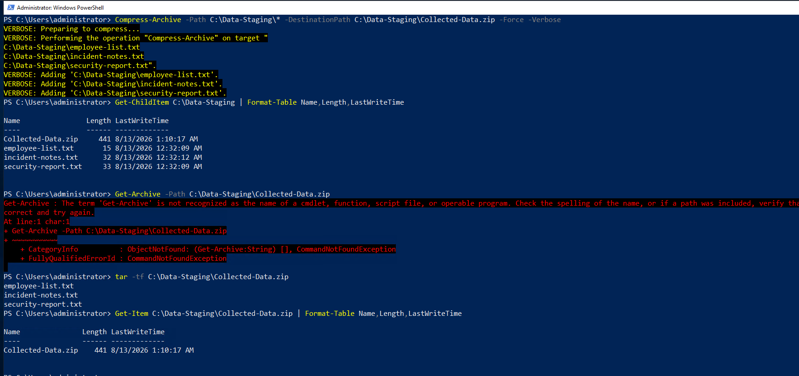
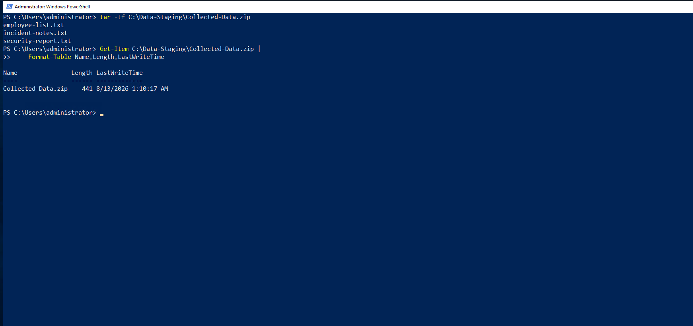

# 10 – Collection

## Overview

This simulation demonstrates a controlled **data collection and staging activity** within the isolated Wazuh Enterprise SOC Lab.

The activity was performed on the previously compromised `WINTERFELL` system. Controlled test data was created specifically for this laboratory exercise and was used to demonstrate how an attacker could identify, collect, stage, and archive data after gaining access to a Windows system.

The exercise began by identifying the target files stored in `C:\LabData`. The selected files were then collected into `C:\Collection-Staging`, transferred into a dedicated staging directory, compressed into a ZIP archive, and finally verified.

The objective of this exercise is to demonstrate the collection workflow from a SOC analyst perspective and provide practical endpoint evidence that can be investigated through Wazuh.

---

## Objectives

- Identify target data on the compromised Windows system.
- Collect selected controlled test files.
- Stage the collected data in a separate directory.
- Create an archive containing the staged data.
- Verify the contents of the resulting archive.
- Capture practical evidence for each stage.
- Demonstrate how collection activity can generate endpoint telemetry.
- Provide evidence suitable for Wazuh-based SOC investigation.

---

## MITRE ATT&CK Mapping

| Tactic       | Technique                                      | ID        |
| ------------ | ---------------------------------------------- | --------- |
| Collection   | Data from Local System                         | T1005     |
| Collection   | Archive Collected Data                         | T1560     |
| Collection   | Archive Collected Data: Local Data Staging     | T1560.001 |

---

## Lab Environment

| Component           | Details                     |
| ------------------- | --------------------------- |
| Attacker Machine    | Arch Linux                  |
| Target System       | WINTERFELL                  |
| Target IP           | `10.10.14.11`               |
| Domain              | `north.sevenkingdoms.local` |
| SIEM                | Wazuh                       |
| Endpoint Monitoring | Sysmon                      |
| Virtualization      | VMware Workstation          |
| Operating System    | Windows                     |
| Collection Tooling  | PowerShell                  |

---

## Attack Scenario

The collection activity followed this sequence:

```text
Previously Compromised WINTERFELL
                    │
                    ▼
          Identify Target Data
                    │
                    ▼
             Data Collection
                    │
                    ▼
              Data Staging
                    │
                    ▼
             Archive Creation
                    │
                    ▼
           Collection Verification
                    │
                    ▼
             Wazuh Investigation
```

---

# Proof of Concept

## 1. Target Data Identified

The first stage of the collection simulation involved identifying controlled test data on the compromised WINTERFELL system.

The target data was located in:

```text
C:\LabData
```

The directory contained three controlled files created specifically for this laboratory exercise:

```text
employee-list.txt
incident-notes.txt
security-report.txt
```

### Evidence



**Screenshot Explanation**

The screenshot provides practical evidence that the target data was identified in `C:\LabData`.

The PowerShell output confirms the presence of the three controlled test files and displays their file names, sizes, and modification timestamps.

This establishes the target data selected for the subsequent collection stage.

---

## 2. Data Collection

The identified test files were collected from `C:\LabData` and copied into the controlled collection directory:

```text
C:\Collection-Staging
```

### Evidence



**Screenshot Explanation**

The screenshot provides practical evidence that the identified test data was successfully collected.

The PowerShell output confirms the copy operation and verifies that the following files were transferred into `C:\Collection-Staging`:

```text
employee-list.txt
incident-notes.txt
security-report.txt
```

The resulting directory listing confirms the presence of the collected files along with their file sizes and timestamps.

This demonstrates the transition from target-data identification to actual data collection.

---

## 3. Data Staging

After collection, the controlled files were copied from the collection directory into a dedicated staging location:

```text
C:\Data-Staging
```

### Evidence



**Screenshot Explanation**

The screenshot provides practical evidence that the collected data was successfully staged for the next phase of the collection workflow.

The PowerShell `-Verbose` output confirms the transfer of:

```text
employee-list.txt
incident-notes.txt
security-report.txt
```

from:

```text
C:\Collection-Staging
```

to:

```text
C:\Data-Staging
```

The final directory listing confirms that all three files are present in the staging location.

This represents the staging phase of the controlled collection workflow.

---

## 4. Archive Creation

The staged test data was packaged into a single ZIP archive within the controlled staging directory.

The resulting archive was created as:

```text
C:\Data-Staging\Collected-Data.zip
```

### Evidence



**Screenshot Explanation**

The screenshot provides practical evidence that the staged collection was successfully packaged into an archive.

The resulting archive contains the collected test files:

```text
employee-list.txt
incident-notes.txt
security-report.txt
```

The creation of `Collected-Data.zip` demonstrates the archive-creation stage of the controlled collection simulation.

---

## 5. Collection Verification

The final stage involved verifying the resulting archive and confirming that the expected collected files were present.

### Evidence



**Screenshot Explanation**

The screenshot provides practical evidence that the collection process completed successfully.

The archive verification confirms the presence of the expected controlled files:

```text
employee-list.txt
incident-notes.txt
security-report.txt
```

The archive file information confirms that the resulting collection archive exists in the controlled staging directory.

This completes the collection Proof of Concept.

---

# Collection Result

The complete collection workflow demonstrated:

```text
Target Data Identified
        │
        ▼
Data Collected
        │
        ▼
Data Staged
        │
        ▼
Archive Created
        │
        ▼
Collection Verified
```

Each stage is supported by practical screenshot evidence captured from the isolated laboratory environment.

---

# Wazuh Investigation

The collection activity provides endpoint telemetry that can be investigated through Wazuh.

Relevant telemetry includes:

```text
Process Creation
PowerShell Activity
File Creation
File Modification
File Copy Operations
Archive Creation
File Access
Directory Activity
```

A SOC analyst can correlate the sequence of PowerShell activity, file operations, staging activity, and archive creation to determine whether the behavior represents legitimate administrative activity or suspicious data collection.

---

# Detection Opportunities

Potential detection opportunities include:

- Suspicious PowerShell execution.
- Unusual file-copy activity.
- Creation of temporary staging directories.
- Collection of multiple files from a target directory.
- Creation of archives containing recently collected files.
- Archive creation in unusual directories.
- Suspicious access to sensitive or business-critical files.
- Abnormal file activity associated with a compromised user session.
- Correlation between file collection and subsequent archive creation.

---

# Key Findings

- Controlled target data was successfully identified on WINTERFELL.
- The selected files were successfully collected.
- The collected files were transferred into a dedicated staging directory.
- The staged files were successfully packaged into a ZIP archive.
- The archive contents were successfully verified.
- Each stage of the collection workflow was documented with practical evidence.
- The activity provides useful endpoint telemetry for Wazuh investigation.
- The simulation demonstrates how collection behavior can be analyzed as part of a SOC investigation.

---

# Security Impact

Unauthorized collection of data can represent a significant security risk after an attacker gains access to an endpoint.

Attackers may search for valuable files, collect information from local systems, stage the data, and package it for later use.

From a SOC perspective, detecting the complete sequence is more valuable than detecting a single file operation in isolation.

Correlation between:

```text
PowerShell Activity
        +
File Access
        +
File Copying
        +
Staging Directory Creation
        +
Archive Creation
```

can provide stronger evidence of suspicious collection behavior.

---

# Conclusion

This simulation demonstrated a controlled data collection workflow within the isolated Wazuh Enterprise SOC Lab.

The activity progressed through target-data identification, collection, staging, archive creation, and final verification.

Each stage was supported by practical screenshot evidence captured from the Windows environment.

The exercise provides a realistic collection scenario that can be investigated using endpoint telemetry and correlated through Wazuh.

All activity was performed using controlled, non-sensitive test data within the isolated VMware laboratory environment.
