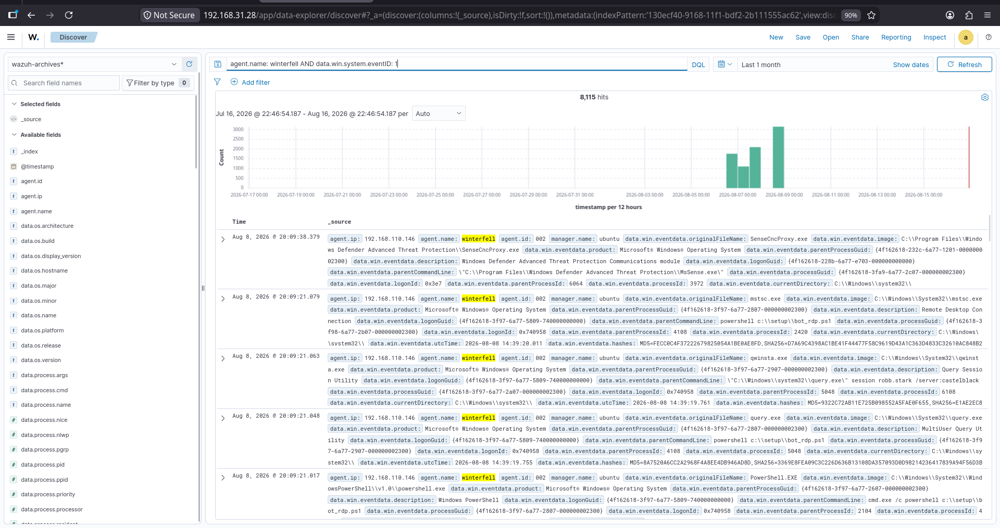

## Overview

Threat hunting is a proactive security practice used to identify suspicious or unusual activity that may not have generated a predefined security alert. The objective is to search endpoint telemetry, investigate process execution, analyze command lines, examine parent-child process relationships, and identify activity that requires further investigation.

This simulation was performed against the Wazuh Enterprise SOC Lab to validate endpoint telemetry collection and demonstrate how threat-hunting activities can be investigated through Wazuh.

The investigation focused on **Sysmon Event ID 1 (Process Creation)** and progressively narrowed the search from general process execution activity to **PowerShell execution** on the `WINTERFELL` Windows endpoint.

---

# Objectives

- Search Windows endpoint telemetry collected by Wazuh.
- Identify Windows process creation events.
- Investigate Sysmon Event ID 1 process creation activity.
- Filter process activity for the `WINTERFELL` endpoint.
- Identify PowerShell execution.
- Analyze PowerShell command-line activity.
- Examine parent-child process relationships.
- Identify the user associated with process execution.
- Review process and parent process IDs.
- Review process hashes and execution metadata.
- Validate threat-hunting visibility through Wazuh Discover.
- Map observed activity to MITRE ATT&CK.
- Document practical evidence for SOC investigation.

---

# MITRE ATT&CK Mapping

| Technique | ID |
|-----------|----|
| Command and Scripting Interpreter | T1059 |
| PowerShell | T1059.001 |
| Windows Command Shell | T1059.003 |

---

# Lab Environment

| Component | Description |
|-----------|-------------|
| SIEM | Wazuh |
| Search Interface | Wazuh Discover |
| Endpoint Monitoring | Sysmon |
| Target Endpoint | `WINTERFELL` |
| Agent Name | `winterfell` |
| Agent ID | `002` |
| Endpoint IP | `192.168.110.146` |
| Domain | `north.sevenkingdoms.local` |
| Operating System | Windows |
| Primary Telemetry | Sysmon Event ID 1 |
| Data Source | `wazuh-archives-*` |

---

# Threat Hunting Tools

- Wazuh Discover
- Wazuh Manager
- Wazuh Archives
- Sysmon
- Windows Event Logs

---

# Threat Hunting Activities

## 1. Process Execution Hunt

Performed an initial search for Windows process creation events generated by Sysmon.

### DQL

agent.name: winterfell AND data.win.system.eventID: 1

## 1. Process Execution Hunt

