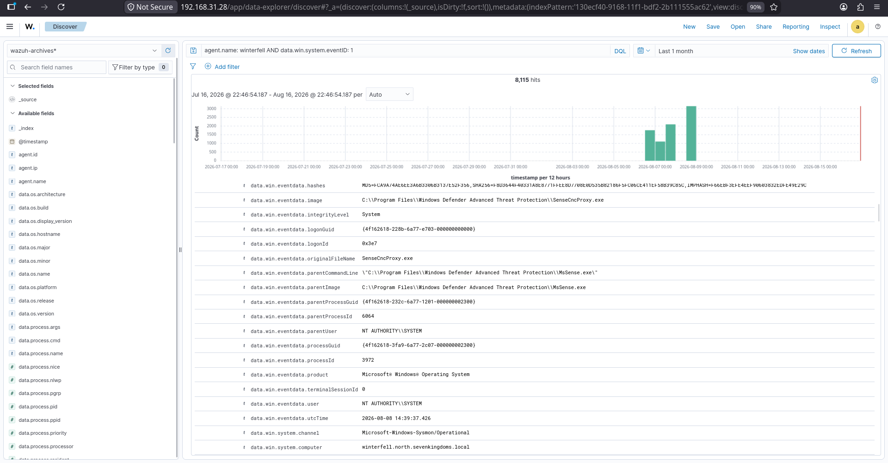
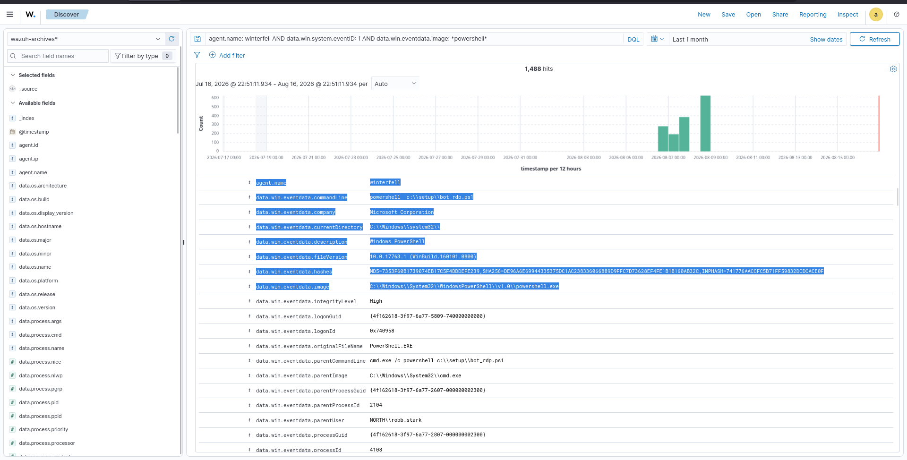

# 11 – Threat Hunting

## Overview
This lab demonstrates structured threat hunting activities using MITRE ATT&CK mapping, Elastic DQL queries, and Wazuh SIEM detection. The goal is to simulate adversary techniques, validate detection rules, and collect evidence.

## Objectives
- Perform process execution hunts
- Map findings to MITRE ATT&CK techniques
- Analyze execution details and anomalies
- Validate Wazuh detection rules
- Document evidence with screenshots

## MITRE ATT&CK Mapping
- T1059 – Command and Scripting Interpreter
- T1106 – Native API Execution
- T1055 – Process Injection
- T1071 – Application Layer Protocol

## Lab Environment
- GOAD Active Directory Lab (Windows endpoints)
- Wazuh SIEM for log collection and detection
- Elastic DQL for hunting queries
- Sysmon for detailed telemetry

## Threat Hunting Tools
- Elastic DQL
- Wazuh SIEM
- Sysmon
- Windows Event Logs

---

# Threat Hunting Activities

## 1. Process Execution Hunt
**Purpose**: Identify suspicious process executions across endpoints  
**DQL**: Query executed to filter anomalous process activity  
**Findings**:  
- Unusual PowerShell execution detected  
- Processes accessing LSASS identified  
**Evidence**: Logs correlated in Elastic and Wazuh  

---

## 2. Process Execution Details
**Purpose**: Drill down into process attributes (parent-child, command-line arguments)  
**Findings**:  
- Parent anomalies (cmd.exe spawning PowerShell)  
- Suspicious command-line flags observed  
**Evidence**: Telemetry captured in Elastic queries  

---

## 3. Process Execution Analysis
**DQL**: Advanced queries to correlate activity with ATT&CK techniques  
**Purpose**: Validate detection coverage and identify gaps  
**Findings**:  
- Credential access attempts observed  
- Correlation with ATT&CK T1055 (Process Injection)  
**Evidence**: Elastic and Wazuh logs confirm detection  

---

# Wazuh Detection
- Alerts triggered for suspicious PowerShell activity  
- LSASS access attempts flagged  
- Custom rules validated against adversary simulation  

---

# Evidence

## Threat Hunting Evidence
- Elastic DQL queries confirm anomalous execution  
- Sysmon logs show process injection attempts  

## Wazuh Evidence
- High-severity alerts for credential access  
- Detection of suspicious parent-child process chains  

---

# Screenshots
- Process Execution Hunt  
- Process Execution Details  
- Process Execution Analysis  

---

# Detection Summary
- Multiple suspicious executions detected  
- Credential access attempts validated  
- Wazuh rules successfully triggered  

# Key Findings
- PowerShell misuse and LSASS access attempts  
- Parent-child anomalies in process execution  
- Effective detection coverage with Wazuh SIEM
