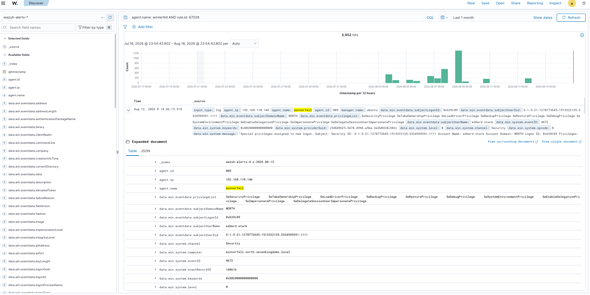
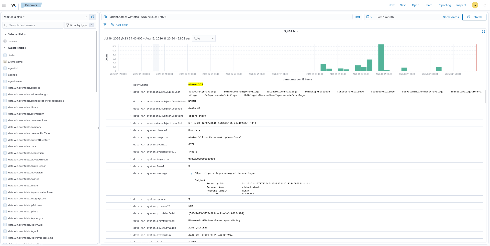

# 02 – Investigation

## Overview

Alert investigation is the phase of the incident response lifecycle where an identified security alert is examined in greater detail to understand the affected endpoint, user account, event details, and security activity associated with the alert.

This investigation was performed against the Wazuh Enterprise SOC Lab using Wazuh Discover. The investigation focused on the `WINTERFELL` Windows endpoint and Wazuh rule `67028`, which identified a Windows Security event associated with special privileges assigned to a new logon.

---

# Objectives

- Investigate the identified Wazuh alert.
- Filter alerts associated with the `WINTERFELL` endpoint.
- Investigate Wazuh rule `67028`.
- Examine the underlying Windows Security event.
- Identify the affected user account.
- Review assigned privileges.
- Review the Windows Event ID.
- Collect detailed evidence for incident response.

---

# MITRE ATT&CK Mapping

| Technique | ID |
|-----------|----|
| Domain Policy Modification | T1484 |

---

# Lab Environment

| Component | Description |
|-----------|-------------|
| SIEM | Wazuh |
| Search Interface | Wazuh Discover |
| Data Source | `wazuh-alerts-*` |
| Endpoint | `WINTERFELL` |
| Agent IP | `192.168.110.146` |
| Operating System | Windows |
| Wazuh Rule | `67028` |
| Windows Event ID | `4672` |

---

# Investigation Activities

## 1. Alert Investigation Details

The identified Wazuh alert was filtered using the `WINTERFELL` endpoint and rule ID `67028`.

### DQL

agent.name: winterfell AND rule.id: 67028

### Evidence Description

The screenshot shows the Wazuh Discover results filtered for the `WINTERFELL` endpoint and Wazuh rule `67028`. The alert data provides the initial investigation context, including the affected endpoint, event information, user account, and Wazuh detection metadata.

---

### Evidence Description

The screenshot shows the expanded Windows Security event associated with the investigated alert. The event is **Windows Event ID 4672**, indicating that special privileges were assigned to a new logon. The event identifies the `NORTH\eddard.stark` account and displays the assigned security privileges and Windows auditing information.

