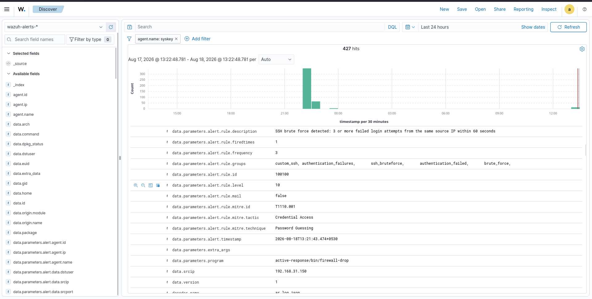
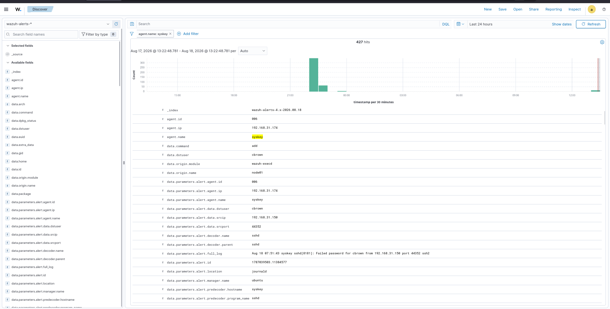
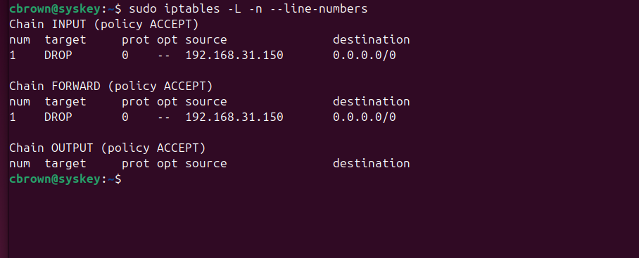
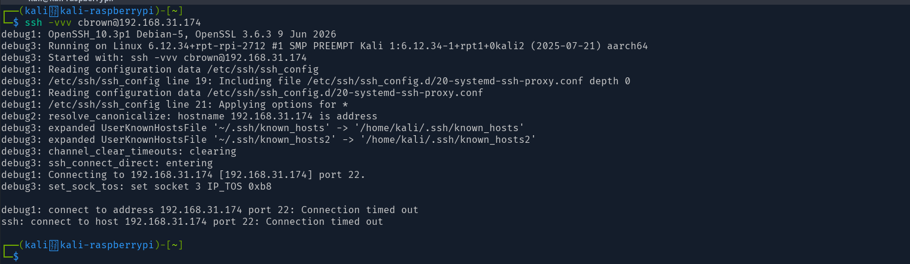

# 03 - Containment

## Overview

Containment is the phase of incident response where the security team takes action to limit the impact of a detected attack and prevent further unauthorized activity.

Wazuh provides automated response capabilities that can execute predefined actions when a detection rule is triggered.

In this lab, a controlled **SSH brute-force attack** was performed against an Ubuntu endpoint. Wazuh detected multiple failed SSH authentication attempts from the same source IP, triggered the custom brute-force detection rule, and automatically executed the `firewall-drop` Active Response.

The attacker's IP address was then blocked at the target firewall, and a follow-up SSH connection attempt was used to verify successful containment.

---

# Lab Objectives

- Understand incident containment using Wazuh
- Detect SSH brute-force activity
- Trigger a custom Wazuh detection rule
- Configure automated Active Response
- Execute `firewall-drop`
- Block the attacking source IP
- Verify firewall enforcement
- Validate containment from the attacker system
- Map the attack to MITRE ATT&CK
- Document the complete incident-response workflow

---

# Lab Environment

| Component | Details |
|-----------|---------|
| Wazuh Version | 4.14.7 |
| Wazuh Manager | Ubuntu |
| Target Host | `syskey` |
| Target IP | `192.168.31.174` |
| Attacker | Kali Linux |
| Attacker IP | `192.168.31.150` |
| Protocol | SSH |
| Target Port | `22/TCP` |
| Detection Rule | `100100` |
| Rule Level | `10` |
| Detection Threshold | 3 failed attempts |
| Detection Window | 60 seconds |
| Active Response | `firewall-drop` |
| MITRE ATT&CK | `T1110.001` |

---

# Containment Workflow

SSH Brute-Force Attack
        |
        v
Multiple Failed SSH Logins
        |
        v
Wazuh Agent Collects Authentication Events
        |
        v
Custom Rule 100100 Matches "Failed password"
        |
        v
Aggregation Rule 100101 Detects ≥3 Events in 60s
        |
        v
Brute-Force Alert Generated in Wazuh
        |
        v
Wazuh Active Response Triggered
        |
        v
firewall-drop Command Executed
        |
        v
Attacker IP Blocked via iptables/firewalld
        |
        v
Follow-up SSH Connection Attempt
        |
        v
Connection Timeout (Access Denied)

# Screenshots

## 1. SSH Brute-Force Detection

The Wazuh alert shows the SSH brute-force detection generated by rule `100100`.

---

## 2. Active Response - Firewall Drop

The Wazuh Active Response event shows that `firewall-drop` was executed against the attacking IP.

---

## 3. Source IP Blocked

The target Ubuntu firewall shows the DROP rule for `192.168.31.150`.

---

## 4. Containment Verified

A follow-up SSH connection from the attacker failed with a connection timeout.

