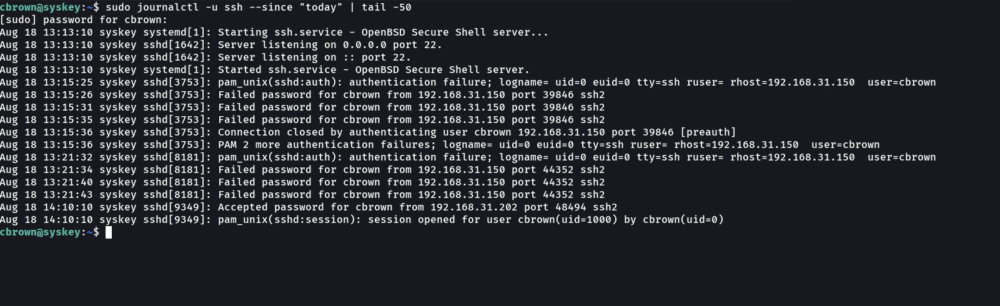
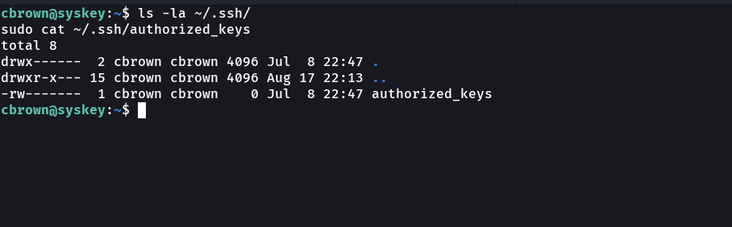
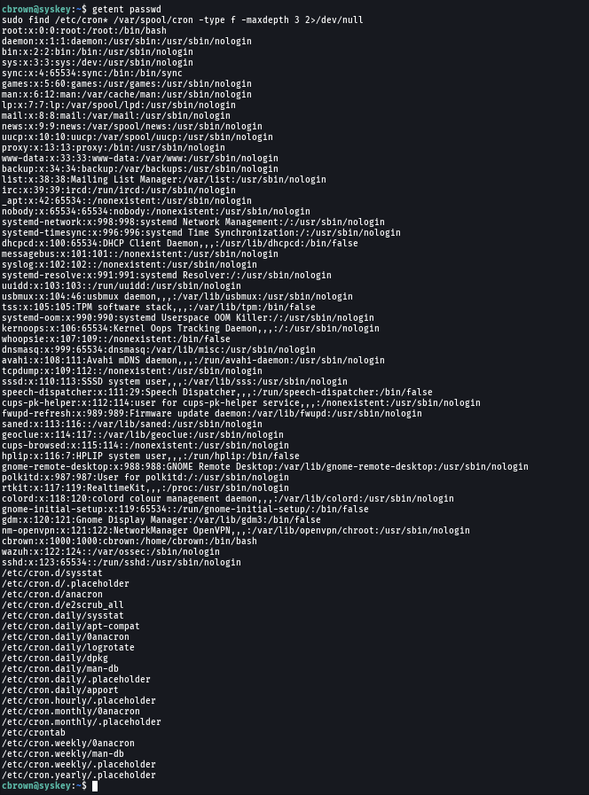
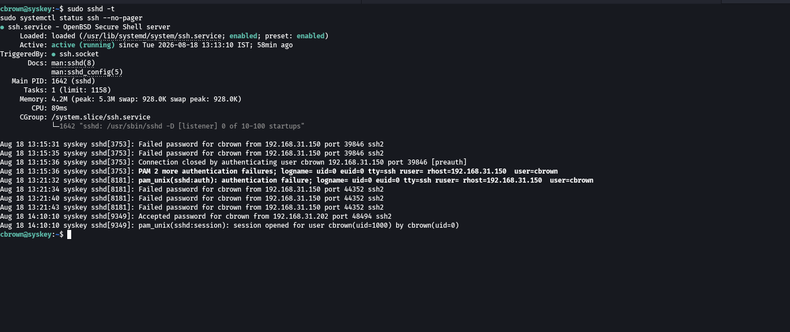
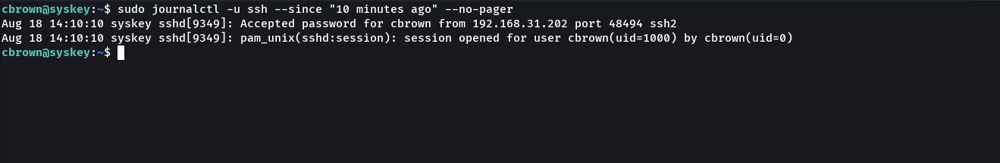

# 04 - Eradication

## Overview
Eradication is the phase of incident response where identified threats, unauthorized access mechanisms, and persistence opportunities are removed from the affected system.

In this lab, the Ubuntu endpoint `syskey` was investigated following a detected SSH brute-force attack. The eradication process focused on reviewing SSH authentication activity, checking SSH authorization mechanisms, reviewing local users and persistence locations, validating the SSH configuration, and performing final verification of the endpoint.

Objective: Ensure that no unauthorized SSH access or persistence remained after the incident.

---

# Lab Objectives
- Investigate SSH authentication activity
- Review the affected Ubuntu endpoint
- Check SSH authorized keys
- Review local users and persistence mechanisms
- Verify SSH configuration
- Validate the SSH service
- Confirm the endpoint after remediation
- Document the eradication phase
- Collect evidence for the incident-response workflow

---

# Lab Environment
| Component       | Details          |
|-----------------|------------------|
| Wazuh Version   | 4.14.7           |
| Wazuh Manager   | Ubuntu           |
| Target Host     | syskey           |
| Target IP       | 192.168.31.174   |
| Attacker        | Kali Linux       |
| Attacker IP     | 192.168.31.150   |
| Protocol        | SSH              |
| Target Port     | 22/TCP           |
| Detection Rule  | 100100           |
| Active Response | firewall-drop    |
| MITRE ATT&CK    | T1110.001 - Password Guessing |

---

# Eradication Workflow
SSH Brute-Force Incident
        |
        v
Review SSH Authentication Activity
        |
        v
Investigate Affected Endpoint
        |
        v
Check SSH Authorized Keys
        |
        v
Review Users and Persistence
        |
        v
Verify SSH Configuration
        |
        v
Validate SSH Service
        |
        v
Final Endpoint Verification
        |
        v
Eradication Complete

---

# Eradication Activities

**SSH Authentication Investigation**  
Command:  
`sudo journalctl -u ssh --since "today" --no-pager`  

**SSH Authorized Keys Review**  
Commands:  
`ls -la ~/.ssh/`  
`sudo cat ~/.ssh/authorized_keys`  

**User and Persistence Investigation**  
Command:  
`getent passwd`  
Check cron persistence:  
`sudo find /etc/cron* /var/spool/cron -type f -maxdepth 3 2>/dev/null`  

**SSH Configuration Verification**  
Commands:  
`sudo sshd -t`  
`sudo systemctl status ssh --no-pager`  

**Final Endpoint Verification**  
Command:  
`sudo journalctl -u ssh --since "10 minutes ago" --no-pager`  

---

# Eradication Results
| Investigation Area       | Result     |
|---------------------------|------------|
| SSH authentication activity | Reviewed |
| SSH authorized keys         | Checked  |
| Local users                 | Reviewed |
| Persistence locations       | Reviewed |
| SSH configuration           | Validated|
| SSH service                 | Verified |
| Final endpoint review       | Completed|
| Eradication                 | Completed|

---

# MITRE ATT&CK Context
Technique: T1110 – Brute Force  
Sub-technique: T1110.001 – Password Guessing  

---

# Incident Response Flow
Detection  
    |  
    v  
Containment  
    |  
    v  
Eradication  
    |  
    v  
Endpoint Investigation  
    |  
    v  
SSH Authorization Review  
    |  
    v  
Persistence Review  
    |  
    v  
SSH Configuration Validation  
    |  
    v  
Final Verification  

---

# Project Structure
12-Incident-Response  
│  
├── 03-Containment  
│   ├── README.md  
│   └── Screenshots  
│       ├── 01-ssh-bruteforce-detected.png  
│       ├── 02-active-response-firewall-drop.png  
│       ├── 03-source-ip-blocked.png  
│       └── 04-containment-verified.png  
│  
└── 04-Eradication  
    ├── README.md  
    └── Screenshots  
        ├── 01-ssh-investigation.png  
        ├── 02-authorized-keys-check.png  
        ├── 03-user-persistence-check.png  
        ├── 04-ssh-hardening-verification.png  
        └── 05-eradication-complete.png  

---

# Skills Demonstrated
- Incident Response  
- Incident Eradication  
- SSH Security Investigation  
- Linux Security Administration  
- SSH Configuration Validation  
- User Account Investigation  
- Persistence Investigation  
- Wazuh SIEM  
- Security Event Analysis  
- Host-Based Investigation  
- Evidence Collection  
- SOC Incident Handling  

---

# Key Takeaways
- The affected Ubuntu endpoint was investigated following the SSH brute-force incident.  
- SSH authentication activity was reviewed to understand the attack.  
- SSH authorized keys were checked for potential unauthorized access.  
- Local users and common persistence locations were reviewed.  
- SSH configuration was validated after the investigation.  
- The SSH service was verified following remediation.  
- Final endpoint verification completed the eradication phase.  
- The collected screenshots provide evidence of the investigation and remediation process.  

---

# Final Result
SSH Brute-Force Incident  
        |  
        v  
Endpoint Investigation  
        |  
        v  
SSH Authorization Review  
        |  
        v  
User & Persistence Review  
        |  
        v  
SSH Configuration Validation  
        |  
        v  
Service Verification  
        |  
        v  
Final Endpoint Review  
        |  
        v  
ERADICATION COMPLETE
