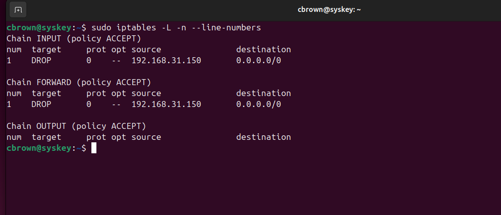
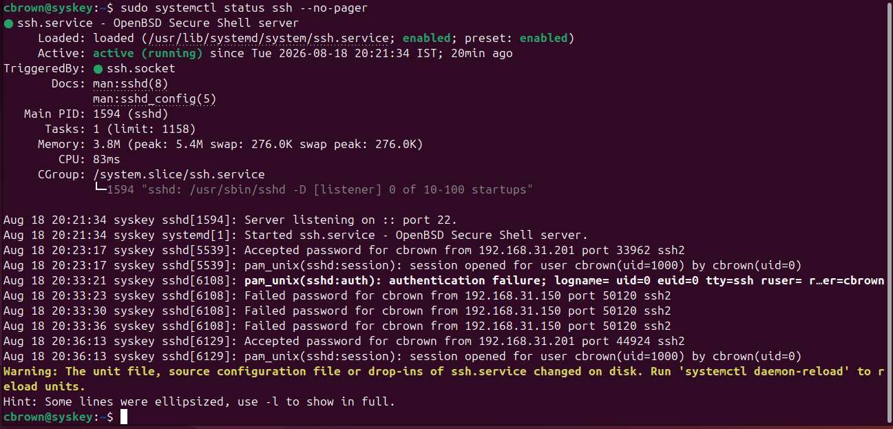
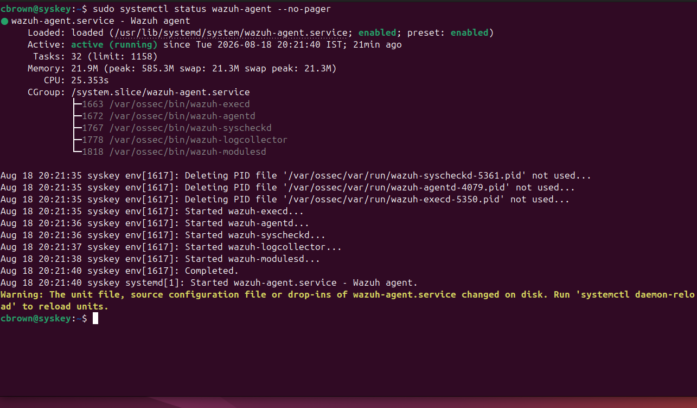
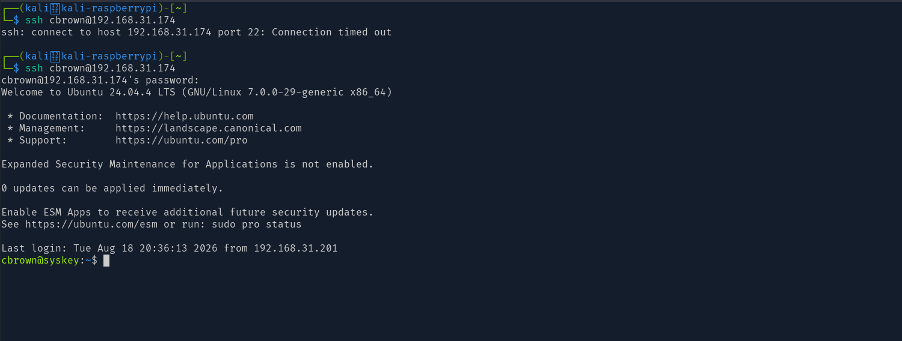
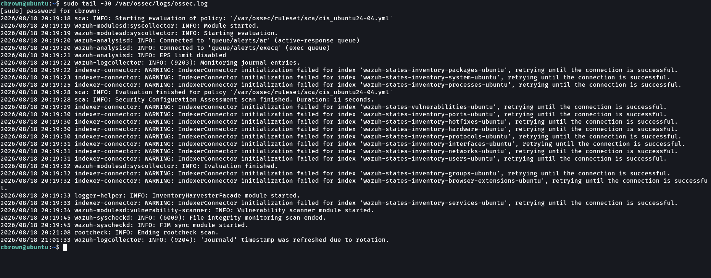

# 05 - Recovery

## Overview
Recovery is the phase of incident response where normal operations are restored after containment and eradication activities have been completed.

In this lab, the Ubuntu endpoint `syskey` was recovered after the SSH brute-force incident. The temporary firewall containment rule was removed, SSH service availability was verified, the Wazuh agent was checked, connectivity from the attacker system was restored, and the endpoint was returned to normal monitoring.

**Objective:** Confirm that the system was operational and that normal security monitoring was restored after the incident.

---

# Lab Objectives
- Restore normal endpoint operations
- Remove the temporary containment firewall block
- Verify the SSH service
- Verify the Wazuh agent
- Restore network connectivity
- Confirm SSH connectivity after recovery
- Verify continued Wazuh monitoring
- Document the recovery phase
- Collect evidence for the incident-response workflow

---

# Lab Environment
| Component       | Details          |
|-----------------|------------------|
| Wazuh Version   | 4.14.7           |
| Wazuh Manager   | Ubuntu           |
| Target Host     | syskey           |
| Target IP       | 192.168.31.174   |
| Attacker        | Kali Linux       |
| Attacker IP     | 192.168.31.150   |
| Protocol        | SSH              |
| Target Port     | 22/TCP           |
| Detection Rule  | 100100           |
| Active Response | firewall-drop    |
| MITRE ATT&CK    | T1110.001 - Password Guessing |

---

# Recovery Workflow
Containment Complete  
        |  
        v  
Eradication Complete  
        |  
        v  
Remove Temporary Firewall Block  
        |  
        v  
Verify Firewall State  
        |  
        v  
Verify SSH Service  
        |  
        v  
Verify Wazuh Agent  
        |  
        v  
Restore SSH Connectivity  
        |  
        v  
Verify Wazuh Monitoring  
        |  
        v  
Recovery Complete  

---

# Recovery Activities

**Firewall Recovery**  
Temporary firewall rules created during containment were removed to restore normal connectivity.  
Commands:  
`sudo iptables -D INPUT 1`  
`sudo iptables -D FORWARD 1`  
Verification:  
`sudo iptables -L -n --line-numbers`  

**SSH Service Verification**  
Command:  
`sudo systemctl status ssh --no-pager`  

**Wazuh Agent Verification**  
Command:  
`sudo systemctl status wazuh-agent --no-pager`  

**Connectivity Verification**  
SSH tested again from attacker system:  
`ssh cbrown@192.168.31.174`  

**Wazuh Monitoring Verification**  
Command:  
`sudo tail -30 /var/ossec/logs/ossec.log`  

---

# Recovery Results
| Recovery Activity          | Result     |
|----------------------------|------------|
| Temporary firewall block   | Removed    |
| 192.168.31.150 block       | Removed    |
| INPUT chain                | Restored   |
| FORWARD chain              | Restored   |
| SSH service                | Verified   |
| Wazuh agent                | Verified   |
| SSH connectivity           | Restored   |
| Wazuh monitoring           | Verified   |
| Recovery                   | Completed  |

---

# Incident Response Flow
Detection  
    |  
    v  
Investigation  
    |  
    v  
Containment  
    |  
    v  
Eradication  
    |  
    v  
Recovery  
    |  
    v  
Firewall Restored  
    |  
    v  
Services Verified  
    |  
    v  
Connectivity Restored  
    |  
    v  
Monitoring Confirmed  
    |  
    v  
RECOVERY COMPLETE  

---

# Incident Timeline
| Stage | Event                          |
|-------|--------------------------------|
| T0    | SSH brute-force attack detected|
| T1    | Incident investigated          |
| T2    | Attacker IP contained          |
| T3    | Firewall DROP rules applied    |
| T4    | Attack activity investigated   |
| T5    | Eradication activities completed|
| T6    | Temporary firewall rules removed|
| T7    | SSH service verified           |
| T8    | Wazuh agent verified           |
| T9    | SSH connectivity restored      |
| T10   | Wazuh monitoring verified      |
| T11   | Recovery completed             |

---

# MITRE ATT&CK Context
Technique: T1110 – Brute Force  
Sub-technique: T1110.001 – Password Guessing  

---

# Project Structure
12-Incident-Response  
│  
├── 01-Alert-Identification  
│   ├── README.md  
│   └── Screenshots  
│  
├── 02-Investigation  
│   ├── README.md  
│   └── Screenshots  
│  
├── 03-Containment  
│   ├── README.md  
│   └── Screenshots  
│       ├── 01-ssh-bruteforce-detected.png  
│       ├── 02-active-response-firewall-drop.png  
│       ├── 03-source-ip-blocked.png  
│       └── 04-containment-verified.png  
│  
├── 04-Eradication  
│   ├── README.md  
│   └── Screenshots  
│       ├── 01-ssh-investigation.png  
│       ├── 02-authorized-keys-check.png  
│       ├── 03-user-persistence-check.png  
│       ├── 04-ssh-hardening-verification.png  
│       └── 05-eradication-complete.png  
│  
└── 05-Recovery  
    ├── README.md  
    └── Screenshots  
        ├── 01-firewall-restored.png  
        ├── 02-ssh-service-verified.png  
        ├── 03-wazuh-agent-verified.png  
        ├── 04-connectivity-restored.png  
        └── 05-recovery-monitoring.png  

---

# Skills Demonstrated
- Incident Response  
- Incident Recovery  
- Wazuh SIEM  
- Wazuh Agent Management  
- Linux Firewall Management  
- iptables  
- SSH Service Management  
- Network Connectivity Verification  
- Security Monitoring  
- Endpoint Recovery  
- Automated Incident Response  
- Evidence Collection  
- SOC Incident Handling  

---

# Key Takeaways
- Temporary firewall containment rules were removed after eradication.  
- Attacker IP `192.168.31.150` was no longer blocked.  
- SSH service was verified operational.  
- Wazuh agent confirmed healthy and connected.  
- SSH connectivity successfully restored.  
- Wazuh monitoring verified after recovery.  
- Screenshots provide evidence of firewall restoration, service verification, agent health, connectivity restoration, and continued monitoring.  
- Recovery phase completed the technical response to the simulated SSH brute-force incident.  

---

# Final Result
SSH Brute-Force Incident  
        |  
        v  
Detection  
        |  
        v  
Investigation  
        |  
        v  
Containment  
        |  
        v  
Eradication  
        |  
        v  
Firewall Block Removed  
        |  
        v  
SSH Service Verified  
        |  
        v  
Wazuh Agent Verified  
        |  
        v  
SSH Connectivity Restored  
        |  
        v  
Monitoring Confirmed  
        |  
        v  
RECOVERY COMPLETE

