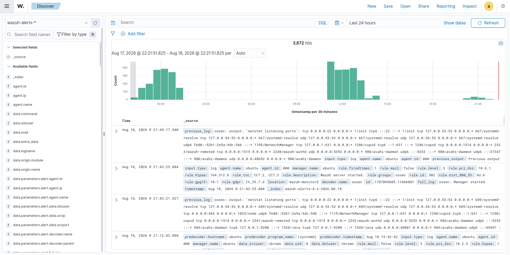
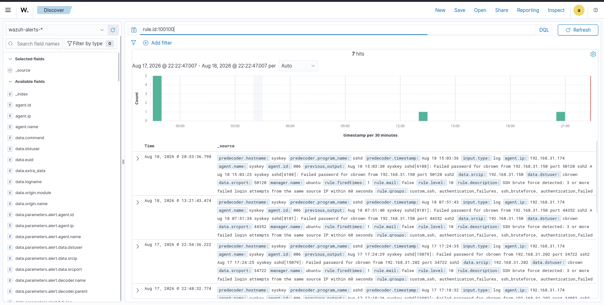
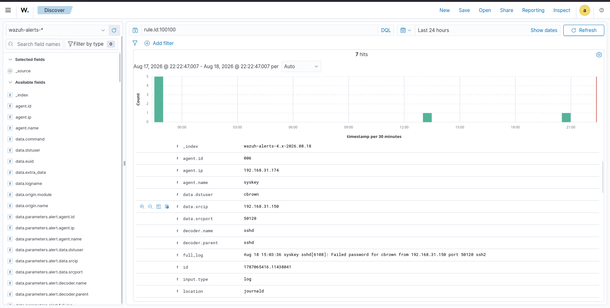
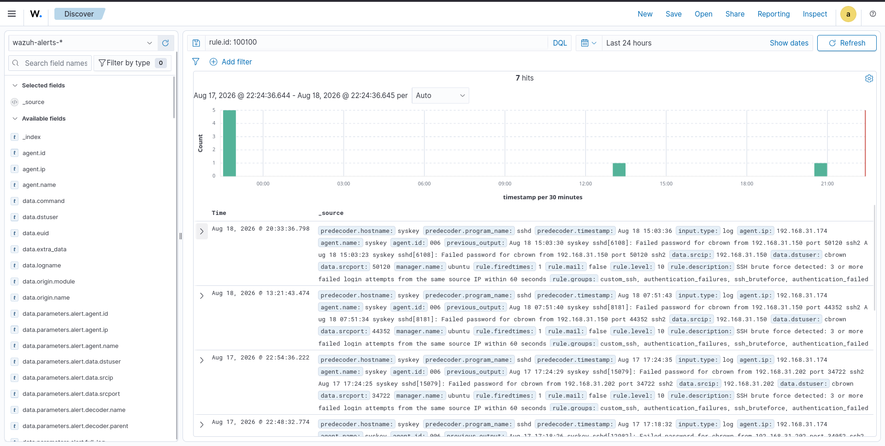
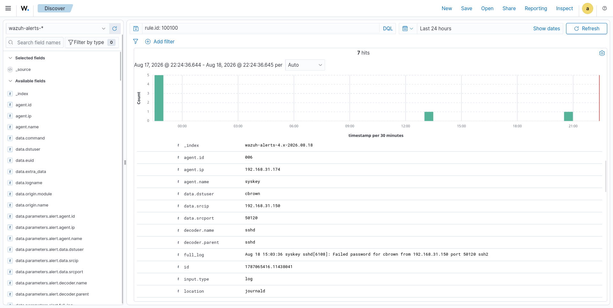

# 02 - Security Events

## Overview
Security Events provides a detailed view of alerts and events collected by Wazuh agents and indexed in the Wazuh Indexer.  
In this lab, the Wazuh Dashboard Discover interface was used to investigate events generated by the custom SSH brute-force detection rule `100100`.  

**Objective:** Identify the source of suspicious activity, the affected endpoint, the targeted user, the detection rule, and the timeline of detected events.

---

# Lab Objectives
- Understand the Wazuh Security Events view  
- Search indexed security events  
- Filter events by Wazuh rule ID  
- Investigate custom detection alerts  
- Identify source IP of suspicious activity  
- Identify affected endpoint and user  
- Review SSH authentication failures  
- Analyze alert timestamps and frequency  
- Investigate events using Wazuh Discover  
- Collect evidence for SOC investigations  
- Support the incident-response workflow  

---

# Lab Environment
| Component             | Details              |
|-----------------------|----------------------|
| SIEM                  | Wazuh                |
| Wazuh Version         | 4.14.7               |
| Dashboard             | Wazuh Dashboard      |
| Index Pattern         | wazuh-alerts-*       |
| Investigation Interface | Discover           |
| Detection Rule        | 100100               |
| Rule Level            | 10                   |
| Detection             | SSH Brute Force      |
| Threshold             | 3 failed attempts    |
| Window                | 60 seconds           |
| Target Host           | syskey               |
| Target IP             | 192.168.31.174       |
| Attacker IP           | 192.168.31.150       |
| Target User           | cbrown               |
| Protocol              | SSH                  |
| Port                  | 22/TCP               |
| MITRE ATT&CK          | T1110.001 – Password Guessing |

---

# Security Event Workflow
SSH Authentication Activity → Wazuh Agent → Wazuh Manager → Decoder → Rule 100100 → Security Alert → Wazuh Indexer → Wazuh Dashboard → Discover → SOC Investigation  

---

# Dashboard Evidence
  
  
  
  
  

---

# Detection Rule Investigation
Filtered query: `rule.id: 100100`  
Rule ID: 100100  
Rule Level: 10  
Detection: ≥3 failed logins from same IP within 60s  
Mapped to MITRE ATT&CK T1110.001 – Password Guessing  

---

# Event Details
| Field        | Value             |
|--------------|-------------------|
| Agent Name   | syskey            |
| Agent IP     | 192.168.31.174    |
| Source IP    | 192.168.31.150    |
| Target User  | cbrown            |
| Decoder      | sshd              |
| Rule ID      | 100100            |
| Rule Level   | 10                |
| Protocol     | SSH               |

Original log: *Failed password for cbrown from 192.168.31.150*  

---

# Event Timeline
Discover timeline showed multiple detections of rule 100100, confirming repeated brute-force attempts.  

---

# Source and Target Analysis
Attacker: 192.168.31.150 → Target Endpoint: syskey (192.168.31.174) → Target User: cbrown → Failed Authentication → Rule 100100 → SSH Brute-Force Detection  

---

# Security Event Fields
Useful fields:  
- rule.id → detection rule  
- rule.level → severity  
- agent.name / agent.ip → endpoint identity  
- data.srcip / srcport → source details  
- data.dstuser → targeted user  
- decoder.name → event decoder  
- full_log → original event  
- timestamp → event timing  

---

# Investigation Workflow
Security Events → General Review → Apply Rule Filter → Matching Events → Event Details → Source IP → Target Endpoint → Target User → Timeline → Rule Analysis → Incident Investigation  

---

# SSH Brute-Force Investigation
Source IP: 192.168.31.150 → Multiple Failed SSH Logins → Target Endpoint: syskey → Target User: cbrown → Rule 100100 → SSH Brute-Force Alert → SOC Investigation  

---

# Detection Evidence
| Item             | Finding               |
|------------------|-----------------------|
| Detection Rule   | 100100                |
| Rule Level       | 10                    |
| Detection Type   | SSH Brute Force       |
| Source IP        | 192.168.31.150        |
| Target Host      | syskey                |
| Target IP        | 192.168.31.174        |
| Target User      | cbrown                |
| Protocol         | SSH                   |
| Decoder          | sshd                  |
| Threshold        | 3 failed attempts     |
| Time Window      | 60 seconds            |
| MITRE Technique  | T1110.001 – Password Guessing |

---

# Relationship to Incident Response
Security Events → Rule 100100 → SSH Brute-Force Alert → Source IP Identification → Investigation → Containment → Eradication → Recovery  

---

# Relationship to Containment
Source IP 192.168.31.150 identified → Wazuh Active Response → firewall-drop → Source IP Blocked  

---

# SOC Analyst Use Cases
- Alert investigation  
- Authentication monitoring  
- Brute-force detection  
- Source IP identification  
- Endpoint investigation  
- User activity analysis  
- Event timeline analysis  
- Detection rule validation  
- Incident investigation  
- Threat hunting  
- Evidence collection  

---

# Key Findings
- Wazuh indexed events successfully.  
- Discover enabled targeted investigation.  
- Rule 100100 detected brute-force attempts.  
- Source IP identified: 192.168.31.150.  
- Target endpoint: syskey (192.168.31.174).  
- Target user: cbrown.  
- Detection mapped to MITRE ATT&CK T1110.001.  
- Evidence supported containment and eradication phases.  

---

# Skills Demonstrated
- Wazuh Discover  
- Security Event Analysis  
- DQL Filtering  
- Alert Investigation  
- SSH Authentication Monitoring  
- Brute-Force Detection  
- Source IP Analysis  
- Endpoint Investigation  
- User Activity Analysis  
- Event Timeline Analysis  
- Detection Rule Analysis  
- MITRE ATT&CK Analysis  
- SOC Investigation  
- Incident Response  
- Evidence Collection  

---

# Project Structure
13-Dashboards/  
│  
├── 01-SOC-Overview/  
│   ├── README.md  
│   └── Screenshots/01-soc-overview.png  
│  
├── 02-Security-Events/  
│   ├── README.md  
│   └── Screenshots/01-security-events-overview.png  
│       ├── 02-security-events-filtered.png  
│       ├── 03-event-details.png  
│       ├── 04-event-timeline.png  
│       └── 05-source-ip-analysis.png  
│  
├── 03-Authentication/  
│   └── Screenshots/03-authentication-monitoring.png  
│  
├── 04-Endpoint-Security/  
│   └── Screenshots/04-endpoint-security.png  
│  
├── 05-Threat-Detection/  
│   └── Screenshots/05-threat-detection.png  
│  
└── 06-Incident-Monitoring/  
    └── Screenshots/06-incident-monitoring.png  

---

# Conclusion
The Wazuh Security Events dashboard provides detailed event-level visibility for SOC investigations.  
Discover was used to filter rule 100100, identify attacker IP, affected endpoint, targeted account, authentication failures, detection timeline, and MITRE ATT&CK mapping.  
This evidence supported containment and eradication, demonstrating how Wazuh enables practical SOC monitoring, detection investigation, and incident-response operations.

