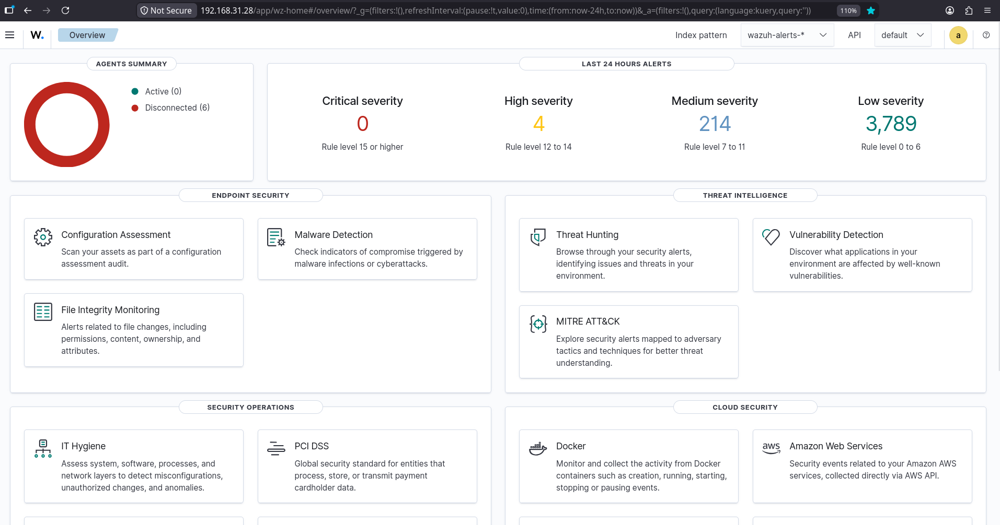
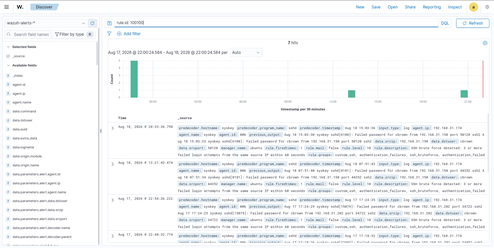
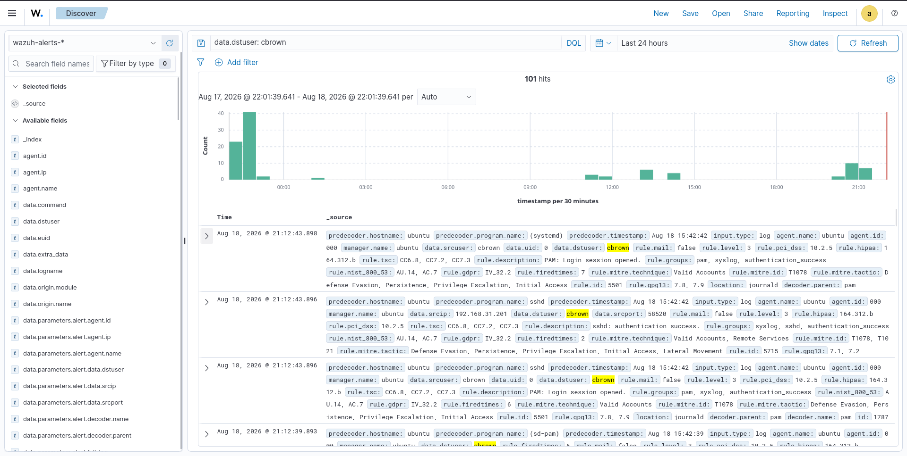
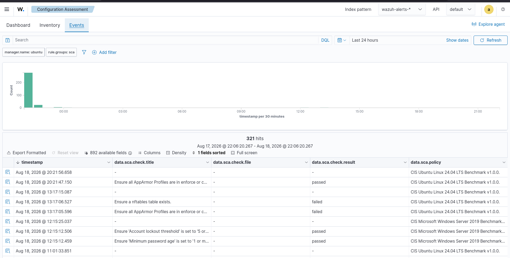
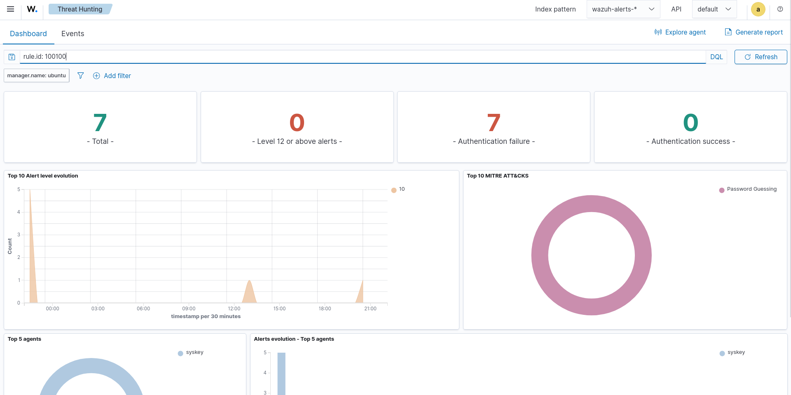
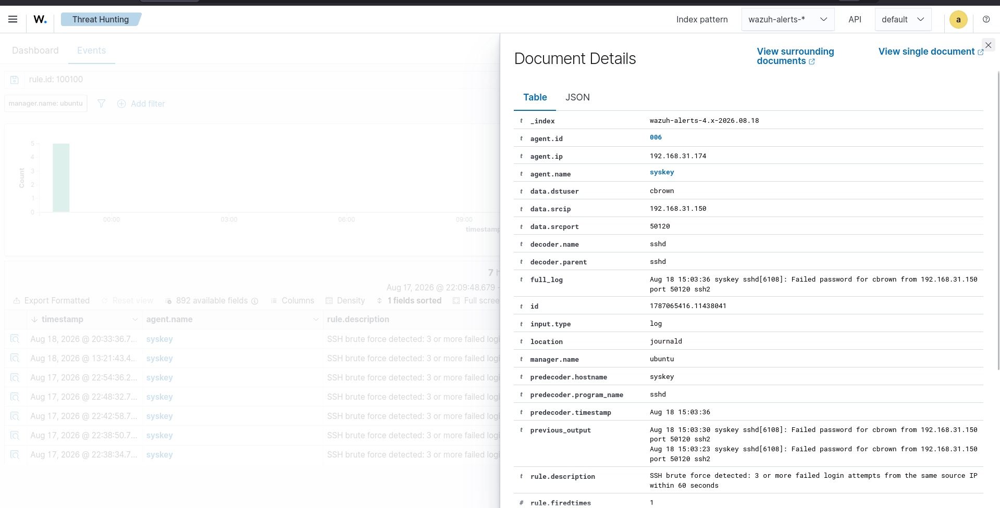

# 01 - SOC Overview

## Overview
The SOC Overview dashboard provides a centralized view of the Wazuh security monitoring environment.  
It gives analysts visibility into endpoint status, alert severity, endpoint security capabilities, threat intelligence features, security operations, and cloud-security integrations.  

**Objective:** Use the Wazuh Overview dashboard as the primary SOC monitoring interface to review the current security posture and provide a centralized starting point for investigations.

---

# Lab Objectives
- Understand the Wazuh SOC Overview dashboard  
- Monitor the overall Wazuh security environment  
- Review agent connectivity status  
- Monitor alert severity distribution  
- Review endpoint security capabilities  
- Review threat intelligence capabilities  
- Understand the SOC monitoring interface  
- Establish a centralized dashboard for security operations  
- Document dashboard evidence for the Wazuh Enterprise SOC Lab  

---

# Lab Environment
| Component         | Details                |
|-------------------|------------------------|
| SIEM              | Wazuh                  |
| Wazuh Version     | 4.14.7                 |
| Dashboard         | Wazuh Dashboard        |
| Index Pattern     | wazuh-alerts-*         |
| Primary Interface | SOC Overview           |
| Monitoring Scope  | Agents & Security Events |
| Alert Monitoring  | Enabled                |
| Endpoint Security | Config Assessment, Malware Detection, FIM |
| Threat Intelligence | Threat Hunting, Vulnerability Detection, MITRE ATT&CK |

---

# SOC Overview Architecture
Agents → Wazuh Manager → Wazuh Indexer → Wazuh Dashboard → SOC Overview  
From here, analysts can access:  
- Alert Monitoring  
- Threat Intelligence  
- Endpoint Security  

---

# Dashboard Overview
The Wazuh Overview dashboard provides multiple monitoring sections:  
- Agents Summary  
- Last 24 Hours Alerts  
- Endpoint Security  
- Threat Intelligence  
- Security Operations  
- Cloud Security  

---

# Agents Summary
Active Agents: 0  
Disconnected Agents: 6  
Disconnected agents indicate reduced visibility and require investigation.  

---

# Alert Severity Overview
| Severity | Alerts | Rule Level |
|----------|--------|------------|
| Critical | 0      | 15+        |
| High     | 4      | 12–14      |
| Medium   | 214    | 7–11       |
| Low      | 3,789  | 0–6        |

---

# Endpoint Security
Capabilities include:  
- Configuration Assessment  
- Malware Detection  
- File Integrity Monitoring  

---

# Threat Intelligence
Capabilities include:  
- Threat Hunting  
- Vulnerability Detection  
- MITRE ATT&CK mapping  

---

# Security Operations
Capabilities include:  
- IT Hygiene  
- PCI DSS compliance monitoring  

---

# Cloud Security
Integrations include:  
- Docker  
- AWS  

---

# Dashboard Evidence
  
  
  
  
  
  

---

# Analyst Workflow
SOC Overview → Review Agent Status → Review Alert Severity → Identify High/Critical Alerts → Security Events → Endpoint Investigation → Threat Hunting → MITRE ATT&CK → Incident Response  

---

# Dashboard Investigation Examples
- **Alert Investigation:** High Severity Alert → Security Event → Alert Details → Rule Analysis → MITRE ATT&CK  
- **Threat Hunting:** Search Telemetry → Filter Events → Investigate Activity → Correlate Events → Determine Risk  
- **Endpoint Investigation:** Config Assessment → Malware Detection → File Integrity Monitoring  

---

# Relationship to Incident Response
SOC Overview → Alert Identification → Investigation → Containment → Eradication → Recovery  

---

# Dashboard Data Observed
| Dashboard Area     | Observed Information |
|--------------------|----------------------|
| Agents Summary     | 0 active, 6 disconnected |
| Critical Alerts    | 0 |
| High Alerts        | 4 |
| Medium Alerts      | 214 |
| Low Alerts         | 3,789 |
| Endpoint Security  | Config Assessment, Malware Detection, FIM |
| Threat Intelligence| Threat Hunting, Vulnerability Detection, MITRE ATT&CK |
| Security Operations| IT Hygiene, PCI DSS |
| Cloud Security     | Docker, AWS |

---

# SOC Analyst Use Cases
- Security posture monitoring  
- Agent health monitoring  
- Alert triage & prioritization  
- Endpoint security monitoring  
- Configuration assessment  
- File integrity monitoring  
- Threat hunting  
- Vulnerability investigation  
- MITRE ATT&CK analysis  
- Incident investigation  
- Compliance monitoring  

---

# Skills Demonstrated
- Wazuh Dashboard  
- SOC Monitoring  
- Security Event Monitoring  
- Alert Triage & Severity Analysis  
- Endpoint Monitoring  
- Configuration Assessment  
- File Integrity Monitoring  
- Threat Hunting  
- Vulnerability Detection  
- MITRE ATT&CK  
- Security Operations  
- Dashboard Analysis  
- SOC Investigation  
- Incident Response  

---

# Key Takeaways
- Wazuh Overview dashboard provides centralized SOC monitoring.  
- Agent connectivity tracked via Agents Summary.  
- Alert severity enables prioritization of events.  
- Endpoint Security adds visibility into system changes.  
- Threat Intelligence supports proactive hunting and adversary analysis.  
- MITRE ATT&CK provides standardized context.  
- Dashboard serves as the starting point for alert triage and incident investigation.  

---

# Project Structure
13-Dashboards/  
│  
├── 01-SOC-Overview/  
│   ├── README.md  
│   └── Screenshots/01-soc-overview.png  
│  
├── 02-Security-Events/  
│   └── Screenshots/02-security-events.png  
│  
├── 03-Authentication/  
│   └── Screenshots/03-authentication-monitoring.png  
│  
├── 04-Endpoint-Security/  
│   └── Screenshots/04-endpoint-security.png  
│  
├── 05-Threat-Detection/  
│   └── Screenshots/05-threat-detection.png  
│  
└── 06-Incident-Monitoring/  
    └── Screenshots/06-incident-monitoring.png  

---

# Conclusion
The SOC Overview dashboard provides a centralized operational view of the Wazuh environment.  
It demonstrates visibility into agents, alerts, endpoint security, threat intelligence, security operations, and cloud security.  
This establishes the Wazuh Dashboard as the primary visualization and monitoring layer of the Wazuh Enterprise SOC Lab.  
SOC Overview serves as the initial point for analysts to identify events, prioritize alerts, investigate endpoints, perform threat hunting, analyze MITRE ATT&CK mappings, and initiate incident-response workflows.
