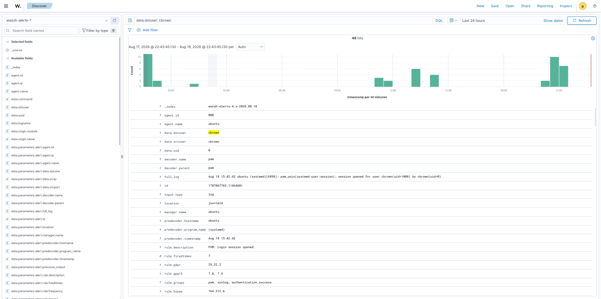
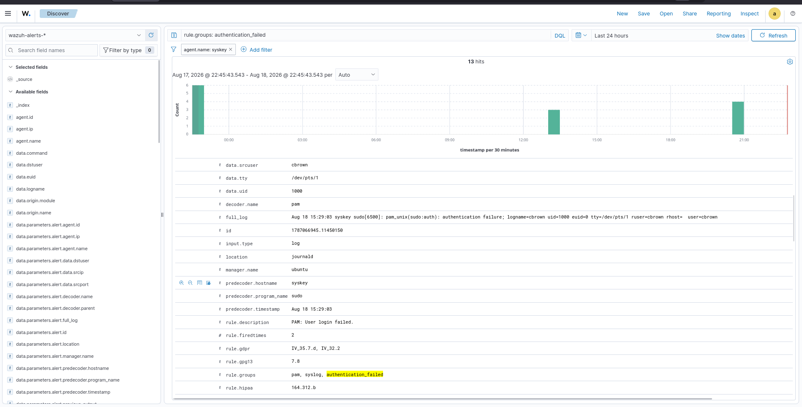
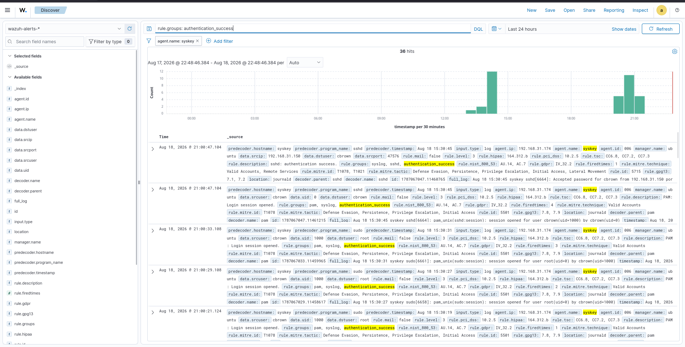
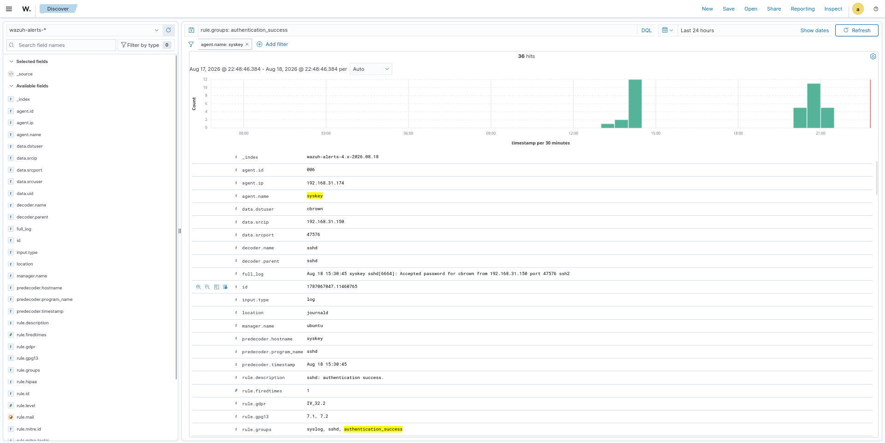
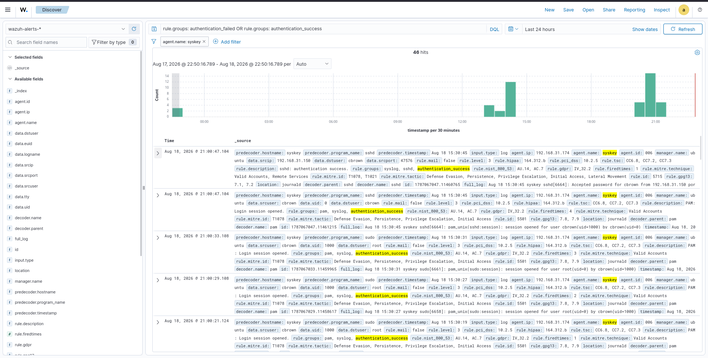

# 03 - Authentication

## Overview
Authentication monitoring is a core SOC capability used to identify successful and failed login activity across monitored endpoints.  
Wazuh collects authentication events from monitored systems and makes them available through the Dashboard for investigation and analysis.  

In this lab, the Wazuh Dashboard Discover interface was used to monitor SSH and PAM authentication activity on the `syskey` endpoint. Authentication events were analyzed to identify successful logins, failed authentication attempts, source IP addresses, targeted users, event timestamps, and authentication-related Wazuh rules.  

**Objective:** Provide visibility into normal authentication activity as well as suspicious behavior such as password guessing and brute-force attacks.

---

# Lab Objectives
- Understand authentication monitoring in Wazuh  
- Monitor SSH authentication events  
- Monitor PAM authentication events  
- Identify successful authentication activity  
- Identify failed authentication activity  
- Identify authentication sources  
- Identify targeted users  
- Analyze authentication timelines  
- Investigate authentication-related Wazuh rules  
- Correlate authentication activity with security incidents  
- Document authentication-monitoring evidence  

---

# Lab Environment
| Component              | Details            |
|------------------------|--------------------|
| SIEM                   | Wazuh              |
| Wazuh Version          | 4.14.7             |
| Dashboard              | Wazuh Dashboard    |
| Index Pattern          | wazuh-alerts-*     |
| Investigation Interface| Discover           |
| Monitored Endpoint     | syskey             |
| Endpoint IP            | 192.168.31.174     |
| Authentication Protocol| SSH                |
| Authentication Sources | SSH / PAM          |
| Target User            | cbrown             |
| Monitoring             | Enabled            |

---

# Authentication Monitoring Architecture
Authentication Activity → SSH / PAM → Wazuh Agent → Wazuh Manager → Decoders → Detection Rules → Wazuh Indexer → Wazuh Dashboard → Discover → SOC Investigation  

---

# Dashboard Evidence
  
  
  
  
  

---

# Authentication Failures
Filter: `rule.groups: authentication_failed`  
Fields: srcip, srcport, dstuser, agent.name, rule.description, timestamp, decoder.name  

---

# Authentication Success
Filter: `rule.groups: authentication_success`  
Shows legitimate or potentially unauthorized successful access. Includes SSH and PAM session activity.  

---

# Authentication Event Details
Expanded events reveal: agent.name, agent.ip, srcip, srcport, dstuser, decoder, rule.id, rule.description, timestamp, full_log.  

---

# Authentication Timeline
Filter: `rule.groups: authentication_failed OR rule.groups: authentication_success`  
Results: 46 hits.  
Agent: syskey (192.168.31.174)  
Source IP: 192.168.31.150  
Target User: cbrown  

Timeline shows repeated attempts, concentrated login activity, and success following failures.  

---

# Investigation Workflow
Authentication Events → Identify Result → Success / Failure → Identify Source → Identify User → Review Timeline → Analyze Rule Details → Determine Security Risk  

---

# SSH Authentication Monitoring
Endpoint: syskey (192.168.31.174)  
Protocol: SSH (22/TCP)  
Telemetry reveals failed logins, successful logins, source IPs, target accounts, login timing, repeated attempts.  

---

# PAM Authentication Monitoring
Events include: *PAM: Login session opened.*  
Provides visibility into authenticated sessions and correlation with user activity.  

---

# Authentication and Brute-Force Detection
Kali Linux (192.168.31.150) → Multiple SSH Attempts → syskey (192.168.31.174) → Authentication Failures → Rule 100100 → SSH Brute-Force Alert → Active Response → Source IP Blocked  

---

# Authentication Investigation Example
Source: 192.168.31.150 → Target Endpoint: syskey → Target Account: cbrown → Authentication Event → Success / Failure → SOC Investigation  

---

# Authentication Monitoring Use Cases
- SSH login monitoring  
- Failed login detection  
- Successful login monitoring  
- Brute-force investigation  
- Password guessing investigation  
- Account activity monitoring  
- Source IP identification  
- Suspicious login investigation  
- Timeline analysis  
- Incident investigation  
- User activity analysis  
- Security-event correlation  

---

# SOC Analyst Investigation Process
1. Identify Authentication Event  
2. Determine Success / Failure  
3. Identify Source IP  
4. Identify Target User  
5. Identify Target Endpoint  
6. Review Timeline  
7. Correlate Related Events  
8. Determine Security Impact  
9. Initiate Incident Response  

---

# Authentication Evidence
- Authentication Overview → General visibility  
- Authentication Failures → Failed login investigation  
- Authentication Success → Successful access monitoring  
- Event Details → Detailed evidence  
- Authentication Timeline → Chronological analysis  

---

# Relationship to Incident Response
Authentication Event → Detection → Investigation → Source Identification → Containment → Eradication → Recovery  

---

# MITRE ATT&CK
Technique: T1110 – Brute Force  
Sub-technique: T1110.001 – Password Guessing  

---

# Key Findings
- Wazuh collected authentication telemetry successfully.  
- SSH and PAM events visible in Discover.  
- Successful and failed events identifiable.  
- Source IPs and target users visible.  
- Events analyzed chronologically.  
- Authentication correlated with brute-force detection.  
- Telemetry supported incident-response workflow.  

---

# Skills Demonstrated
- Wazuh Authentication Monitoring  
- SSH Log Monitoring  
- PAM Log Monitoring  
- Authentication Event Analysis  
- Successful Login Investigation  
- Failed Login Investigation  
- Source IP Analysis  
- User Activity Analysis  
- Event Timeline Analysis  
- Wazuh Discover  
- DQL Filtering  
- Security Event Correlation  
- Brute-Force Investigation  
- MITRE ATT&CK  
- SOC Investigation  
- Incident Response  

---

# Project Structure
13-Dashboards/  
│  
├── 01-SOC-Overview/  
│   └── Screenshots/01-soc-overview.png  
│  
├── 02-Security-Events/  
│   └── Screenshots/01-security-events-overview.png  
│  
├── 03-Authentication/  
│   └── Screenshots/01-authentication-overview.png  
│       ├── 02-authentication-failures.png  
│       ├── 03-authentication-success.png  
│       ├── 04-authentication-event-details.png  
│       └── 05-authentication-timeline.png  
│  
├── 04-Endpoint-Security/  
│   └── Screenshots/04-endpoint-security.png  
│  
├── 05-Threat-Detection/  
│   └── Screenshots/05-threat-detection.png  
│  
└── 06-Incident-Monitoring/  
    └── Screenshots/06-incident-monitoring.png  

---

# Conclusion
Authentication monitoring provides the SOC with visibility into how users and systems authenticate across the monitored environment.  
In this lab, Wazuh Discover was used to analyze SSH and PAM authentication activity, identify successful and failed events, examine source IPs and target users, and analyze authentication activity over time.  

Workflow: Authentication Telemetry → Event Classification → Success/Failure → Source/User Identification → Timeline Analysis → Security Correlation → SOC Investigation → Incident Response  

This demonstrates how Wazuh authentication telemetry serves as a critical evidence source for SOC monitoring, threat detection, investigation, and incident response.

