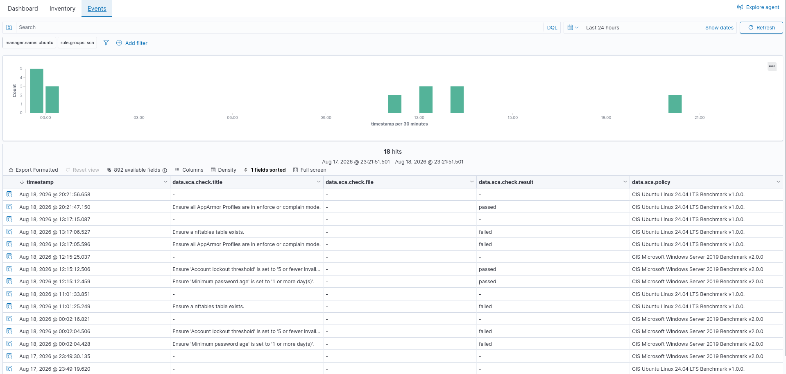
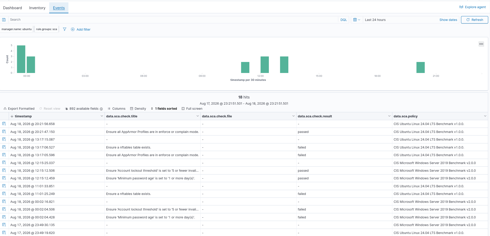
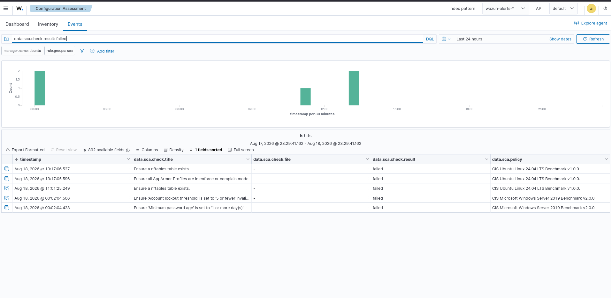
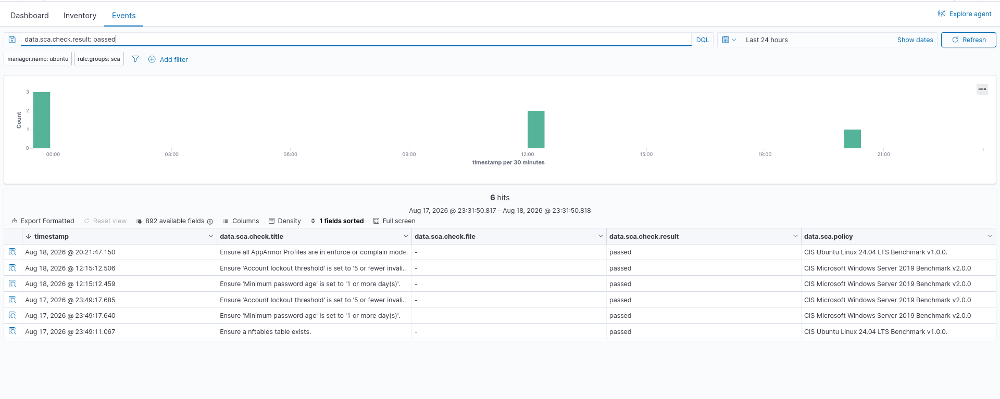
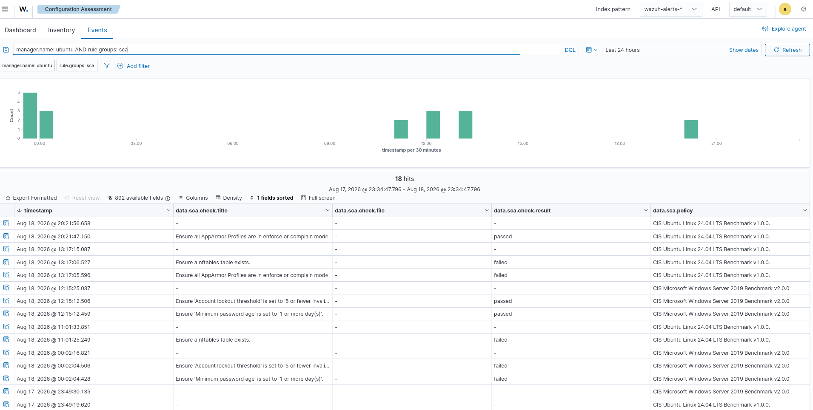

# 04 - Endpoint Security

## Overview
Endpoint security monitoring provides visibility into the security posture, configuration state, and compliance status of monitored systems.  
Wazuh provides **Security Configuration Assessment (SCA)** capabilities that evaluate endpoints against security benchmarks and identify configuration weaknesses.  

In this lab, the Wazuh **Configuration Assessment → Events** interface was used to review SCA results, identify failed security checks, identify passed checks, and analyze configuration-assessment activity over time.  

**Objective:** Review CIS benchmark results for Ubuntu Linux 24.04 and Microsoft Windows Server 2019, identify configuration weaknesses, and document endpoint security evidence.

---

# Lab Objectives
- Understand endpoint security monitoring with Wazuh  
- Understand Security Configuration Assessment (SCA)  
- Monitor endpoint configuration compliance  
- Review CIS benchmark results  
- Identify failed security checks  
- Identify passed security checks  
- Analyze configuration assessment events  
- Review endpoint security activity over time  
- Investigate configuration weaknesses  
- Document endpoint security evidence  
- Support SOC investigation and remediation workflows  

---

# Lab Environment
| Component              | Details                                      |
|------------------------|----------------------------------------------|
| SIEM                   | Wazuh                                        |
| Wazuh Version          | 4.14.7                                       |
| Dashboard              | Wazuh Dashboard                              |
| Module                 | Configuration Assessment                     |
| Interface              | Events                                       |
| Index Pattern          | wazuh-alerts-*                               |
| Manager                | ubuntu                                       |
| Monitoring             | Enabled                                      |
| Assessment Type        | Security Configuration Assessment            |
| Ubuntu Benchmark       | CIS Ubuntu Linux 24.04 LTS Benchmark v1.0.0  |
| Windows Benchmark      | CIS Microsoft Windows Server 2019 Benchmark v2.0.0 |

---

# Endpoint Security Architecture
Monitored Endpoint → Security Configuration Assessment → CIS Benchmarks → Security Checks → PASSED / FAILED → Wazuh Agent → Wazuh Manager → SCA Detection → Wazuh Indexer → Wazuh Dashboard → Configuration Assessment → SOC Analysis  

---

# Dashboard Evidence
  
  
  
  
  

---

# Configuration Assessment Results
- **Failed Security Checks**  
  Filter: `data.sca.check.result: failed` → 5 failed events.  
  Examples: nftables table missing, AppArmor profiles not enforced, account lockout threshold misconfigured, minimum password age too low.  

- **Passed Security Checks**  
  Filter: `data.sca.check.result: passed` → 6 passed events.  
  Examples: AppArmor profiles enforced, account lockout threshold correct, minimum password age correct, nftables table present.  

---

# Endpoint Security Timeline
Filter: `manager.name: ubuntu AND rule.groups: sca`  
Time range: Last 24 hours → 18 SCA events.  
Timeline shows assessment activity at multiple points, with both passed and failed checks.  

---

# Failed Configuration Examples
| Security Check                          | Result |
|-----------------------------------------|--------|
| Ensure a nftables table exists          | Failed |
| Ensure all AppArmor Profiles enforced   | Failed |
| Account lockout threshold               | Failed |
| Minimum password age                    | Failed |

---

# Passed Configuration Examples
| Security Check                          | Result |
|-----------------------------------------|--------|
| AppArmor Profiles enforcement           | Passed |
| Account lockout threshold               | Passed |
| Minimum password age                    | Passed |
| nftables table check                    | Passed |

---

# CIS Benchmark Coverage
- Ubuntu: CIS Ubuntu Linux 24.04 LTS Benchmark v1.0.0  
- Windows: CIS Microsoft Windows Server 2019 Benchmark v2.0.0  

---

# SOC Investigation Workflow
SCA Events → Review Assessment → Identify Security Check → Determine Result → PASSED / FAILED → Investigate Failed Controls → Assess Risk → Plan Remediation → Validate / Retest  

---

# Endpoint Security Investigation Process
1. Open Wazuh Configuration Assessment  
2. Navigate to Events interface  
3. Review SCA events  
4. Identify endpoint and associated policy  
5. Examine individual checks  
6. Determine pass/fail status  
7. Investigate failed controls  
8. Assess security impact  
9. Remediate weaknesses  
10. Re-run assessment to validate  

---

# Security Monitoring Use Cases
- Security configuration assessment  
- CIS benchmark monitoring  
- Linux/Windows hardening  
- AppArmor monitoring  
- Firewall configuration assessment  
- Account/password policy monitoring  
- Compliance monitoring  
- Remediation validation  
- SOC investigation  

---

# Relationship to Incident Response
Endpoint Monitoring → Security Configuration Assessment → Identify Weak Configuration → Investigation → Containment → Eradication → Recovery → Validation  

---

# Evidence Summary
- Endpoint Security Overview → General visibility  
- Configuration Assessment → Detailed results  
- Failed Security Checks → Identify weaknesses  
- Passed Security Checks → Verify compliant controls  
- Endpoint Security Timeline → Chronological analysis  

---

# Key Findings
- Wazuh collected SCA events successfully.  
- 18 SCA events observed in 24h.  
- 5 failed checks identified.  
- 6 passed checks identified.  
- CIS Ubuntu and Windows benchmarks applied.  
- Weaknesses included firewall, AppArmor, account lockout, and password-age controls.  
- Results support SOC investigations and remediation workflows.  

---

# Skills Demonstrated
- Wazuh SCA  
- Endpoint Security Monitoring  
- CIS Benchmark Analysis  
- Configuration Compliance  
- Linux/Windows Security Assessment  
- Security Control Validation  
- Failed Configuration Investigation  
- Security Posture Analysis  
- Wazuh Dashboard / Discover  
- DQL Filtering  
- Event Timeline Analysis  
- SOC Investigation  
- Incident Response Support  
- Remediation Validation  

---

# Project Structure
13-Dashboards/  
│  
├── 01-SOC-Overview/  
│   └── Screenshots/01-soc-overview.png  
│  
├── 02-Security-Events/  
│   └── Screenshots/01-security-events-overview.png  
│  
├── 03-Authentication/  
│   └── Screenshots/01-authentication-overview.png  
│  
├── 04-Endpoint-Security/  
│   └── Screenshots/01-endpoint-security-overview.png  
│       ├── 02-configuration-assessment.png  
│       ├── 03-failed-security-checks.png  
│       ├── 04-passed-security-checks.png  
│       └── 05-endpoint-security-timeline.png  
│  
├── 05-Threat-Detection/  
│   └── Screenshots/05-threat-detection.png  
│  
└── 06-Incident-Monitoring/  
    └── Screenshots/06-incident-monitoring.png  

---

# Conclusion
Endpoint security monitoring provides the SOC with visibility into the configuration and compliance posture of monitored systems.  
In this lab, Wazuh Configuration Assessment was used to review events, analyze CIS benchmark results, identify passed and failed controls, and examine endpoint security activity over time.  

Workflow: SCA Telemetry → Configuration Assessment → Security Checks → PASSED / FAILED → Security Analysis → Risk Assessment → Remediation → Validation  

This demonstrates how Wazuh SCA provides critical visibility for SOC monitoring, compliance, hardening, and incident-response support.

