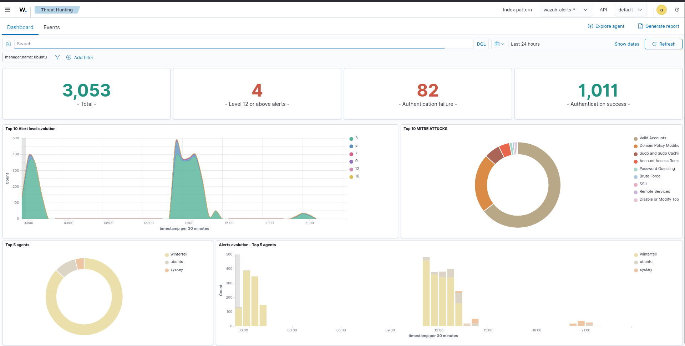
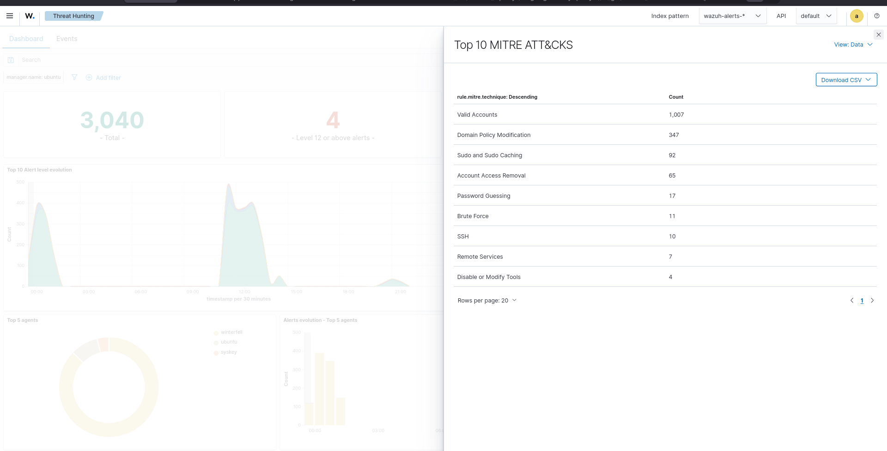
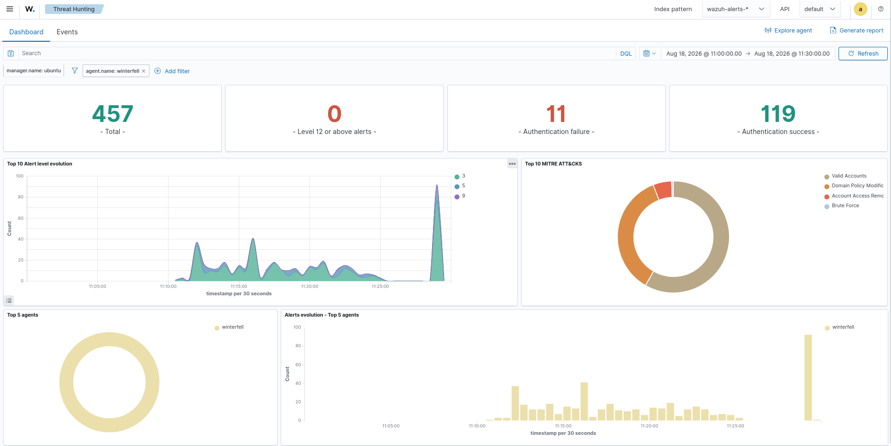
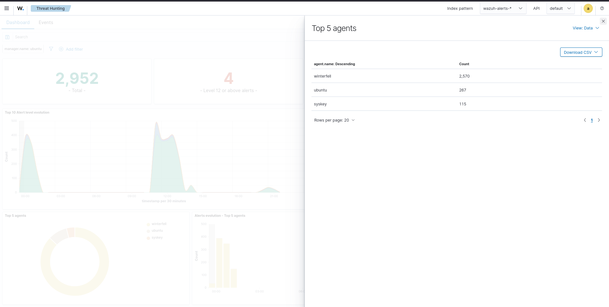
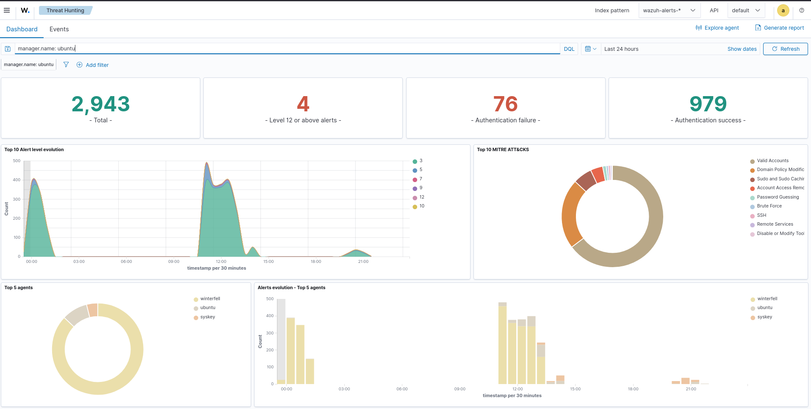

# 05 - Threat Detection

## Overview
Threat detection is a core SOC capability used to identify, analyze, and investigate suspicious activity across monitored endpoints.  
In this lab, the Wazuh Dashboard **Threat Hunting** interface was used to analyze security alerts, alert severity, MITRE ATT&CK techniques, affected agents, authentication activity, and alert timelines.  

**Objective:** Provide visibility into detected threats, alert severity, MITRE ATT&CK techniques, affected endpoints, and threat activity over time.

---

# Lab Objectives
- Monitor security alerts using Wazuh Threat Hunting  
- Analyze alert severity  
- Identify high-severity alerts  
- Analyze authentication failures and successes  
- Identify MITRE ATT&CK techniques  
- Identify affected Wazuh agents  
- Analyze alert distribution  
- Analyze threat activity over time  
- Investigate suspicious authentication activity  
- Correlate alerts with MITRE ATT&CK  
- Support SOC investigation and incident response  

---

# Lab Environment
| Component     | Details          |
|---------------|------------------|
| SIEM          | Wazuh            |
| Wazuh Version | 4.14.7           |
| Dashboard     | Wazuh Dashboard  |
| Interface     | Threat Hunting   |
| Index Pattern | wazuh-alerts-*   |
| Manager       | ubuntu           |
| Agents        | winterfell, ubuntu, syskey |
| Monitoring    | Enabled          |
| Time Range    | Last 24 hours    |

---

# Threat Detection Architecture
Security Telemetry → Wazuh Agents → Wazuh Manager → Decoders → Detection Rules → Wazuh Indexer → Wazuh Dashboard → Threat Hunting → Alert Analysis → MITRE ATT&CK Mapping → SOC Investigation → Incident Response  

---

# Dashboard Evidence
  
  
  
  
  

---

# Threat Detection Analysis
Threat Hunting provides a centralized interface for investigating security alerts generated by Wazuh.  
Workflow: Alert → Severity → MITRE ATT&CK Technique → Affected Agent → Timestamp → Event Details → Threat Investigation  

---

## MITRE ATT&CK Analysis
Observed techniques:  
- Valid Accounts  
- Domain Policy Modification  
- Sudo and Sudo Caching  
- Account Access Removal  
- Password Guessing  
- Brute Force  
- SSH  
- Remote Services  
- Disable or Modify Tools  

---

## Authentication Threat Detection
Dashboard visibility includes:  
- Authentication failures  
- Authentication successes  
- Password guessing  
- Brute-force activity  
- SSH activity  
- Valid account usage  
- Remote services  

---

## Agent Analysis
Top agents by alert volume:  
| Agent      | Alert Count |
|------------|-------------|
| winterfell | 2,570       |
| ubuntu     | 267         |
| syskey     | 115         |

---

## Alert Severity Investigation
SOC workflow:  
Identify alert → Review severity → Identify endpoint → Review event details → Identify MITRE ATT&CK technique → Correlate events → Assess impact → Initiate incident response  

---

# Threat Hunting Workflow
Threat Hunting Dashboard → Identify Alert Activity → Review Severity → Identify Agent → Review Authentication Activity → Identify MITRE ATT&CK Technique → Review Timeline → Correlate Events → Determine Risk → SOC Investigation → Incident Response  

---

# SOC Investigation Use Cases
- Threat hunting  
- Alert triage  
- Authentication investigation  
- Password-guessing investigation  
- Brute-force investigation  
- SSH monitoring  
- MITRE ATT&CK analysis  
- Endpoint investigation  
- Alert severity analysis  
- Timeline analysis  
- Suspicious activity detection  
- Security-event correlation  
- Incident investigation  

---

# Threat Detection Evidence
| Evidence File                  | Purpose                                |
|--------------------------------|----------------------------------------|
| 01-threat-detection-overview.png | Overall threat-detection dashboard     |
| 02-mitre-attack-analysis.png     | MITRE ATT&CK technique analysis        |
| 03-alert-severity-analysis.png   | Alert severity and activity analysis   |
| 04-agent-threat-analysis.png     | Alert distribution by agent            |
| 05-threat-detection-timeline.png | Chronological threat activity analysis |

---

# MITRE ATT&CK
Mapped techniques: Valid Accounts, Password Guessing, Brute Force, SSH, Remote Services, Domain Policy Modification, Account Access Removal, Sudo and Sudo Caching, Disable or Modify Tools.  

---

# Relationship to Incident Response
Threat Detection → Alert Triage → Investigation → Threat Identification → Source Identification → Containment → Eradication → Recovery → Lessons Learned  

---

# Key Findings
- Wazuh Threat Hunting successfully displayed security-event activity.  
- Dashboard provided visibility into overall alert volume.  
- Authentication failures and successes were visible.  
- MITRE ATT&CK techniques mapped to detected activity.  
- Multiple agents generated alerts; winterfell had highest volume.  
- Alert severity and timeline analysis supported investigations.  
- Threat-detection evidence correlated with incident-response activities.  

---

# Skills Demonstrated
- Wazuh Threat Hunting  
- Security Alert Analysis  
- Alert Triage  
- Threat Detection  
- Alert Severity Analysis  
- MITRE ATT&CK Analysis  
- Authentication Monitoring  
- Brute-Force Investigation  
- Password-Guessing Investigation  
- SSH Security Monitoring  
- Agent Analysis  
- Timeline Analysis  
- Security Event Correlation  
- SOC Investigation  
- Incident Response  

---

# Project Structure
13-Dashboards/  
│  
├── 01-SOC-Overview/  
│   └── Screenshots/01-soc-overview.png  
│  
├── 02-Security-Events/  
│   └── Screenshots/01-security-events-overview.png  
│  
├── 03-Authentication/  
│   └── Screenshots/01-authentication-overview.png  
│  
├── 04-Endpoint-Security/  
│   └── Screenshots/01-endpoint-security-overview.png  
│  
├── 05-Threat-Detection/  
│   └── Screenshots/01-threat-detection-overview.png  
│       ├── 02-mitre-attack-analysis.png  
│       ├── 03-alert-severity-analysis.png  
│       ├── 04-agent-threat-analysis.png  
│       └── 05-threat-detection-timeline.png  
│  
└── 06-Incident-Monitoring/  
    └── Screenshots/06-incident-monitoring.png  

---

# Conclusion
Threat detection provides the SOC with centralized visibility into security alerts, endpoint activity, authentication events, alert severity, and MITRE ATT&CK techniques.  
In this lab, Wazuh Threat Hunting was used to analyze detected activity, identify affected agents, review alert severity, examine MITRE ATT&CK mappings, and analyze activity over time.  

Workflow: Security Telemetry → Detection → Alert Triage → Severity Analysis → Agent Analysis → MITRE ATT&CK Mapping → Timeline Investigation → Threat Assessment → SOC Investigation → Incident Response  

