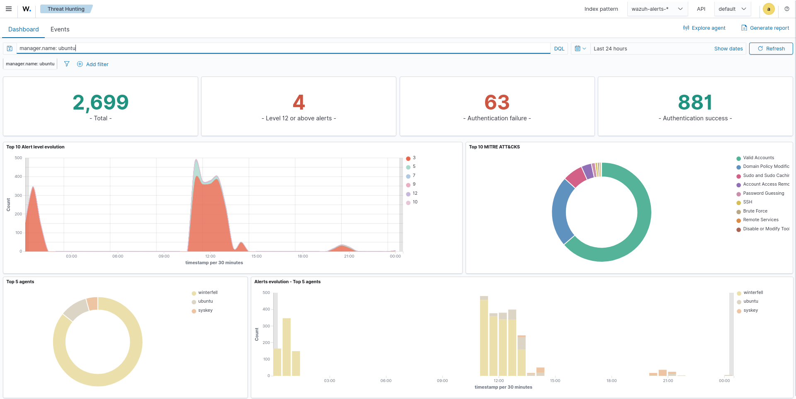
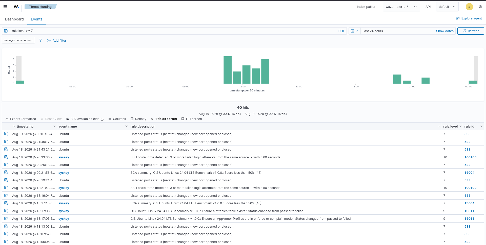
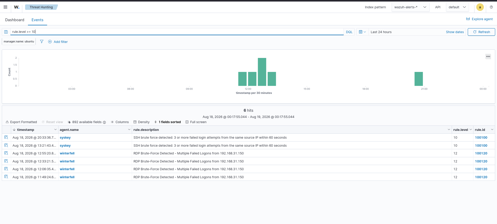
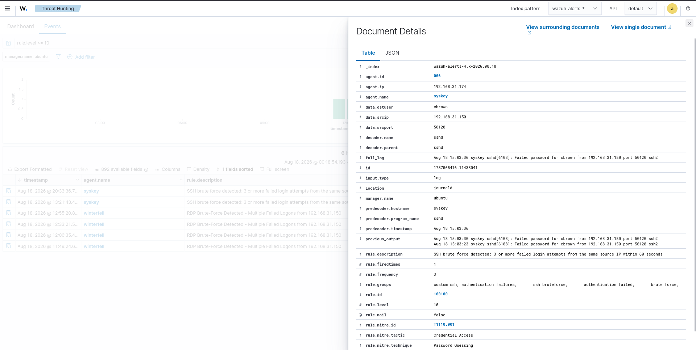
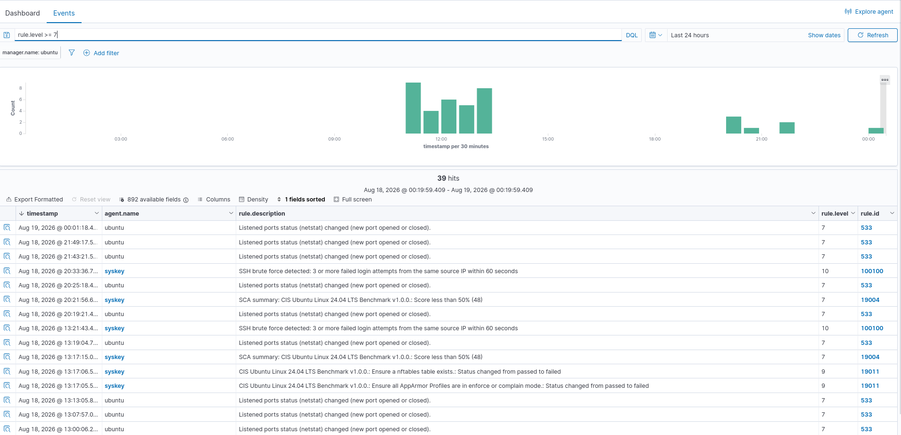

# 06 - Incident Monitoring

## Overview
Incident monitoring is a core SOC capability used to continuously monitor, investigate, and correlate security events detected across monitored endpoints.  
In this lab, the Wazuh Dashboard **Threat Hunting** interface was used to monitor security events, identify higher-priority alerts, investigate SSH brute-force activity, examine detailed alert evidence, and analyze incident activity chronologically.  

**Objective:** Provide documented evidence of incident monitoring, alert triage, high-priority event investigation, detailed event analysis, and incident timelines.

---

# Lab Objectives
- Monitor security incidents using Wazuh  
- Identify security events requiring investigation  
- Filter alerts by Wazuh rule level  
- Analyze medium-severity and higher events  
- Identify higher-priority alerts  
- Investigate SSH brute-force activity  
- Identify affected endpoints  
- Identify source IP addresses  
- Identify targeted users  
- Review Wazuh rule information  
- Analyze MITRE ATT&CK mappings  
- Review incident timelines  
- Correlate related security events  
- Document incident evidence  
- Support SOC incident-response workflows  

---

# Lab Environment
| Component                 | Details            |
|---------------------------|--------------------|
| SIEM                      | Wazuh              |
| Wazuh Version             | 4.14.7             |
| Dashboard                 | Wazuh Dashboard    |
| Interface                 | Threat Hunting     |
| Index Pattern             | wazuh-alerts-*     |
| Manager                   | ubuntu             |
| Primary Investigated Host | syskey             |
| Endpoint IP               | 192.168.31.174     |
| Source IP                 | 192.168.31.150     |
| Target User               | cbrown             |
| Monitoring                | Enabled            |
| Time Range                | Last 24 hours      |

---

# Incident Monitoring Architecture
Security Telemetry → Wazuh Agent → Wazuh Manager → Decoders → Detection Rules → Wazuh Indexer → Wazuh Dashboard → Threat Hunting → Alert Triage → Event Investigation → Incident Analysis → Incident Response  

---

# Understanding Wazuh Rule Levels
| Rule Level | Dashboard Severity |
|------------|--------------------|
| 0–6        | Low                |
| 7–11       | Medium             |
| 12–14      | High               |
| 15         | Critical           |

Filters used:  
- `rule.level >= 7` → broader incident context and timeline visibility  
- `rule.level >= 10` → focused investigation of higher-priority alerts  

---

# Dashboard Evidence
  
  
  
  
  

---

# Incident Alert Details
Filter: `rule.level >= 7` → broader set of incident-related events.  
Observed events: SSH brute-force detections, SCA alerts, network/listened-port changes, configuration events.  

---

# High-Severity Incidents
Filter: `rule.level >= 10` → narrowed to higher-priority alerts.  
Included SSH brute-force activity detected by custom rule 100100.  

---

# Incident Event Details
Expanded SSH brute-force alert evidence:  
| Field       | Value             |
|-------------|-------------------|
| Agent       | syskey            |
| Agent ID    | 006               |
| Agent IP    | 192.168.31.174    |
| Source IP   | 192.168.31.150    |
| Source Port | 50120             |
| Target User | cbrown            |
| Decoder     | sshd              |
| Rule ID     | 100100            |
| Rule Level  | 10                |
| MITRE ID    | T1110.001         |
| Technique   | Password Guessing |

Rule description: *SSH brute force detected: 3 or more failed login attempts from the same source IP within 60 seconds*.  

---

# Incident Timeline
Filter: `rule.level >= 7` → contextual visibility.  
Observed events:  
- Level 7 network/listened-port events  
- Level 7 SCA summary events  
- Level 9 SCA configuration failures  
- Level 10 SSH brute-force detections  

---

# Incident Investigation Workflow
Security Alert → Alert Triage → Review Rule Level → Identify Agent → Identify Source IP → Identify Target User → Review Rule Description → Inspect Event Details → Review MITRE ATT&CK Mapping → Analyze Timeline → Determine Security Impact → Containment / Response  

---

# Incident Event Correlation
Failed SSH Attempts → Source IP 192.168.31.150 → Target syskey → Target User cbrown → Multiple Attempts → Rule 100100 → Rule Level 10 → MITRE T1110.001 Password Guessing → SOC Investigation  

---

# MITRE ATT&CK Mapping
Technique: T1110.001 – Password Guessing  

---

# Incident Monitoring Use Cases
- Security alert triage  
- SSH brute-force investigation  
- Password-guessing investigation  
- Authentication monitoring  
- Source IP analysis  
- Target-user analysis  
- Endpoint investigation  
- Rule-level analysis  
- MITRE ATT&CK correlation  
- Timeline analysis  
- Security-event correlation  
- Incident investigation  
- Incident-response preparation  

---

# SOC Analyst Investigation Process
1. Identify alert  
2. Review rule level  
3. Determine investigation need  
4. Identify endpoint  
5. Identify source IP  
6. Identify targeted account  
7. Review rule description  
8. Inspect event details  
9. Review MITRE ATT&CK info  
10. Correlate related events  
11. Analyze timeline  
12. Assess impact  
13. Initiate containment/response  
14. Document evidence  

---

# Incident Evidence
| Screenshot                       | Purpose                                   |
|----------------------------------|-------------------------------------------|
| 01-incident-monitoring-overview.png | Overall incident-monitoring dashboard     |
| 02-incident-alert-details.png       | Medium-severity and higher event visibility |
| 03-high-severity-incidents.png      | Focused investigation of level 10+ alerts |
| 04-incident-event-details.png       | Detailed SSH brute-force evidence         |
| 05-incident-timeline.png            | Chronological incident activity           |

---

# Incident Response Relationship
Detection → Alert Triage → Investigation → Source Identification → Impact Assessment → Containment → Eradication → Recovery → Lessons Learned  

---

# Key Findings
- Wazuh successfully collected incident-related events.  
- Rule-level filtering prioritized events.  
- `rule.level >= 7` gave broader context.  
- `rule.level >= 10` focused on high-priority alerts.  
- SSH brute-force detected on syskey.  
- Source IP: 192.168.31.150.  
- Target account: cbrown.  
- Rule 100100 triggered at level 10.  
- Mapped to MITRE ATT&CK T1110.001.  
- Event details included supporting logs.  
- Timeline analysis revealed related activity.  
- Evidence supports complete SOC investigation workflow.  

---

# Skills Demonstrated
- Wazuh Incident Monitoring  
- Security Alert Triage  
- Threat Hunting  
- Rule-Level Analysis  
- SSH Security Monitoring  
- Brute-Force Investigation  
- Password-Guessing Investigation  
- Authentication Event Analysis  
- Source IP Analysis  
- Target Account Analysis  
- Endpoint Investigation  
- Event Correlation  
- MITRE ATT&CK Mapping  
- Timeline Analysis  
- SOC Investigation  
- Incident Response  

---

# Project Structure
13-Dashboards/  
│  
├── 01-SOC-Overview/  
│   └── Screenshots/01-soc-overview.png  
│  
├── 02-Security-Events/  
│   └── Screenshots/01-security-events-overview.png  
│  
├── 03-Authentication/  
│   └── Screenshots/01-authentication-overview.png  
│  
├── 04-Endpoint-Security/  
│   └── Screenshots/01-endpoint-security-overview.png  
│  
├── 05-Threat-Detection/  
│   └── Screenshots/01-threat-detection-overview.png  
│  
└── 06-Incident-Monitoring/  
    └── Screenshots/01-incident-monitoring-overview.png  
        ├── 02-incident-alert-details.png  
        ├── 03-high-severity-incidents.png  
        ├── 04-incident-event-details.png  
        └── 05-incident-timeline.png  

---

# Conclusion
Incident monitoring provides the SOC with a structured method for detecting, prioritizing, investigating, and documenting security events.  
In this lab, Wazuh Threat Hunting was used to monitor alerts, filter by rule level, investigate SSH brute-force activity, identify source IP and targeted account, examine detailed evidence, map activity to MITRE ATT&CK, and analyze the incident timeline.  

Workflow: Security Telemetry → Detection → Alert Triage → Rule-Level Analysis → Event Investigation → Source Identification → User Identification → MITRE ATT&CK Mapping → Timeline Analysis → Security Assessment → Incident Response  

