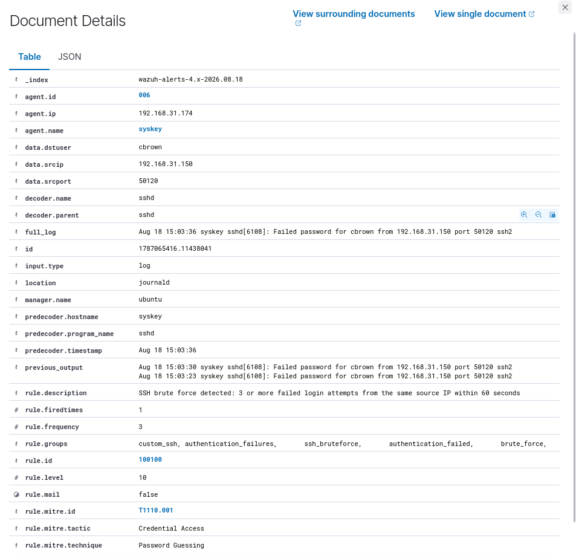
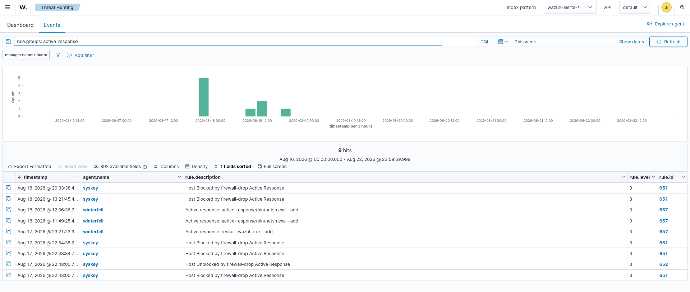
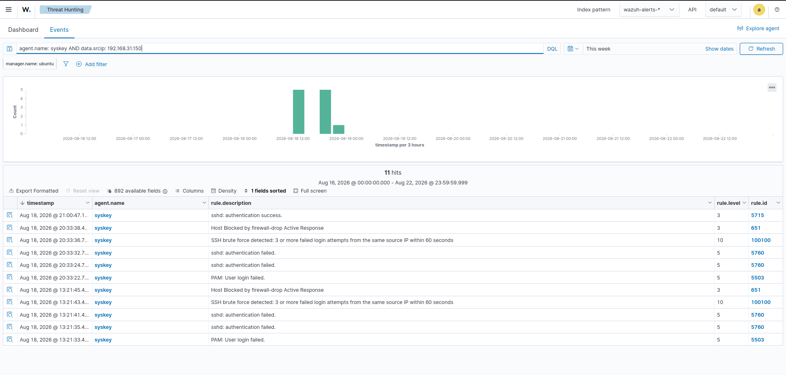

# 02 - Incident Report

## Overview
This directory documents a simulated SSH brute-force incident detected and investigated using Wazuh.  
The incident demonstrates a complete SOC investigation workflow:  

**Detection → Investigation → Containment → Eradication → Recovery → Verification**

The investigation focuses on repeated SSH authentication failures against the `syskey` agent from source IP `192.168.31.150`.

---

## Incident Summary
| Field            | Details                          |
|------------------|----------------------------------|
| Incident Type    | SSH Brute-Force Attack           |
| Affected Agent   | syskey                           |
| Agent IP         | 192.168.31.174                   |
| Source IP        | 192.168.31.150                   |
| Target Service   | SSH                              |
| Detection Rule   | 100100                           |
| Detection Level  | 10                               |
| MITRE Technique  | T1110.001 – Password Guessing    |
| MITRE Tactic     | Credential Access                |
| Response         | firewall-drop Active Response    |
| Manager          | ubuntu                           |
| Platform         | Wazuh                            |

---

## 1. Incident Detection
Wazuh detected multiple failed SSH authentication attempts from the same source IP.  
Custom brute-force detection rule triggered when ≥3 failed login attempts occurred within 60 seconds.  

**Detection Rule**  
Rule ID: 100100  
Rule Level: 10  
Description: SSH brute force detected: 3 or more failed login attempts from the same source IP within 60 seconds  

Evidence:  
- Source IP: 192.168.31.150  
- Destination agent: syskey  
- SSH service  
- Multiple failed authentication attempts  
- Rule ID 100100, Level 10  
- MITRE Technique T1110.001 – Password Guessing  

---

## 2. Incident Timeline
Sequence:  
- Multiple SSH authentication failures  
- SSH brute-force rule triggered  
- Wazuh Active Response executed  
- Source host blocked by firewall-drop  
- Subsequent authentication activity observed  
- Recovery verification performed  

---

## 3. Containment
Active Response executed firewall-drop when brute-force detection triggered.  
Containment evidence:  
- Host Blocked by firewall-drop Active Response  
- Rule ID: 651, Rule Level: 3  

---

## 4. Eradication
Authentication activity from source IP reviewed post-containment.  
Evidence:  
- sshd: authentication failed  
- PAM: User login failed  
- SSH brute-force detection  
- Firewall-drop Active Response  

---

## 5. Recovery Verification
Later successful SSH authentication observed: *sshd: authentication success*.  
This is treated as **post-containment verification**, not proof of complete recovery.  

---

## 6. MITRE ATT&CK Mapping
Technique: T1110.001 – Password Guessing  
Tactic: Credential Access  

---

## 7. Detection and Response Summary
- **Detection:** repeated SSH authentication failures from same source IP  
- **Analysis:** correlated via agent.name, data.srcip, rule.id, rule.level, rule.description  
- **Containment:** firewall-drop Active Response executed  
- **Recovery:** subsequent authentication activity reviewed  

---

## 8. Key Wazuh Rules
| Rule ID | Level | Description                                |
|---------|-------|--------------------------------------------|
| 5503    | 5     | PAM: User login failed                     |
| 5760    | 5     | sshd: authentication failed                |
| 100100  | 10    | SSH brute force detected                   |
| 651     | 3     | Host Blocked by firewall-drop Active Response |
| 5715    | 3     | sshd: authentication success               |

---

## 9. Investigation Conclusion
The Wazuh deployment successfully detected and correlated repeated SSH authentication failures.  
Custom rule 100100 escalated activity to level 10 and triggered Active Response.  

Demonstrated capabilities:  
- SSH authentication monitoring  
- Brute-force detection  
- MITRE ATT&CK mapping  
- Alert correlation  
- Active Response containment  
- Post-containment verification  
- Incident documentation  

---

# Dashboard Evidence
  
  
  
  
  

---

# Related Documentation
- 13-Dashboards/05-Threat-Detection/  
- 13-Dashboards/06-Incident-Monitoring/  
- 14-Reporting/01-Daily-SOC-Report/  
- Detection-Engineering/  
- Incident-Reports/  

---

# Project Structure
```text
14-Reporting/
└── 02-Incident-Report/
    ├── README.md
    └── Screenshots/
        ├── 01-incident-overview.png
        ├── 02-incident-alert-details.png
        ├── 03-containment-evidence.png
        ├── 04-eradication-evidence.png
        └── 05-recovery-verification.png

