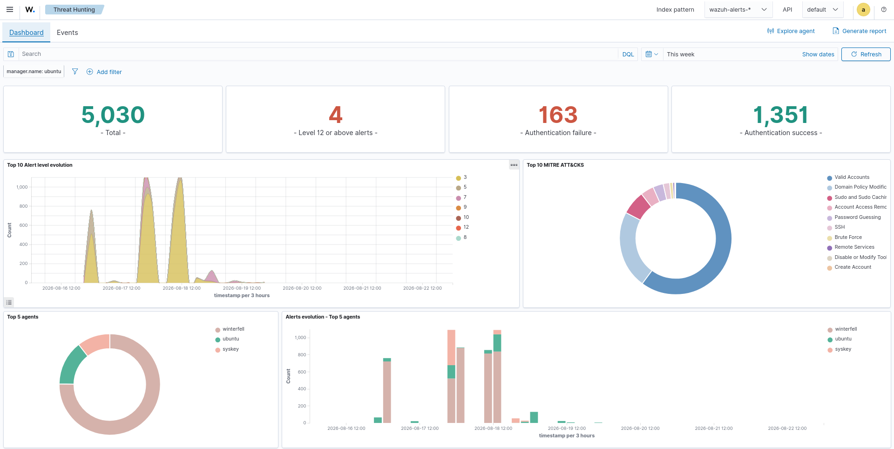
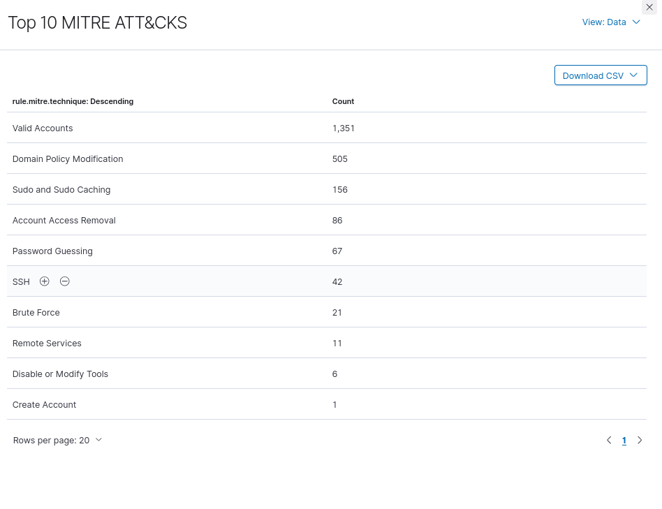
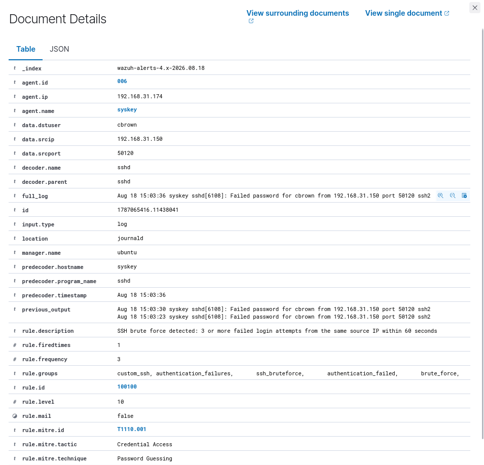
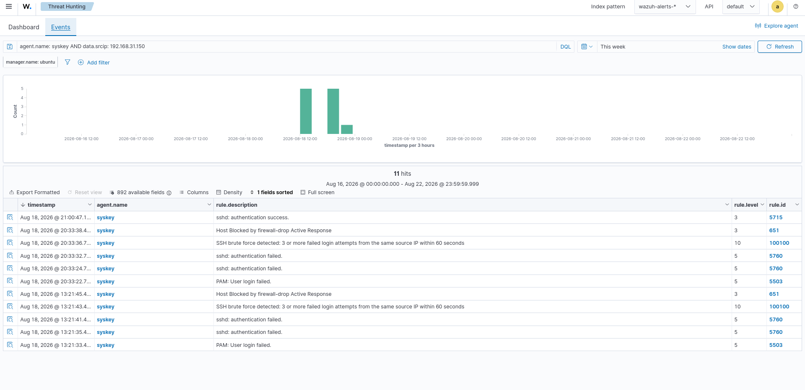

# 03 - Threat Report

## Overview
This report summarizes the threat activity observed in the Wazuh environment during the investigation period.  
The analysis focuses on:  
- Overall security alert activity  
- MITRE ATT&CK technique distribution  
- SSH brute-force activity  
- Threat activity timeline  
- Detection and response evidence  

---

## 1. Threat Overview
The Wazuh Threat Hunting dashboard provides a high-level view of observed security activity.  

Dashboard visibility includes:  
- Total security alerts  
- High-severity alerts  
- Authentication failures and successes  
- Alert-level evolution  
- MITRE ATT&CK technique distribution  
- Top affected agents  
- Alert evolution by agent  



**Key Observations**  
- Overall alert volume distribution across agents  
- MITRE ATT&CK visualization highlights most frequent techniques  

---

## 2. MITRE ATT&CK Analysis
Top 10 MITRE ATT&CK techniques observed:  



| Technique                 | Count |
|---------------------------|------:|
| Valid Accounts            | 1,351 |
| Domain Policy Modification|   505 |
| Sudo and Sudo Caching     |   156 |
| Account Access Removal    |    86 |
| Password Guessing         |    67 |
| SSH                       |    42 |
| Brute Force               |    21 |
| Remote Services           |    11 |
| Disable or Modify Tools   |     6 |
| Create Account            |     1 |

**Analysis**  
- Valid Accounts dominates observed techniques.  
- Password Guessing, SSH, and Brute Force are directly relevant to the SSH brute-force incident.  

---

## 3. SSH Brute-Force Analysis
Dedicated investigation of SSH brute-force activity on `syskey`.  



**Incident Indicators**  
| Field       | Value            |
|-------------|------------------|
| Agent       | syskey           |
| Agent IP    | 192.168.31.174   |
| Source IP   | 192.168.31.150   |
| Source Port | 50120            |
| Service     | sshd             |
| Rule ID     | 100100           |
| Rule Level  | 10               |
| Frequency   | 3 failures       |
| MITRE ID    | T1110.001        |
| Tactic      | Credential Access|
| Technique   | Password Guessing|

**Detection Logic**  
- ≥3 failed SSH logins within 60 seconds from same source IP.  
- Events: `sshd: authentication failed`, `PAM: User login failed`.  
- Mapped to MITRE ATT&CK T1110.001 – Password Guessing.  

---

## 4. Threat Timeline
Chronological sequence:  
- PAM login failed  
- sshd authentication failed  
- SSH brute-force detection  
- Firewall-drop Active Response  
- Subsequent authentication activity  



**Key Rules Observed**  
| Rule ID | Level | Description                                |
|---------|-------|--------------------------------------------|
| 5503    | 5     | PAM: User login failed                     |
| 5760    | 5     | sshd: authentication failed                |
| 100100  | 10    | SSH brute force detected                   |
| 651     | 3     | Host Blocked by firewall-drop Active Response |
| 5715    | 3     | sshd: authentication success               |

---

## 5. Threat Detection and Response
SOC workflow demonstrated:  
Authentication Activity → Failed Login Detection → Brute-Force Correlation → MITRE Mapping → Alert Generation → Active Response → Post-Containment Monitoring  

---

## 6. Threat Assessment
- Source IP: 192.168.31.150  
- Target: syskey (192.168.31.174)  
- Detection mapped to MITRE ATT&CK T1110.001 – Password Guessing  

---

## 7. Response Summary
- **Detection:** repeated SSH authentication failures  
- **Correlation:** triggered rule 100100  
- **Severity:** level 10 alert  
- **MITRE Mapping:** T1110.001 – Password Guessing  
- **Containment:** firewall-drop Active Response blocked source host  
- **Monitoring:** post-containment authentication activity reviewed  

---

## 8. Conclusion
Wazuh provided end-to-end visibility into SSH brute-force activity.  
Demonstrated capabilities:  
- Authentication monitoring  
- Brute-force detection  
- MITRE ATT&CK mapping  
- Alert correlation  
- Active Response containment  
- Post-containment monitoring  
- Threat documentation for SOC reporting  

---

# Dashboard Evidence
  
  
  
  

---

# Related Documentation
- 13-Dashboards/05-Threat-Detection/  
- 13-Dashboards/06-Incident-Monitoring/  
- 14-Reporting/01-Daily-SOC-Report/  
- 14-Reporting/02-Incident-Report/  
- Detection-Engineering/  

---

# Project Structure
```text
14-Reporting/
└── 03-Threat-Report/
    ├── README.md
    └── Screenshots/
        ├── 01-threat-overview.png
        ├── 02-mitre-analysis.png
        ├── 03-bruteforce-analysis.png
        └── 04-threat-timeline.png

