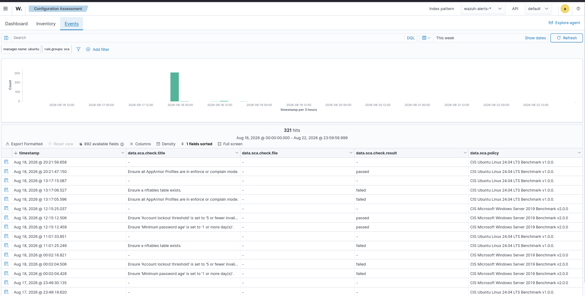
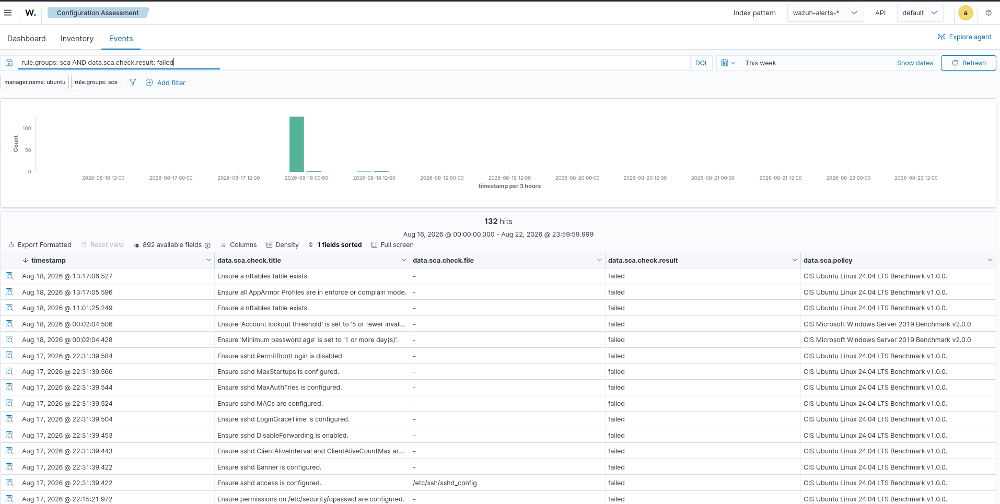
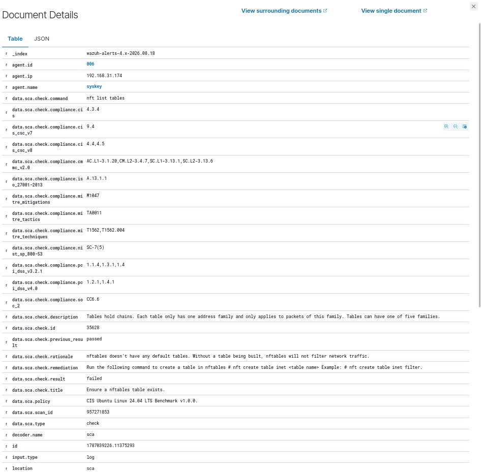
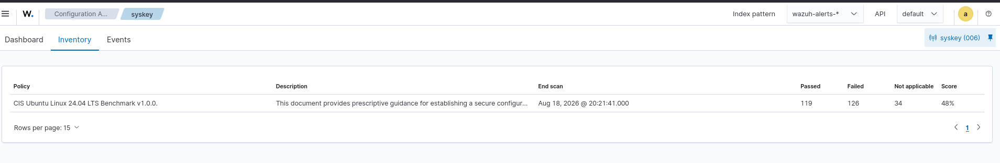

# 04 - Compliance Report

## Overview
This report documents the security configuration assessment results collected from the Wazuh Security Configuration Assessment (SCA) module.  
The assessment focuses on CIS security configuration benchmarks and provides evidence of passed and failed security controls, compliance score, and remediation information.

---

## Assessment Scope
| Item              | Details                                   |
|-------------------|-------------------------------------------|
| Platform          | Ubuntu Linux 24.04 LTS                    |
| Agent             | syskey                                    |
| Agent ID          | 006                                       |
| Manager           | ubuntu                                    |
| Assessment        | Wazuh Security Configuration Assessment   |
| Policy            | CIS Ubuntu Linux 24.04 LTS Benchmark v1.0.0 |
| Assessment Period | Aug 18, 2026                              |
| Compliance Score  | 48%                                       |

---

## 1. Compliance Overview
The Wazuh SCA event view provides visibility into configuration assessment activity.  
The assessment contains checks from CIS benchmark policies and records both successful and failed configuration checks.



**Observed Results**  
- Firewall configuration  
- AppArmor configuration  
- Password/account security  
- CIS Ubuntu Linux security requirements  
- CIS Windows Server security requirements  

---

## 2. Failed Controls
The assessment identified multiple failed configuration controls.  



Examples:  
- Ensure a nftables table exists  
- Ensure all AppArmor Profiles are in enforce or complain mode  
- Additional CIS benchmark controls  

---

## 3. SCA Check Details
Individual findings can be investigated directly from Wazuh event details.  



**Example Finding**  
- **Check:** Ensure a nftables table exists  
- **Check ID:** 35628  
- **Command:** `nft list tables`  
- **Result:** failed  
- **Policy:** CIS Ubuntu Linux 24.04 LTS Benchmark v1.0.0  

**Rationale**  
Without a default nftables table, firewall traffic cannot be filtered.  

**Remediation**  
Create an nftables table as recommended, validate before implementation, and align with firewall architecture.  

---

## 4. Compliance Summary


**Assessment Results**  
| Metric           | Result |
|------------------|--------|
| Passed           | 119    |
| Failed           | 126    |
| Not Applicable   | 34     |
| Compliance Score | 48%    |
| End Scan         | Aug 18, 2026 @ 20:21:41 |

---

## 5. Security Observations
- **Firewall Configuration:** nftables table missing.  
- **AppArmor:** profiles not consistently enforced.  
- **Overall Compliance:** 48% score, with 126 failed controls.  

---

## 6. Recommended Remediation Process
A structured remediation process should be followed:  
1. Review each failed SCA control.  
2. Identify the affected configuration.  
3. Validate the recommended remediation.  
4. Apply the configuration change.  
5. Re-run the SCA assessment.  
6. Verify that the control changes from failed to passed.  
7. Document remediation and validation evidence.  
8. Track remaining failed controls until target compliance is achieved.  

---

## 7. Evidence
| Screenshot                | Purpose                                      |
|---------------------------|----------------------------------------------|
| 01-compliance-overview.png| SCA events and benchmark assessment activity |
| 02-failed-controls.png    | Failed CIS configuration controls            |
| 03-sca-details.png        | Detailed failed nftables SCA check           |
| 04-compliance-summary.png | Overall CIS compliance score and control results |

---

## 8. SOC Analyst Perspective
SCA results can be integrated into routine monitoring and vulnerability/configuration management workflows.  
From a SOC perspective, findings support:  
- Identifying insecure host configurations  
- Prioritizing weaknesses  
- Correlating findings with security events  
- Tracking remediation progress  
- Validating hardening efforts  
- Providing compliance evidence  
- Supporting periodic security assessments  

---

# Conclusion
The Wazuh Configuration Assessment identified a **48% compliance score** against the CIS Ubuntu Linux 24.04 LTS Benchmark.  
126 failed controls highlight configuration weaknesses requiring remediation.  

This demonstrates how Wazuh can support continuous security configuration assessment, compliance monitoring, and SOC workflows alongside event monitoring, threat detection, and incident investigation.

---

# Project Structure
```text
14-Reporting/
├── 01-Daily-SOC-Report/
│   ├── README.md
│   └── Screenshots/
│
├── 02-Incident-Report/
│   ├── README.md
│   └── Screenshots/
│
├── 03-Threat-Report/
│   ├── README.md
│   └── Screenshots/
│
└── 04-Compliance-Report/
    ├── README.md
    └── Screenshots/
        ├── 01-compliance-overview.png
        ├── 02-failed-controls.png
        ├── 03-sca-details.png
        └── 04-compliance-summary.png

