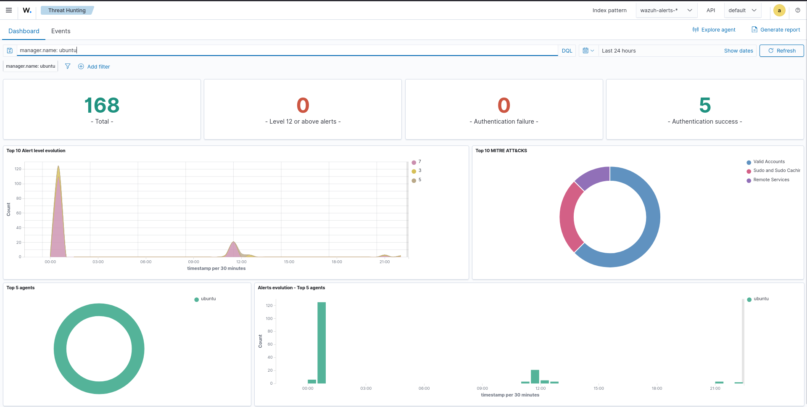
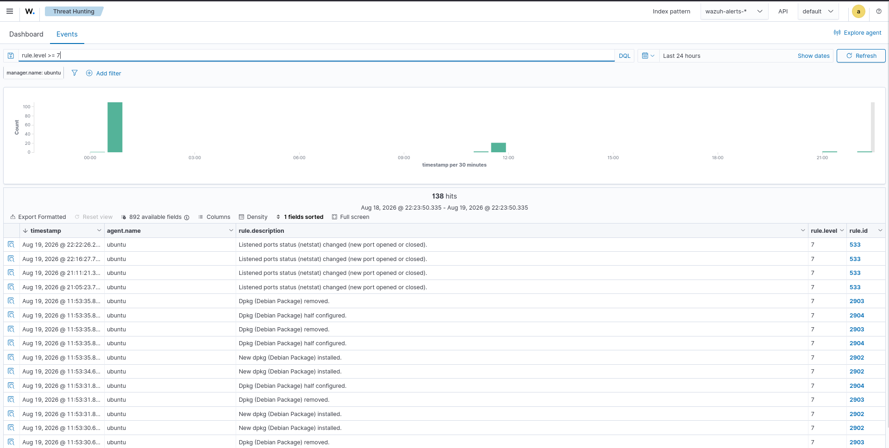
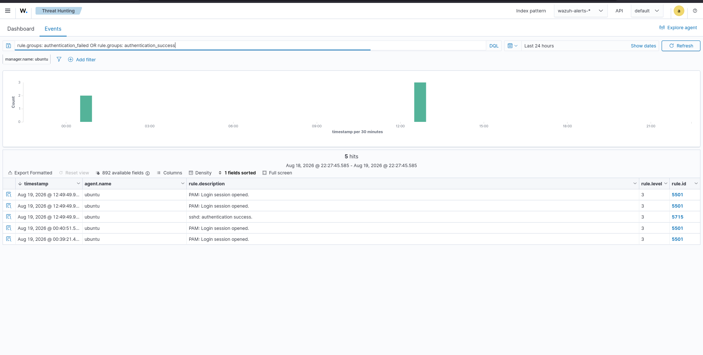
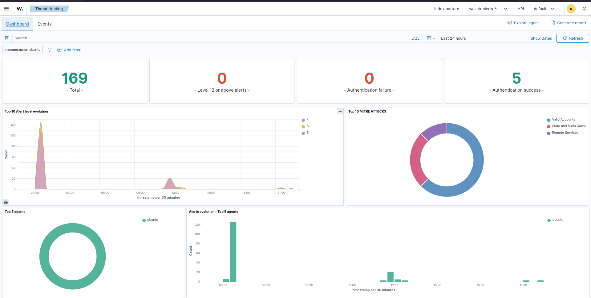

# 01 - Daily SOC Report

## Overview
A Daily SOC Report provides a structured summary of security activity observed during a defined reporting period.  
In this lab, the Wazuh Dashboard was used to review security alerts, authentication activity, threat intelligence, affected agents, and overall security activity during the selected reporting period.  

**Objective:** Demonstrate how a SOC analyst can transform Wazuh telemetry into a concise daily operational report for monitoring, triage, investigation, and management visibility.

---

# Reporting Period
| Field            | Value             |
|------------------|-------------------|
| Reporting Period | Last 24 Hours     |
| SIEM             | Wazuh             |
| Wazuh Version    | 4.14.7            |
| Manager          | ubuntu            |
| Dashboard        | Wazuh Dashboard   |

---

# Lab Objectives
- Generate a daily SOC security summary  
- Review overall security activity  
- Analyze alert volume and severity  
- Monitor authentication activity  
- Identify MITRE ATT&CK techniques  
- Identify affected agents  
- Document analyst observations  
- Provide security recommendations  
- Demonstrate SOC reporting capabilities  

---

# Reporting Workflow
Wazuh Security Telemetry → Security Alerts → Dashboard Analysis → Authentication / Threat Detection → Alert Review → Analyst Analysis → Daily Report → Recommendations  

---

# Dashboard Evidence
  
  
  
  

---

# Daily SOC Overview
The Threat Hunting dashboard provided visibility into:  
- Total alerts  
- Level 12+ alerts  
- Authentication failures and successes  
- Alert-level evolution  
- MITRE ATT&CK techniques  
- Top affected agents  
- Alert evolution  

---

# Daily Alert Summary
Events interface showed:  
- Event timestamps  
- Agent names  
- Rule descriptions  
- Rule levels and IDs  
- Security-event activity  

---

# Authentication Summary
Authentication evidence included:  
- Successful authentication events  
- PAM session activity  
- SSH authentication activity  
- Authentication timestamps  
- Affected agent and rules  

---

# Threat Summary
Threat Hunting dashboard showed:  
- Alert activity and severity  
- MITRE ATT&CK techniques  
- Affected agents  
- Authentication activity  
- Alert evolution  

---

# Security Activity Summary
| Area                     | Status   |
|---------------------------|----------|
| Security Alert Monitoring | Reviewed |
| Alert Severity            | Reviewed |
| Authentication Activity   | Reviewed |
| MITRE ATT&CK Activity     | Reviewed |
| Agent Activity            | Reviewed |
| Threat Activity           | Reviewed |
| Event Timeline            | Reviewed |

---

# Notable Security Activity
- Current period: primarily legitimate authentication and PAM session activity.  
- Historical incident: SSH brute-force (Source IP 192.168.31.150 → Target syskey → User cbrown → Rule 100100 → Level 10 → MITRE T1110.001). Documented separately in Incident Response.  

---

# Analyst Assessment
Analyst should:  
- Review overall alert activity  
- Identify unusual changes in alert volume  
- Monitor authentication events and suspicious sources  
- Review higher-priority alerts  
- Analyze affected endpoints  
- Review MITRE ATT&CK techniques  
- Correlate related events  
- Document notable findings  

---

# Security Recommendations
- Continue monitoring authentication activity  
- Investigate unexpected authentication events  
- Review higher-priority Wazuh alerts  
- Monitor repeated authentication failures  
- Review endpoints generating unusually high alert volumes  
- Investigate new/unusual MITRE ATT&CK techniques  
- Validate endpoint security configuration  
- Correlate alerts with incident-response activity  
- Maintain daily SOC reporting for visibility  

---

# Daily SOC Reporting Workflow
Daily Monitoring → Dashboard Review → Alert Summary → Authentication Review → Threat Analysis → Event Correlation → Analyst Assessment → Security Recommendations → Daily SOC Report  

---

# Evidence Collected
| Screenshot                   | Purpose                          |
|------------------------------|----------------------------------|
| 01-daily-soc-overview.png    | Overall daily SOC activity       |
| 02-daily-alert-summary.png   | Security alert/event summary     |
| 03-authentication-summary.png| Authentication activity          |
| 04-threat-summary.png        | Threat detection overview        |

---

# SOC Skills Demonstrated
- Daily SOC Reporting  
- Security Event Monitoring  
- Alert Triage  
- Authentication Monitoring  
- Threat Detection  
- MITRE ATT&CK Analysis  
- Agent Monitoring  
- Event Correlation  
- Security Dashboard Analysis  
- Wazuh Threat Hunting / Events  
- Incident Documentation  
- Analyst Assessment  
- Security Recommendations  
- Incident Response Support  

---

# Project Structure
15-Reporting/  
│  
├── 01-Daily-SOC-Report/  
│   ├── README.md  
│   └── Screenshots/  
│       ├── 01-daily-soc-overview.png  
│       ├── 02-daily-alert-summary.png  
│       ├── 03-authentication-summary.png  
│       └── 04-threat-summary.png  
│  
├── 02-Incident-Report/  
│   └── README.md  
│  
├── 03-Threat-Report/  
│   └── README.md  
│  
├── 04-Compliance-Report/  
│   └── README.md  
│  
└── 05-Security-Summary/  
    └── README.md  

---

# Conclusion
The Daily SOC Report demonstrates how Wazuh telemetry can be transformed into structured operational reporting.  
It combines dashboard visibility, alert monitoring, authentication analysis, threat detection, MITRE ATT&CK context, and analyst observations.  

Workflow: Wazuh Telemetry → Dashboard Monitoring → Alert Analysis → Authentication Review → Threat Analysis → Analyst Assessment → Daily SOC Report  

This provides documented evidence of daily SOC monitoring and supports ongoing security operations.

